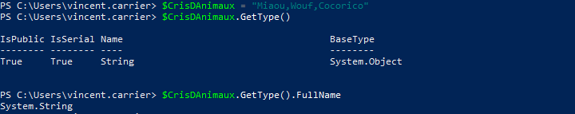
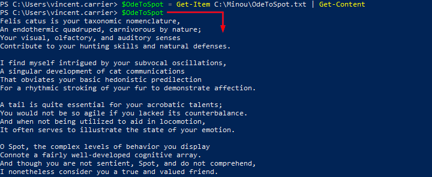
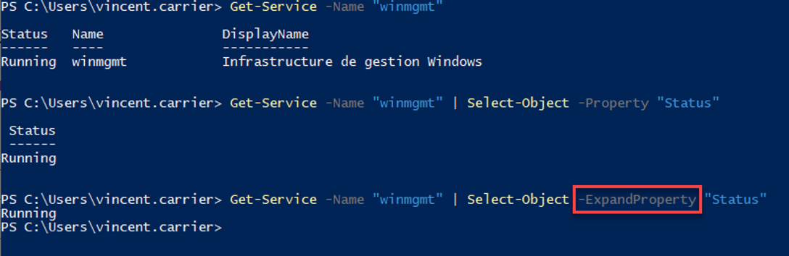
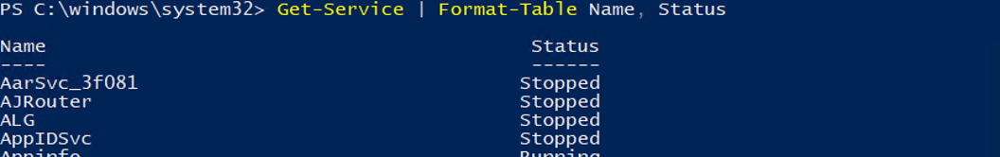

import Tabs from '@theme/Tabs';
import TabItem from '@theme/TabItem';

# Rencontre 2 - Fondements de PowerShell

:::note Résumé de la séance du jeudi 4 juillet 2024

<Tabs>

<TabItem value="deroulement" label="👨‍🏫 Déroulement du cours">

1. Objets
1. Pipeline
1. Variables
1. Types de données
1. Tableaux et opérations sur les tableaux

</TabItem>

<TabItem value="exercices" label="💻 Exercices à compléter">

Les exercices suivants se trouveront dans votre section personnelle du bloc-notes du cours, sous l'onglet *Exercices*:
- Mini-Exercice #2
- Exercice 02a: Objets et pipeline
- Exercice 02b: Collections

</TabItem>

<TabItem value="ressources" label="📚 Ressources à consulter">

La présentation PowerPoint est sur le Teams du cours, sous le canal Général > Fichiers > Supports de cours.

</TabItem>

</Tabs>

:::

PowerShell est un langage **orienté objet** reposant sur le cadre logiciel _.NET Framework_. De ce fait, chaque commande (cmdlet) retourne un ou plusieurs objets. Cette particularité diffère des commandes externes et des autres langages de shell, qui retournent du texte

Les objets sont beaucoup plus facile à interpréter par des algorithmes, car on peut extraire l'information qu'on souhaite sans procéder à des manipulations de chaînes de caractères. Ils nous donnent l'opportunité de les manipuler à notre guise, en les passant d'une commande à l'autre dans ce qu'on appelle le pipeline. Or, les humains ont plus de facilité à lire du texte que des objets. Donc à la fin de la chaîne de commandes, l'objet résultant est automatiquement converti en texte afin d'être lu par l'utilisateur.

Cette séance de cours porte principalement sur l'utilisation des objets qui résultent des différentes commandes PowerShell ainsi que le chaînage de plusieurs commandes dans le _pipeline_.


## Objets

Les commandes PowerShell retournent un ou plusieurs objets. Un objet est une structure de données, un élément logique d'information d'une structure définie par une classe (ou type). Il est composé de plusieurs membres, soit des propriétés (ou méthodes), qui représentent de l'information décrivant l'objet, et des méthodes (ou fonctions) qui posent une action sur cet objet.

### Connaître les membres d'un objet

La commande `Get-Member` permet d'obtenir la liste des propriétés et des méthodes offertes par cet objet. Dans le cas d'une collection d'objets, elle analyse le type d'objet dans la collection.


On peut spécifier le type de membre pour une recherche plus ciblée.


### Obtenir une propriété

Par exemple, la commande `Get-Item` retourne l'information sur un fichier ou un dossier. Le résultat de cette commande est un objet qui décrit le fichier ou le dossier correspondant.


Si l'objet représente un fichier, il possèdera une propriété `.Length` qui représente sa taille, en octets. Pour accéder à un membre d'un objet, on utilise le caractère point. Il y a plusieurs manières d'identifier l'objet, soit avec des parenthèses, soit en le passant dans une variable.


### Explorer les propriétés d'un objet

Pour explorer un objet, il est également utile de demander à lister toutes ses propriétés.


Il est ainsi plus facile de trouver des propriétés intéressantes.


### Appeler une méthode

L'appel d'une méthode se fait de la même manière que pour une propriété, sauf que la méthode peut accepter des paramètres. Comme une méthode n'est pas une commande PowerShell, les paramètres n'obéissent pas aux même règles: ils ne sont pas nommés, et doivent être spécifiés en parenthèses.


Si la méthode qu'on appelle n'a pas de paramètre, il faut écrire les parenthèses quand même.


### Connaître le type d'un objet

Une manière de connaître le type d'un objet est d'appeler sa méthode GetType(). Cette méthode existe dans tous les types d'objets, et retourne un objet qui décrit le type de cet objet.


Par exemple, la commande Get-Item peut retourner des fichiers et des dossiers, qui sont des structures très différentes. Selon l'élément que l'on tente d'obtenir, le type de l'objet résultant sera différent.



Si la commande retourne plusieurs objets, alors le type de l'objet retourné sera un array, c'est-à-dire un objet qui contient plusieurs objets. On les identifie avec des crochets [ ] à la fin de leur type.


## Le _pipeline_

Le _pipeline_ est le mécanisme par lequel l'information circule dans une session PowerShell. Il permet de chaîner des commandes afin que l'objet sortant d'une commande entre dans la prochaine pour y être traité. Le caractère pour chaîner les commande est la barre verticale `|` (appelée "_pipe_" ou "_tube_").

Pour mieux conceptualiser le _pipeline_, on peut voir chaque commande comme une machine qui prend un ou plusieurs objets en entrée (_input_), effectue un traitement en tenant compte de ces intrants (qui peuvent impliquer des appels au système d'exploitation), puis produit un objet en sortie (_output_) et le jette dans le _pipeline_.


Une commande produisant un objet en sortie (ou un objet déposé directement dans le _pipeline_) sera donc passé en entrée à la commande suivante, qui le passera dans un de ses paramètres, le traitera et produira un autre objet de type différent, qui pourra être passé à la prochaine commande, et ainsi de suite.


À la fin du _pipeline_, l'objet qui s'y trouve "tombe" dans la console (le host), où il sera automatiquement converti en texte selon plusieurs règles régies à la fois par la configuration de PowerShell et par la nature de cet objet.


On peut éviter à l'objet de tomber dans la console en le "pipant" dans une autre commande (habituellement, avec le verbe Out-), ou bien en l'affectant à une variable.



Si on souhaite se débarrasser de l'objet résultant, il suffit de terminer la chaîne de _pipeline_ par la commande Out-Null, qui désigne simplement une sortie vers rien du tout.


### Sélection

Plusieurs commandes, et particulièrement celles dont le verbe est `Get`, produisent des objets en sortie dans le pipeline, qui possèdent des propriétés. Certains objets en possèdent un grand nombre, et lorsqu'ils sont affichés sous forme de texte dans la console, parfois seules les propriétés principales sont affichées. Une opération simple consiste à "extraire" de cet objet certaines propriétés. Cette opération se nomme la "sélection" et peut être réalisée avec la commande `Select-Object`. 

La sélection ne "transforme" pas vraiment l'objet, elle en produit plutôt une copie transformée.

On peut créer des objets composés de certaines propriétés en spécifiant le paramètre `-Property` de la commande `Select-Object`.

Par exemple, la commande suivante permet de "transformer" l'objet représentant le service "winmgmt" en objet composé uniquement de ses propriétés `Name`et `Status`.

```powershell
Get-Service -Name "winmgmt" | Select-Object -Property "Name", "Status"
```

On remarque qu'à l'exécution de cette commande, il reste des entêtes de colonnes. Alternativement, on peut extraire seulement la **valeur** de la propriété en spécifiant le paramètre `-ExpandProperty`.

```powershell
Get-Service -Name "winmgmt" | Select-Object -ExpandProperty "Status"
```




### Commandes de formatage

Lorsqu'un objet arrive au bout du _pipeline_, il est automatiquement converti en texte par PowerShell afin d'être affiché dans la console dans un format lisible par l'utilisateur. Comme un objet possède des données brutes, PowerShell doit faire un choix dans sa manière de représenter textuellement l'objet à l'écran. Le formatage se fait en fonction de plusieurs facteurs, dont la nature de la commande, le nombre de propriétés de l'objet, etc. On peut utiliser des commandes de formatage (typiquement, des commandes débutant par le verbe `Format-`.)

| Commande | Alias | Description |
| -- | -- | -- |
| `Format-List` | `fl` | Convertit l'objet en texte sous forme de liste |
| `Format-Table` | `ft` | Convertit l’objet en texte sous forme de tableau (moins détaillé) |
| `Format-Wide` | `fw` | Convertit l’objet en texte réparti sur la largeur (très sommaire) |
| `Format-Hex` | `fhx` | Convertit des données en texte montrant leur valeur hexadécimale |

On peut également effectuer des sélections à l'intérieur même de la commande de formatage. 



C'est pratique pour explorer toutes les propriétés d'un objet. On peut le formater sous forme de liste et forcer l'affichage de toutes ses propriétés avec le symbole *.


:::caution

Une fois un objet passé dans la commande de formatage, il est automatiquement converti en texte. C'est pourquoi le formatage est généralement utilisé à la toute fin du pipeline, ou avant une commande de sortie (`Out-`).

:::

### Commandes de sortie

Par défaut, lorsqu'un objet arrive au bout du _pipeline_, il est affiché dans la console (_host_) après avoir été converti en texte. On peut rediriger l'objet vers une autre sortie, comme un fichier ou une imprimante. Voici quelques commandes de sortie disponibles:

| Commande | Alias | Description |
| -- | -- | -- |
| `Out-Default` |  | Envoie l’objet vers la sortie par défaut (implicite, par défaut Out-Host) |
| `Out-Host` | `oh` | Envoie l’objet vers la console (il sera converti automatiquement en texte) |
| `Out-File` |  | Envoie l’objet vers un fichier (il sera converti automatiquement en texte) |
| `Out-Null` |  | Envoie l’objet vers le néant (l’objet sera détruit) |
| `Out-String` | `oss` | Convertit les objets en chaîne de caractères |
| `Out-Printer` | `lp` | Envoie l’objet vers une imprimante |
| `Out-GridView` | `ogv` | Sort l’objet vers une grille graphique (dans une fenêtre séparée) |
