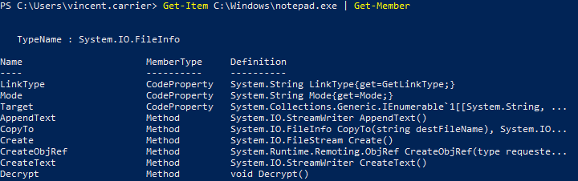

import Tabs from '@theme/Tabs';
import TabItem from '@theme/TabItem';

# Rencontre 2 - Fondements de PowerShell

:::note Résumé de la séance du jeudi 4 juillet 2024

<Tabs>

<TabItem value="deroulement" label="👨‍🏫 Déroulement du cours">

1. Objets
1. Pipeline
1. Variables
1. Types de données
1. Tableaux et opérations sur les tableaux

</TabItem>

<TabItem value="exercices" label="💻 Exercices à compléter">

Les exercices suivants se trouveront dans votre section personnelle du bloc-notes du cours, sous l'onglet *Exercices*:
- Mini-Exercice #2
- Exercice 02a: Objets et pipeline
- Exercice 02b: Collections

</TabItem>

<TabItem value="ressources" label="📚 Ressources à consulter">

La présentation PowerPoint est sur le Teams du cours, sous le canal Général > Fichiers > Supports de cours.

</TabItem>

</Tabs>

:::

PowerShell est un langage **orienté objet** reposant sur le cadre logiciel _.NET Framework_. De ce fait, chaque commande (cmdlet) retourne un ou plusieurs objets. Cette particularité diffère des commandes externes et des autres langages de shell, qui retournent du texte

Les objets sont beaucoup plus facile à interpréter par des algorithmes, car on peut extraire l'information qu'on souhaite sans procéder à des manipulations de chaînes de caractères. Ils nous donnent l'opportunité de les manipuler à notre guise, en les passant d'une commande à l'autre dans ce qu'on appelle le pipeline. Or, les humains ont plus de facilité à lire du texte que des objets. Donc à la fin de la chaîne de commandes, l'objet résultant est automatiquement converti en texte afin d'être lu par l'utilisateur.

Cette séance de cours porte principalement sur l'utilisation des objets qui résultent des différentes commandes PowerShell ainsi que le chaînage de plusieurs commandes dans le _pipeline_.

## Objets

Les commandes PowerShell retournent un ou plusieurs objets. Un objet est une structure de données, un élément logique d'information d'une structure définie par une classe (ou type). Il est composé de plusieurs membres, soit des propriétés (ou méthodes), qui représentent de l'information décrivant l'objet, et des méthodes (ou fonctions) qui posent une action sur cet objet.

### Connaître les membres d'un objet

La commande `Get-Member` permet d'obtenir la liste des propriétés et des méthodes offertes par cet objet. Dans le cas d'une collection d'objets, elle analyse le type d'objet dans la collection.

On peut spécifier le type de membre pour une recherche plus ciblée.

### Obtenir une propriété

Par exemple, la commande `Get-Item` retourne l'information sur un fichier ou un dossier. Le résultat de cette commande est un objet qui décrit le fichier ou le dossier correspondant.

Si l'objet représente un fichier, il possèdera une propriété `.Length` qui représente sa taille, en octets. Pour accéder à un membre d'un objet, on utilise le caractère point. Il y a plusieurs manières d'identifier l'objet, soit avec des parenthèses, soit en le passant dans une variable.

### Explorer les propriétés d'un objet

Pour explorer un objet, il est également utile de demander à lister toutes ses propriétés.

Il est ainsi plus facile de trouver des propriétés intéressantes.
