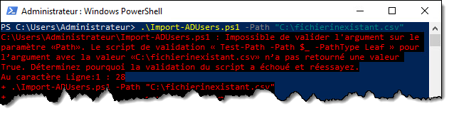

# Travail pratique 2 (É2024)

Ce TP est à faire **individuellement**. Il compte pour **30%** de la note du cours. La remise se fera via Microsoft Teams dans un devoir qui sera intitulé TP2.

## Préparation

Pour réaliser ce deuxième travail pratique, vous devrez d'abord avoir complété les exercices du cours #05. Ces exercices vous auront permis de mettre en place un environnement Active Directory.

## Mandat

Vous devez développer un script PowerShell qui créera des utilisateurs Active Directory à partir du liste qui vous sera remise au format CSV.

### Le fichier d'entrée

Le fichier CSV est construit dans le format suivant, séparé par des **points-virgules**:

```
"Nom";"Prenom";"NoEmp";"Admin"
"Lapointe";"Valérie";"99001";"Non"
"Sparrow";"Serge";"99002";"Non"
"St-Denis";"Martin";"99003";"Oui"
"Grimard";"Pierre-Olivier";"99004";"Non"
"Langlois";"Julie";"99005";"Non"
```

On y retrouve le Nom, le prénom, le numéro d'employé de chaque utilisateur à créer, ainsi qu'un champ mentionnant si l'utilisateur doit être administrateur du système (Oui ou Non).

### Comptes utilisateurs

Votre script devra créer un compte sur Active Directory pour chaque utilisateur spécifié dans le fichier. Voici les consignes:

- Les utilisateurs doivent obligatoirement être créés dans l'unité d'organisation **Utilisateurs** située à la racine du domaine.

- Le **nom d’utilisateur** doit être la première lettre du prénom et les 4 premières du nom de famille, en **lettres minuscules**. Les attributs **Name**, **sAMAccountName** et **UserPrincipalName** doivent tous trois porter ce nom.

- Le **prénom** et le **nom** de l'utilisateur correspond au fichier d'entrée.

- Le **nom complet** de l’utilisateur est son prénom suivi de son nom.

- La **description** de l’utilisateur est son numéro d'employé..

- Le **mot de passe** doit être les 2 premières lettres du nom de famille en **majuscules**, les 2 premières lettres du prénom en **minuscules**, suivi du numéro d’employé.

- L'utilisateur **doit changer son mot de passe** à la prochaine ouverture de session.

- Si l’utilisateur doit être **admin**, il doit être ajouté au groupe des **Admins du domaine**.

Si on devait créer les utilisateurs manuellement, voici à quoi ils ressembleraient dans l'interface graphique:


### Lancement du script

Le script doit **exiger** un paramètre `-Path` **obligatoire** dans lequel on spécifie le chemin du fichier CSV à charger. Le script doit alors créer les utilisateurs selon les paramètres indiqués dans le fichier. **Le script ne doit rien retourner sur le pipeline et ne doit pas montrer de message d'erreur.**

**Le paramètre `-Path` doit aussi pouvoir accepter une valeur à l'entrée du pipeline.**


Les comptes ainsi créés devraient être visibles dans la console Utilisateurs et ordinateurs Active Directory.


### Validation du paramètre

Le script doit planter si le chemin spécifié en paramètre est invalide. Pour ce faire, vous devez utiliser les **fonctionnalités de validation des paramètres** de PowerShell.



### Journalisation

Le script doit aussi garder une trace de toutes les actions qu’il entreprend dans le fichier **Import-LocalUsers.log** :
- Début du script
- Traitement d’un utilisateur
- Création de l’utilisateur
- Ajout au groupe d'administration si nécessaire
- Fin du script

Chaque ligne doit être horodatée (timestamp) dans le format illustré, avec une précision en millisecondes. Cette fonctionnalité doit être réalisée au moyen d’une **fonction**, et cette dernière doit avoir un maximum d’autonomie. Par ailleurs, le fichier doit être situé sous **C:\\Users\\*utilisateur*\\AppData\\Local\\Temp\\Import-ADUsers\\** (celui-ci doit être créé automatiquement s’il n’existe pas). Vous devez utiliser au maximum les variables d’environnement offertes par Windows. **La logique de création automatique de répertoire devrait se trouver dans la fonction de journalisation.**


## Consignes de remise

Vous devez remettre ce travail sur Teams en format texte!
:::danger
N'oubliez pas de nommez votre fichier convenablement: **Nom_Prenom_TP2.txt**. De grâce, ne perdez pas des points sur une consigne aussi simple.
:::

## Conseils

- Avant de commencer à coder, décrivez les étapes en pseudo-code pour déterminer la logique générale du script. Vous pourrez ensuite &laquo;&nbsp;traduire&nbsp;&raquo; ce pseudo-code en PowerShell, étape par étape.
- Vous pouvez installer VS Code sur votre VM pour développer votre script.
- Testez des parties de votre script au lieu de lancer le script au complet à chaque fois. N’hésitez pas à tester les commandes toutes seules, définir des variables manuellement pour tester, etc.

## Critères d’évaluation

Le script sera évalué selon les critères suivants :

| Critère d'évaluation | Pondération |
| :-- | --: |
| Conception et fonctionnement général | 10% |
| Paramètres du script | 10% |
| Traitement du fichier d’entrée | 10% |
| Création des utilisateurs | 40% |
| Journalisation | 15% |
| Lisibilité et documentation | 10% |
| Respect des consignes | 5% |
| **Total** | **100%** |

Voici les détails de ce qui sera évalué pour chaque critère:

- **Conception et fonctionnement général [10%]**
    - Le script fonctionne du premier coup
    - Aucune erreur n’est affichée pendant l’exécution
    - Logique générale du script (pas de code inutile ou redondant)
    - Respect des bonnes pratiques de programmation
- **Paramètres du script [10%]**
    - Définition des paramètres conformes à l’énoncé
    - Paramètre obligatoire
    - Validation de l’existence du fichier en entrée
    - Traitement du paramètre par l’entrée du pipeline
- **Traitement du fichier d’entrée [10%]**
    - Lecture juste du fichier CSV en entrée
    - Utilisation des commandes et paramètres appropriés
- **Création des utilisateurs [40%]**
    - Création correcte des comptes utilisateurs locaux
    - Les attributs sont conformes à l'énoncé
    - Utilisation adéquates des commandes
    - Ajout des comptes admin au groupe des administrateurs du domaine
- **Journalisation [15%]**
    - Écriture des étapes d’exécution dans un fichier log
    - Emploi d’une fonction de journalisation
    - Autonomie de la fonction
    - Emplacement du fichier log conforme à la demande
    - Utilisation adéquate des variables d’environnement
- **Lisibilité et documentation [10%]**
    - Choix judicieux des noms de variables et de fonctions
    - Utilisation judicieuse des commentaires
    - Indentation correcte
    - Propreté du code
- **Respect des consignes [5%]**
    - Remise du script sur Teams tel que demandé
    - Nom du script et des paramètres tel que demandé