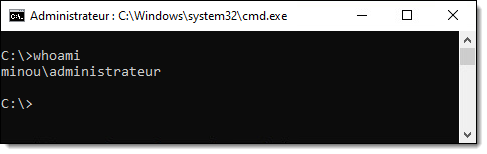

import Tabs from '@theme/Tabs';
import TabItem from '@theme/TabItem';

Dans ce cours, vous devez monter un environnement de laboratoire virtualisé dans Labinfo. Voici comment le répliquer simplement avec des commandes PowerShell.

## Architecture de l'environnement de labo

Le diagramme ci-dessous montre le plan conceptuel du réseau que vous devrez concevoir dans votre environnement virtuel.


Il sera composé des machines virtuelles suivantes:

| Hôte | Fonction | Adresse IP | Modèle (labinfo) |
| ---- | ---- | ---- | ---- |
| PFSENSE | Passerelle / NAT | 192.168.21.1 | MODELE_pfSense (Sans DHCP) |
| DC01 | Contrôleur de domaine et serveur DHCP | 192.168.21.10 | MODELE_WinServer2025_Datacenter |
| PCDEV | Poste client | *(dynamique)* | MODELE_Win11-24H2_Education |

:::tip
Pour que vos VM soient organisées dans un même bloc dans Labinfo, ajoutez le préfixe `3T5-xx-` devant le nom des VM dans vSphere (où *xx* représente vos initiales).


:::


## Montage de la passerelle (pfSense)

Dans l'environnement Labinfo, vous avez un profil Large, comme en témoigne le nom de votre profil qui commence par `L-`. Vous avez donc dix réseaux privés qui vous sont attribués et que vous pouvez utiliser à votre guise. Vous pouvez brancher plusieurs de vos VM dans un même réseau privé et elles pourront communiquer entre elles. Toutefois, ces réseaux sont complètement isolés et ne sont pas routés vers Internet. Pour offrir un moyen d'accès à Internet aux machines dans un de vos réseaux privés, vous devez y déposer une passerelle.

Dans votre environnement de laboratoire, vous devez placer une VM entre un réseau offrant une connectivité Internet et un réseau privé. Les notions derrière cette technologique seront vues dans un autre cours.

Tout d'abord, créez une nouvelle machine virtuelle basée sur le modèle **MODELE_pfSense (Sans DHCP)**. 

:::info
Les modèles sont situés dans le répertoire **MODELES\420-VCarrier**.
:::

Puis modifiez ses paramètres matériels. Cette machine est dotée de deux cartes d'interface réseau matérielles virtualisées. La première interface est appelée "WAN" et est connectée à Internet (*Acces-Internet-1*). La deuxième interface est appelée "LAN" et est connectée dans le réseau privé interne. Vous n'avez qu'à choisir un de vos dix subnets privés et utiliser le même pour chacune de vos VM. Les réseaux privés sont nommés `L-###-01` à `L-###-10`.


Ensuite, démarrez la VM. Vous pouvez accéder à la console en cliquant sur "Lancer Remote Console".


Sur sa console, on peut y voir un écran d'information et un menu d'administration, mais la VM est déjà configurée alors on n'a pas à y toucher. Prenez toutefois note de l'adresse IP LAN. On y retrouve l'adresse `192.168.21.1/24`. Ce qui signifie que l'adresse IP de cette machine est `192.168.21.1` (l'adresse de la passerelle par défaut des machines situées dans le même réseau local) et que la partie réseau de l'adresse IP est de 24 bits (donc un masque de sous-réseau de `255.255.255.0`). Ce sera à considérer lorsque vous monterez d'autres machines dans ce réseau. Puis laissez simplement la machine allumée; tant qu'elle est allumée, elle assurera la liaison entre le réseau local et Internet.


:::tip
Pour sauver des ressources dans LabInfo, la DiSTI a programmé un script qui met automatiquement hors tension toutes les VM à chaque nuit. Vous pouvez protéger vos VM de ce mécanisme. Je vous le conseille pour votre passerelle et votre contrôleur de domaine.

Pour activer cette protection, il faut simplement attribuer la balise "Ne pas fermer".


:::


## Montage du contrôleur de domaine

Pour créer un domaine, il faut installer le rôle des Services de domaine Active Directory sur un serveur, puis effectuer sa promotion à un contrôleur de domaine. Voici comment on procède.

### Étape 1: Clonage de la machine virtuelle

La première étape consiste à installer et configurer une édition Serveur de Windows. Pour le laboratoire, utilisez le modèle **MODELE_WindowsServer2025_Datacenter** pour créer votre VM. Assurez-vous de brancher son adaptateur réseau dans `L-###-##` (le réseau local privé que vous avez choisi lors du montage de votre passerelle).


### Étape 2: Changement du nom d'hôte

À l'installation du système d'exploitation, il est d'usage de modifier le nom d'hôte de la machine. Le nom d'hôte de Windows à son installation est généré aléatoirement et il est préférable que les machines de notre environnement aient un nom représentatif de leur rôle. Il est un bon réflexe de le faire au tout début du processus de montage, car il est plus compliqué changer le nom d'un système après sa promotion. Je vous recommande de le faire aussitôt le système d'exploitation installé.

```powershell
Rename-Computer -NewName "DC01" -Restart
```

:::tip
Vous pouvez omettre le paramètre `-Restart` si vous voulez éviter que le serveur ne redémarre automatiquement.
:::


### Étape 3: Configuration du réseau

Lors de l'installation de Windows, le client DHCP est activé par défaut tant pour l'assignation d'une adresse IP que pour ses résolveurs DNS. Il est généralement une bonne pratique de désactiver le client DHCP sur les serveurs et de plutôt opter pour une assignation statique.

On a l'habitude de voir les configurations IP et DNS comme une seule et même catégorie de paramètres, puisqu'ils sont configurables au même endroit dans l'interface graphique, mais avec PowerShell, on les configure avec deux commandes distinctes.


#### Identification de l'interface

Tout d'abord, il nous faut connaître le nom de l'interface à configurer. Par défaut, Windows attribue les noms "Ethernet0", "Ethernet1", et ainsi de suite, selon l'ordre de leur découverte par l'énumération *Plug-and-Play*. Si le serveur possède plus d'une interface ethernet, identifiez d'abord celle qui assurera la connectivité au réseau de production.

```powershell
Get-NetAdapter
```


#### Assignation de l'adresse IP

Ensuite, vous pourrez procéder à la configuration IP de cette interface. Dans cet exemple, j'ai isolé les paramètres propres à l'adressage IP dans un *hashtable* afin de la passer par *splatting*. Assurez-vous que l'adresse IP, le masque de sous-réseau ainsi que la passerelle par défaut correspondent à votre environnement.

```powershell
$IPAddressSplat = @{
    IPAddress      = "192.168.21.10"
    PrefixLength   = 24    # Équivalent à 255.255.255.0 (/24)
    DefaultGateway = "192.168.21.1"
    AddressFamily  = "IPv4"
}

New-NetIPAddress @IPAddressSplat -InterfaceAlias "Ethernet0" 
```

#### Assignation du résolveur DNS

Configurez finalement le résolveur DNS. Puisque ce serveur deviendra ultimement un serveur DNS à la fin du processus de promotion, on va temporairement lui affecter des résolveurs DNS publics. Ceci sera modifié automatiquement lors de la promotion du serveur.

```powershell
Set-DnsClientServerAddress -ServerAddresses "8.8.8.8", "8.8.4.4" -InterfaceAlias "Ethernet0"
```

### Étape 4: Promotion

#### Installation du rôle ADDS

Avant de pouvoir promouvoir le serveur comme contrôleur de domaine, on doit d'abord installer le rôle *Active Directory Domain Services*. Plutôt que de le faire par l'interface graphique, on peut le faire au moyen de cette commande PowerShell.

```powershell
Install-WindowsFeature -Name AD-Domain-Services -IncludeManagementTools
```

Cette commande procède également à l'installation de tous les rôles et fonctionnalités connexes, incluant le module PowerShell pour Active Directory. Vous pourrez ensuite utiliser ces commandes en les important dans votre session PowerShell.

```powershell
Import-Module -Name ActiveDirectory
```

:::info
La commande précédente affiche un message d'avertissement pour signaler qu'aucun contrôleur de domaine n'a été trouvé. C'est normal, puisque votre domaine n'existe pas encore! Vous avez quand même besoin du module pour utiliser la commande qui vous permet de promouvoir votre serveur. Vous pouvez donc ignorer l'avertissement.
:::


#### Promotion du contrôleur de domaine

Une fois le rôle installé, on peut procéder à la promotion. La commande `Install-ADDSForest` permet la création de la forêt par la promotion de son premier contrôleur de domaine. Il faut fournir plusieurs arguments à la commande, l'exemple suivant les identifie dans un *hashtable* pour ensuite les passer par *splatting*.

- Les paramètres `-DomainName` et `-DomainNetbiosName` désignent respectivement le nom de domaine pleinement qualifié (FQDN) du domaine et le nom NETBIOS, parfois appelé "pré-Windows 2000".

- Les paramètres `-ForestMode` et `-DomainMode` désignent le niveau fonctionnel de forêt et de domaine respectivement. La valeur "WinThreshold" signifie le niveau fonctionnel le plus élevé pris en charge par le système d'exploitation.

- Les paramètres `-DatabasePath`, `-LogPath` et `-SysvolPath` contrôlent l'emplacement où seront enregistrés la base de données (NTDS.DIT), les journaux transactionnels ainsi que le répertoire SYSVOL qui sera répliqué à travers tous les contrôleurs de domaine.

- Le paramètres `-InstallDNS` est un paramètre de type *switch* qui détermine si le service DNS doit être installé sur ce serveur. On peut aussi activer la délégation DNS avec le paramètre `-CreateDnsDelegation`. Habituellement, dans un environnement de laboratoire, on souhaite installer le service DNS mais ne pas lui configurer une délégation.

- Le paramètre `-SafeModeAdministratorPassword` permet de spécifier un mot de passe pour la récupération d'urgence. Il doit être fourni pour activer le mode de restauration des services d'annuaire (DSRM), un sorte de mode sans échec pour contrôleurs de domaine destiné à réparer ou restaurer la base de données Active Directory. Bien qu'il ne soit que peu utilisé, il peut s'avérer nécessaire en cas de problème, et il est important de choisir un mot de passe fort et de le garder en lieu sûr (et surtout pas en texte clair). Il admet une chaîne sécurisée (securestring) alors on doit procéder à sa conversion. Concernant le choix du mot de passe dans l'exemple suivant, on se permet bien sûr des largesses, puisqu'il s'agit d'un environnement de laboratoire.

Le système redémarrera automatiquement une fois l'opération complétée. Pour ne pas qu'il redémarre automatiquement, on peut activer le switch `-NoRebootOnCompletion`.


```powershell
$ADDSForestSplat = @{
    DomainName = "auto.cemti.ca"        # Le nom DNS de votre domaine racine
    DomainNetbiosName = "AUTO"          # Le nom NETBIOS de votre domaine racine
    ForestMode = "WinThreshold"         # Les plus récents niveaux fonctionnels
    DomainMode = "WinThreshold"
    DatabasePath = "C:\Windows\NTDS"    # Les emplacements par défaut pour la base de données
    LogPath = "C:\Windows\NTDS"
    SysvolPath = "C:\Windows\SYSVOL"
    InstallDns = $true                  # On doit installer un serveur DNS
    CreateDnsDelegation = $false        # Pas de délégation possible (il n'y a pas d'autre domaine)
    # Il faut aussi un mot de passe de récupération (DSRM). On doit le convertir en chaîne chiffrée.
    SafeModeAdministratorPassword = ConvertTo-SecureString -String "Passw0rd" -AsPlainText -Force
}

Install-ADDSForest @ADDSForestSplat -Force
```

:::info
La commande `Install-ADDSForest` sert à créer le domaine racine de sa forêt, et par conséquent, la forêt elle-même. Si on avait voulu créer un nouveau domaine dans une forêt existante (par exemple, un domaine enfant), il aurait fallu utiliser la commande `Install-ADDSDomain`. Et si on avait voulu installer un contrôleur de domaine au sein d'un domaine existant, alors la commande à utiliser aurait été `Install-ADDSDomainController`.
:::


#### Vérification de la configuration DNS

Lorsque le serveur est promu en tant que contrôleur de domaine, le résolveur DNS configuré dans l'interface réseau est automatiquement modifié pour 127.0.0.1, l'adresse *loopback*, faisant ainsi référence à l'hôte local. Autrement dit, l'interface réseau devient un client du service DNS hébergé sur la même machine. Tous les résolveurs DNS configurés auparavant sur l'interface seront automatiquement inscrits comme redirecteurs DNS dans la configuration du serveur.


:::info
Lorsqu'on installe le rôle ADDS, le gestionnaire de serveur de Windows affiche un petit drapeau pour nous inciter à en effectuer la promotion. Comme nous configurons le service par PowerShell, cette notification n'est pas nécessaire et peut même induire en erreur, en laissant faussement croire qu'il reste une étape à effectuer. Il suffit alors d'inscrire au registre que cette opération a été effectuée. 


Cette opération n'est pas obligatoire, mais elle est souhaitable dans la mesure où on utilise le gestionnaire de serveur.

```powershell
$ServerMgrCleanupSplat = @{
    Path  = "HKLM:\SOFTWARE\Microsoft\ServerManager\Roles\10"
    Name  = "ConfigurationState"
    Value = 2
}

Set-ItemProperty @ServerMgrCleanupSplat
```
:::


### Étape 5: Installation du service DHCP

Dans ce laboratoire, on souhaite installer, configurer et activer le service DHCP sur le contrôleur de domaine. Habituellement, en production, on préfère que le serveur DHCP soit sur une machine différente d'un contrôleur de domaine, pour des raisons de sécurité, mais dans un laboratoire on peut se permettre de tricher un peu.


#### Installation du rôle

On doit d'abord installer le rôle *Serveur DHCP* sur le serveur.

```powershell
Install-WindowsFeature -Name DHCP -IncludeManagementTools
```

#### Activation du serveur dans ADDS

Si vous installez un serveur DHCP sur une machine membre d'un domaine Active Directory (ou un contrôleur de domaine), le service DHCP doit obligatoirement être approuvé dans le domaine. Cette opération doit être faite par un administrateur du domaine et doit spécifier le nom DNS du serveur qui hébergera le service DHCP ainsi que son adresse IP.

```powershell
Add-DhcpServerInDC -DnsName "DC01.auto.cemti.ca" -IPAddress "192.168.21.10"
```


#### Configuration des mises à jour DNS

Le serveur DHCP de Windows est capable de communiquer avec le DNS afin d'enregistrer automatiquement les hôtes qui obtiennent une adresse. Ce n'est pas obligatoire, mais dans un environnement de domaine, c'est souvent souhaitable.

```powershell
Set-DhcpServerv4DnsSetting -DynamicUpdates Always -DeleteDnsRRonLeaseExpiry $True
```


### Étape 6: Configuration de l'étendue DHCP

Pour la configuration des étendues, les commandes à utiliser dépendent fortement de la topologie du réseau. Voici les étapes pour un environnement de laboratoire simple à un seul segment (plat). 


#### Création de l'étendue

Dans notre exemple, puisque le segment réseau contient à la fois des hôtes dont l'adresse IP est assignée de manière statique et des hôtes dont elle est assignée dynamiquement, nous définissons une étendue dont la plage d'adresses va de *.100* à *.254*, et on laisse le reste des adresses hors de l'étendue pour les assignations statiques. Aussi, nous spécifions un état **inactif**; on l'activera une fois sa configuration complétée.

```powershell
$DhcpScopeSplat = @{
    Name       = "lan"
    StartRange = "192.168.21.100"
    EndRange   = "192.168.21.254"
    SubnetMask = "255.255.255.0"
    State      = "Inactive"
}

Add-DhcpServerv4Scope @DhcpScopeSplat
```

#### Ajout d'options d'étendue

On souhaite également ajouter à cette étendue certaines options, notamment:
- La passerelle par défaut (option 3)
- Le(s) résolveur(s) DNS (option 6)
- Le nom de domaine DNS (option 15)

Notez que la valeur de `ScopeId` correspond à **l'adresse réseau** de l'étendue.

```powershell
$DhcpScopeOptionSplat = @{
    ScopeId   = "192.168.21.0"
    Router    = "192.168.21.1"
    DnsServer = "192.168.21.10"
    DnsDomain = "auto.cemti.ca"
}

Set-DhcpServerv4OptionValue @DhcpScopeOptionSplat
```

#### Activation de l'étendue

Finalement, une fois la configuration de l'étendue terminée, on peut activer cette dernière.

```powershell
Set-DhcpServerv4Scope -ScopeId 192.168.21.0 -State Active
```

:::info
Lorsqu'on installe le rôle DHCP, le gestionnaire de serveur de Windows affiche un petit drapeau pour nous inciter à activer et configurer le serveur. Comme nous configurons le service par PowerShell, cette notification n'est pas nécessaire et peut même induire en erreur, en laissant faussement croire qu'il reste une étape à effectuer. Il suffit alors d'inscrire au registre que cette opération a été effectuée. 


Cette opération n'est pas obligatoire, mais elle est souhaitable dans la mesure où on utilise le gestionnaire de serveur.

```powershell
$ServerMgrCleanupSplat = @{
    Path  = "HKLM:\SOFTWARE\Microsoft\ServerManager\Roles\12"
    Name  = "ConfigurationState"
    Value = 2
}

Set-ItemProperty @ServerMgrCleanupSplat
```
:::


## Préparation de votre machine de développement


### Étape 1: Clonage de la VM

Pour compléter cet environnement de lab, vous devez cloner un modèle de poste de travail.

N'oubliez pas de connecter leur adaptateur réseau virtuel dans le même réseau privé que vos autres machines.


### Étape 2: Changement du nom d'hôte

Il est toujours important de donner un nom d'hôte significatif à un serveur ou un poste client. Celui-ci est plus convivial que l'adresse IP lorsqu'il est question de rejoindre un serveur pour profiter des services qu'il offre. Dans le cas d'un poste client, c'est important pour faciliter le support. Active Directory crée et maintient automatiquement un enregistrement A pour chaque machine membre du domaine, de sorte qu'on puisse la résoudre par son nom dans la zone associée au domaine.

Voici un exemple de commande pour renommer la machine. Évidemment, chaque machine doit avoir un nom différent, autrement il y aura des conflits. Utilisez cette commande pour renommer chacune de vos machines (SRV01, SRV02, PC0001 et PC0002).

<Tabs>
<TabItem value="PowerShell" label="PowerShell">

```powershell
Rename-Computer -NewName "NOUVEAUNOM" -Restart
```
</TabItem>
<TabItem value="Cmd" label="Cmd">

```cmd
wmic computersystem where caption='%COMPUTERNAME%' rename NOUVEAUNOM
shutdown /r /t 0
```
</TabItem>
</Tabs>


### Étape 3: Configuration du réseau

Cette étape est cruciale. Elle est différente pour les serveurs et les postes clients.

Les postes clients (Windows 10/11) sont habituellement configurés par DHCP. Leur simple présence dans un réseau local où se trouve un serveur DHCP actif déclenchera un processus d'assignation automatique de configuration IP. Donc si vous avez correctement configuré le serveur DHCP, il n'y a pas d'action particulière à entreprendre. Vérifiez simplement avec la commande `ipconfig.exe` que l'adresse IP est bien configurée. Le quatrième bloc devrait normalement être 100 ou plus, puisque c'est ainsi que l'étendue DHCP devrait être configurée.

:::info Configuration statique

Si la machine requiert une configuration statique, vous pouvez utiliser la même technique de pour votre contrôleur de domaine, à l'aide de `New-NetIPAddress` et `Set-DnsClientServerAddress`. Il faut bien sûr s'assurer que le ou les resolveurs DNS soient les adresses de vos contrôleurs de domaine et rien d'autre.

:::

### Étape 4: Test de résolution DNS

Tout d'abord, assurez-vous que la machine que vous souhaitez joindre à votre domaine dispose d'une connectivité à au moins un contrôleur de domaine, et surtout que la zone DNS du domaine Active Directory soit résolvable. Généralement, les résolveurs correspondent aux adresses IP des contrôleurs de domaine.
- Si cet hôte a été configuré de manière statique, assurez-vous de lui configurer un résolveur appartenant au domaine (l'adresse d'un contrôleur de domaine).
- Si cet hôte a été configuré par DHCP, assurez-vous que ce dernier lui a configuré un résolveur appartenant au domaine (option 6).

:::caution
Il ne faut **jamais** configurer des résolveurs DNS publics sur une machine membre du domaine, comme *8.8.8.8*, *8.8.4.4* ou *1.1.1.1*. Puisque le domaine AD, interne et privé, n'est pas propagé dans le DNS public, ces résolveurs ne seront jamais en mesure de résoudre le *namespace* de votre domaine. Il faut impérativement que les clients DNS soient configurés avec **uniquement** des résolveurs internes, généralement les contrôleurs de domaine.
:::

Pour tester la résolution DNS, vous pouvez lancer la commande suivante:

<Tabs>
<TabItem value="PowerShell" label="PowerShell">

```powershell
Resolve-DnsName -Name "auto.cemti.ca"
```
</TabItem>
<TabItem value="Cmd" label="Cmd">

```
nslookup auto.cemti.ca
```
</TabItem>
</Tabs>


### Étape 5: Jonction au domaine

Pour joindre la machine au domaine, vous pouvez utiliser la commande PowerShell `Add-Computer`. La commande suivante redémarrera automatiquement la machine; si vous ne souhaitez pas qu'elle redémarre maintenant, ne spécifiez pas `-Restart`. Sachez cependant que le nouveau nom ne prendra effet qu'après un redémarrage complet de la machine.

```powershell
Add-Computer -DomainName "auto.cemti.ca" -Restart
```

:::tip
On peut utiliser cette commande pour créer le compte ordinateur dans une unité d'organisation de notre choix, plutôt que dans le conteneur par défaut "computers". Cela peut s'avérer utile dans un domaine où notre compte n'est pas administrateur de domaine et ne dispose de droits de création de comptes ordinateurs que dans certains OU spécifiques, ou encore pour faire en sorte qu'il reçoive des GPO. 

Pour spécifier l'OU dans lequel créer le compte ordinateur, il suffit de passer le nom distinctif (*DistinguishedName*) de l'unité d'organisation ou du conteneur dans lequel créer le nouvel objet.

```powershell
$AddComputerSplat = @{
    DomainName = "auto.cemti.ca" 
    OUPath = "OU=Portables,OU=Ordinateurs,DC=auto,DC=cemti,DC=ca"
}

Add-Computer @AddComputerSplat
```
:::


### Consoles d'administration (RSAT)

Les outils d'administration à distance (Remote Server Administration Tools, RSAT) désignes les consoles d'administration graphiques qui s'installent avec un rôle sur un serveur. Mais il est généralement possible d'installer les consoles sur un autre serveur, ou même sur un poste client, afin que l'administrateur puisse manipuler les consoles d'administration sans devoir démarrer une session interactive sur le serveur. On peut donc installer les consoles sans installer le rôle ou le service.

Le mode d'installation de ces outils est différent selon qu'on souhaite l'installer sous Windows 11 ou sous Windows Server, et les commandes sont différentes. Les exemples suivants installent toutes les consoles d'administration pour Active Directory, DNS et DHCP.

#### Sous Windows Serveur

```powershell
Install-WindowsFeature -Name "RSAT-AD-Tools", "GPMC", "RSAT-DNS-Server", "RSAT-DHCP" -IncludeAllSubFeature
```

:::info
Vous n'avez pas besoin de faire ceci sur un contrôleur de domaine, puisque les outils sont installés automatiquement lors de la configuration d'Active Directory.
:::

#### Sous Windows 11

```powershell
Get-WindowsCapability -Online | Where-Object { $_.Name -Match "^rsat\.activedirectory|grouppolicy|dns|dhcp.*$" } | Add-WindowsCapability -Online
```

### Outils Sysinternals

La suite Sysinternals est un incontournable pour tout admin réseau opérant dans un environnement Windows. Téléchargez la suite sur le [site de Sysinternals](https://learn.microsoft.com/fr-ca/sysinternals/downloads/sysinternals-suite) puis extrayez le fichier ZIP dans le répertoire `C:\Outils`.

On peut installer les outils au moyen de PowerShell, bien sûr!

```powershell
$uri = "https://download.sysinternals.com/files/SysinternalsSuite.zip"
$dossierOutils = "C:\Outils"
$zipPath = Join-Path -Path $dossierOutils -ChildPath "SysinternalsSuite.zip"
$dossierSysinternals = Join-Path -Path $dossierOutils -ChildPath "SysinternalsSuite"

New-Item -Path $dossierOutils -ItemType Directory
Invoke-WebRequest -Uri $Uri -OutFile $zipPath
Expand-Archive -Path $zipPath -DestinationPath $dossierSysinternals
Remove-Item $zipPath
```


### Installation de Visual Studio Code

Pour installer Visual Studio Code, vous pouvez utiliser le gestionnaire de paquets Winget, mais cela ne permet pas de modifier le comportement de l'installation. Par ailleurs, Winget n'est pas une commande PowerShell. Voici comment l'installer grâce à PowerShell tout en l'enregistrant dans les menus contextuel et en créant un raccourci sur le bureau.

```powershell
$dest = "$env:TEMP\vscodesetup.exe"
$uri = "https://code.visualstudio.com/sha/download?build=stable&os=win32-x64"
$arg = "/VERYSILENT /MERGETASKS=!runcode,addcontextmenufiles,addcontextmenufolders,desktopicon"
Invoke-WebRequest -Uri $uri -OutFile $dest
Start-Process -FilePath $dest -ArgumentList $arg -Wait -PassThru
Remove-Item $dest
```

Et vous pouvez même installer l'extension PowerShell un coup parti.

```powershell
$codecli = "C:\Program Files\Microsoft VS Code\bin\code.cmd"
Start-Process -FilePath $codecli -ArgumentList "--install-extension ms-vscode.powershell" -Wait -NoNewWindow
```


## Utilisation de compte de domaine

Lorsque vous avez effectué la promotion de votre contrôleur de domaine, le compte Administrateur local du serveur est devenu le compte Administrateur du domaine. Vous pouvez donc l'utiliser pour démarrer une session sur n'importe quelle machine jointe au domaine.

Pour l'utiliser toutefois, vous devez spécifier le nom de votre domaine, car sinon Windows pensera que vous voulez utiliser le compte Administrateur local, qui est différent. Il est important de démarrer une session avec un compte du domaine si vous voulez vous connecter à des machines distantes.


Pour vous assurer que vous avez démarré une session avec un compte du domaine, lancez la commande `whoami`. Si c'est le nom de votre domaine qui est à la gauche du *backslash*, alors vous êtez bel et bien authentifiés avec un compte du domaine; si c'est plutôt le nom d'hôte de la machine, c'est que vous utilisez un compte local. Vous aurez de la difficulté à lancer des tâches administratives sur des ordinateurs distants!


