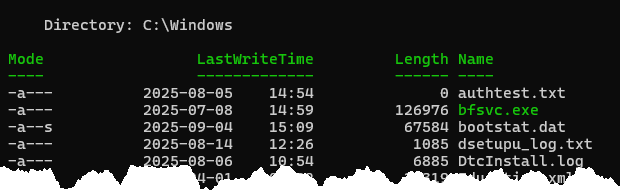
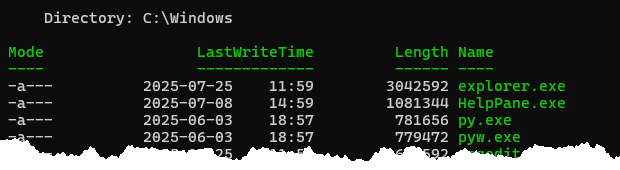
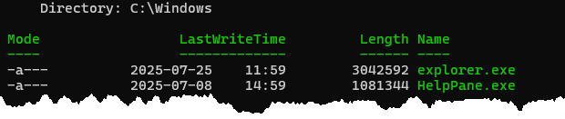
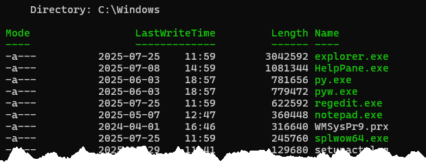
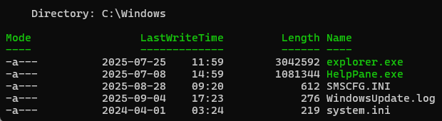
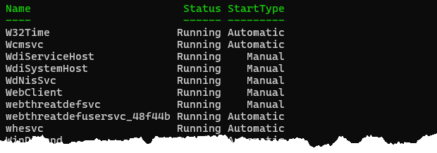
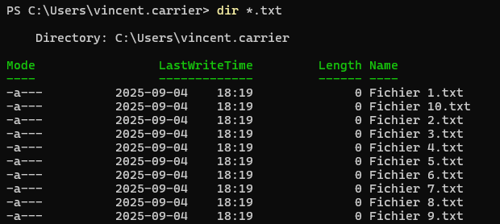
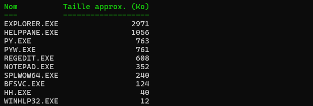
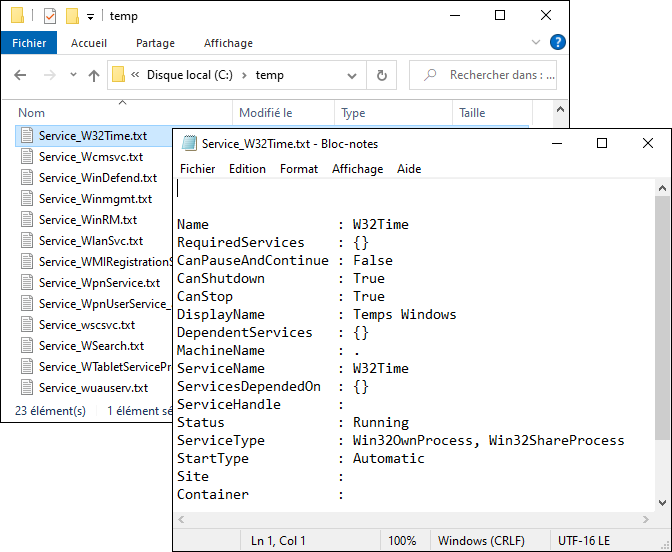

Vous pouvez télécharger ces exercices sous forme de fichier PowerShell. Ouvrez le fichier dans Visual Studio Code (avec l'extension PowerShell installée). Vous pouvez sélectionner une ligne de commande et appuyer sur la touche F8 pour exécuter cette commande dans le terminal intégré.

📝 [Exercice S02](https://github.com/vcarrier/b63-exercices/tree/main/S02%20-%20Pipeline%20-%20Tableaux%20-%20Strings)

## Partie 2.1: Pipeline

Les exercices suivants visent à vous familiariser avec le pipeline PowerShell et le chaînage des commandes.

### 2.1.1. Analyse du pipeline

Pour chacune des lignes de commandes suivantes, décrivez l'objet produit par chaque commande de la chaîne. Pour ce faire, analysez l'objet résultant de chaque maillon à l'aide des commandes `Get-Member` ou `Select-Object`.

1. `"Spooler" | Get-Service | Select-Object * | Format-List | Out-File Spooler.txt`
    - `"Spooler"` *(exemple)*
        - Type de l'objet en sortie: **String**
        - Description: **Le mot "spooler", qui est le nom du service recherché**
    - `Get-Service`
        - Type de l'objet en sortie: 
        - Description: 
    - `Select-Object`
        - Type de l'objet en sortie: 
        - Description: 
    - `Format-List`
        - Type de l'objet en sortie: 
        - Description: 
    - `Out-File`
        - Type de l'objet en sortie: 
        - Description: 

2. `Get-Item C:\Windows\System32\drivers\etc\hosts | Get-Content | Out-Null`
    - `Get-Item`
        - Type de l'objet en sortie: 
        - Description: 
   - `Get-Content`
        - Type de l'objet en sortie: 
        - Description: 
    - `Out-Null`
        - Type de l'objet en sortie: 
        - Description: 

3. `Get-LocalGroup -Name Administrateurs | Get-LocalGroupMember | Select-Object -Property Name, SID | Out-GridView`
    - `Get-LocalGroup`
        - Type de l'objet en sortie: 
        - Description: 
    - `Get-LocalGroupMember`
        - Type de l'objet en sortie: 
        - Description: 
    - `Select-Object`
        - Type de l'objet en sortie: 
        - Description: 

### 2.1.2. Chaînage de commandes

Dans cet exercice, trouvez la ligne de commande PowerShell à utiliser pour obtenir l'information demandée.

Pour chaque question, inscrivez la ligne de commande et insérez une copie d'écran pour votre référence personnelle. Vous devriez pouvoir répondre à la question en utilisant **une seule ligne de commande**, en chaînant plusieurs commandes à l'aide de l'opérateur **`|`** (*pipe*).

A) À l'aide des commandes `Get-ChildItem` et `Select-Object`, obtenez la liste de **tous les fichiers** se terminant par **l'extension .EXE** du répertoire **`C:\Windows`**, en affichant seulement le **nom complet**, la **date de dernière modification** et la **date de création**.

B) Sauvegardez toute l'information retournée par `Get-ComputerInfo` dans le fichier `info.txt` (à créer dans le répertoire courant).

C) À l'aide de la commande `Get-Item`, **affichez le texte** contenu dans ce fichier.

D) Dressez la liste des cartes réseau à l'aide de la commande `Get-NetAdapter` sous forme de tableau avec seulement leur **nom**, leur **description** et leur **adresse MAC**.

E) Créez un nouveau répertoire nommé *Minou* dans le répertoire courant, puis utilisez le pipeline pour entrer dans ce répertoire immédiatement après en une seule ligne de commande.

F) Démarrez Notepad à l'aide de la commande `Start-Process`, mais faites-le en affichant son **numéro de processus (PID)** dans la console. N'affichez que son numéro de processus, rien d'autre, **sans l'en-tête de colonne** "PID". (*Attention, cette commande ne produit pas d'objet de manière automatique, il faut le provoquer*).

G) 🏆 Obtenez la liste de **toutes les adresses IPv4** de votre ordinateur. On souhaite avoir les **informations détaillées** enregistrées dans un **fichier texte**, tout en affichant un **tableau sommaire** dans la console avec seulement une colonne *IPaddress* et une colonne *InterfaceAlias*. Tout ceci doit se faire **en une seule ligne de commande** en utilisant le pipeline. Pour répondre à cette question, vous aurez besoin, entre autres, des commandes `Get-NetIPAddress` et `Tee-Object`.

## Partie 2.2: Tableaux

Les exercices suivants visent à vous familiariser avec les tableaux en PowerShell.

### 2.2.1. Les fichiers

A) Obtenir tous les fichiers contenus dans le répertoire `C:\Windows`.
   

B) Obtenir tous les fichiers contenus dans le répertoire `C:\Windows`, triés **par ordre décroissant de taille**.

C) Même chose, mais montrer seulement les fichiers **plus grands que 1 mégaoctet**.

D) Même chose, mais montrer seulement les fichiers qui pèsent **entre 1 et 10 mégaoctets**.

E) Même chose, mais montrer seulement les fichiers qui pèsent soit **plus de 1 mégaoctet ou moins de 1 kilooctet**.

### 2.2.2. Les services

A) Obtenir la liste de tous les services dont le nom commence par W et afficher les propriétés Name, Status et StartType dans un tableau.

B) Même chose, mais montrer seulement les services en cours d'exécution.

C) Même chose, mais montrer seulement les services en cours d'exécution qui s'exécutent automatiquement.

### 2.2.3. Défis

A) 🏆 Créer 10 fichiers nommés "Fichier 1.txt" à "Fichier 10.txt" dans le répertoire du profil de l'utilisateur.

:::tip Indice
Vous devrez créer un tableau et utiliser la commande `ForEach-Object`!
:::

B) 🏆 Dressez la liste de tous les fichiers .EXE dans C:\Windows, sous forme d'un tableau montrant le nom du fichier en majuscules ainsi que la taille approximative en kilooctets, arrondi à l'entier près.

:::tip Indice
Utilisez les propriétés personnalisées avec `Select-Object`.
:::

C) 🏆🏆 À partir de votre ligne de commande à la question 4.2.3, créez un fichier nommé "Service_nomduservice.txt" pour chaque service dans le répertoire courant. Chaque fichier doit contenir la liste détaillée de toutes les propriétés de ce service.

:::tip Indice
Vous aurez besoin de la commande `ForEach-Object` pour traiter individuellement chaque service, et de la commande `Out-File` ou `Set-Content` pour écrire le fichier. Vous aurez aussi probablement besoin d'insérer une structure `$()` dans une chaîne de caractères quelque part.
:::

