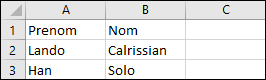

## Partie 3.1: Strings

Les exercices suivants visent à vous familiariser avec les chaînes de caractères en PowerShell.


**A)** Obtenir la liste de tous les chemins contenus dans la **variable d'environnement** `PATH`, sous forme de **tableau de strings**.


**B)** Inverser le sens des barres obliques dans la chaîne `C:\Windows\System32` pour qu'elle devienne `C:/Windows/System32` en utilisant une méthode de remplacement (`replace`).


**C)** En utilisant les solutions précédentes, inversez le sens des barres obliques pour tous les chemins de la variable `PATH`.


**D)** En utilisant PowerShell, rouver la ligne de commande qui donne le **nombre de mots** dans ce texte.

Pour répondre la question, créez la variable suivante (copier-coller):

```powershell
$montexte = "Lorem ipsum dolor sit amet, consectetur adipiscing elit. "      + `
    "Donec interdum ut lorem eget consequat. Nam sed leo hendrerit diam "    + `
    "pharetra blandit. Vestibulum enim diam, congue sit amet sem in, "       + `
    "maximus varius metus. Pellentesque in turpis rutrum, ornare ante a, "   + `
    "dapibus felis. Sed pellentesque, nunc non tincidunt pretium, velit "    + `
    "lorem scelerisque sem, quis tristique elit ex vel massa. Nam quam "     + `
    "magna, tempus sit amet lacus in, placerat suscipit velit. Aenean "      + `
    "eleifend fermentum risus, at laoreet urna malesuada nec. Etiam "        + `
    "tempus lectus scelerisque, sagittis elit sed, posuere nunc. Ut id "     + `
    "dictum libero, sed pharetra metus. Phasellus ac elit arcu. Fusce "      + `
    "nec luctus neque. In commodo id tellus at placerat. Class aptent "      + `
    "taciti sociosqu ad litora torquent per conubia nostra, per "            + `
    "inceptos himenaeos. Nam turpis tortor, eleifend ut tristique "          + `
    "vel, eleifend ut neque."
```


**E)** En utilisant le texte précédente, trouver la ligne de commande qui donne le **nombre de phrases**.


## Partie 3.2: Fichiers CSV

Dans le logiciel Excel, produisez un fichier CSV avec ces valeurs.

| Nom        | Prenom | Profession         |
| ---------- | ------ | ------------------ |
| Skywalker  | Luke   | Jedi               |
| Solo       | Han    | Contrebandier      |
| Calrissian | Lando  | Contrebandier      |
| Vader      | Darth  | Sith               |
| Sidious    | Darth  | Sith               |
| Organa     | Leia   | Princesse          |
| Fett       | Boba   | Chasseur de primes |
| Hutt       | Jabba  | Gangster           |


Voici ce que ça donne dans Excel.


Exportez ensuite le fichier en format CSV.


**A)** Avec PowerShell, utilisez la commande `Get-Content` pour voir le contenu de ce fichier texte. Vous devriez voir ceci:


**B)** Utilisez maintenant la commande `Import-Csv` pour importer le fichier sous forme d'un tableau d'objets. Vous devriez avoir une structure semblable à celle-ci:


** Attention au délimiteur! **


**C)** Donnez le **prénom** et le **nom** des **contrebandiers**, en ordre **alphabétique** de nom.


**D)** Sauvegardez ces nouvelles données dans le fichier contrebandiers.csv afin qu'il puisse être ouvert dans Excel (donc encore attention au délimiteur. Attention aussi à la première ligne qui contient l'information de type. Le fichier devrait ressembler à ceci:


Le fichier devrait pouvoir être ouvert dans Excel sans erreur.




:::info Exercices optionnels

Voici des exercices optionnels sur les expressions régulières. Ces notions n'ont pas été présentées en classe mais sont disponibles dans les notes de cours. Elles ne seront pas validées en examen.

A) En utilisant **une expression régulière**, valider si la chaîne de caractères "A1B 2C3" correspond à **un code postal canadien** à l'aide de l'opérateur `-Match`.

*Note: Un code postal canadien est constitué ainsi: `lettre` `chiffre` `lettre` `espace` `chiffre` `lettre` `chiffre`.*


B) En utilisant **une expression régulière**, trouvez une ligne de commande qui retourne tous les chemins de la variable `PATH` qui **se terminent par un "\\"**.


:::


