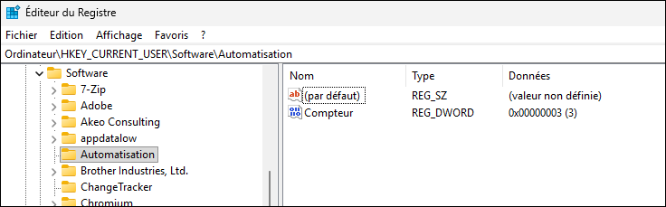

## Partie 1 - Exploration

Dans cette partie, essayez les manipulations suivantes à l'aide d'un script ou de la ligne de commande. Après chaque étape, regardez ce qui se passe dans la base de registre à l'aide de Regedit.

**a)** Sur l'ordinateur du laboratoire, à l'aide de PowerShell seulement, **obtenez** le chemin du fichier affiché comme papier peint. Mettez-le **dans une variable**. Voici l'endroit où ce chemin est stocké:
- Chemin de la clé: `HKEY_CURRENT_USER\Software\Microsoft\Windows\CurrentVersion\Policies\System`
- Nom de la valeur: `Wallpaper`

```powershell
$Path = "HKCU:\Software\Microsoft\Windows\CurrentVersion\Policies\System"
$ValueName = "Wallpaper"
$WallpaperPath = Get-ItemPropertyValue -Path $Path -Name $ValueName
$WallpaperPath
```

:::caution
Il faut faire attention à la syntaxe de PowerShell. Dans le registre, les racines s'écrivent `HKEY_LOCAL_MACHINE\` et `HKEY_CURRENT_USER\`, mais sous PowerShell, il faut utiliser les PSDrives. Les racines s'écrivent donc `HKLM:\` et `HKCU:\`. Par conséquent, la syntaxe suivante est incorrecte et lèvera une erreur:

```powershell
$Path = "HKEY_CURRENT_USER\Software\Microsoft\Windows\CurrentVersion\Policies\System"
$ValueName = "Wallpaper"
# error-next-line
$WallpaperPath = Get-ItemPropertyValue -Path $Path -Name $ValueName        # Erreur!
```
:::


**b)** Vérifiez si **la clé** `HKEY_CURRENT_USER\SOFTWARE\Automatisation` existe.

```powershell
Test-Path -Path "HKCU:\SOFTWARE\Automatisation"
```


**c)** Créez une clé de registre nommée `Automatisation` à l'emplacement suivant dans la base de registre: `HKEY_CURRENT_USER\SOFTWARE`. Puis testez à nouveau l'existence de la clé.

```powershell
$Path = "HKCU:\SOFTWARE\Automatisation"
$NewKey = New-Item -Path $Path -Force
Test-Path -Path $Path
```


**d)** Dans la clé `HKEY_CURRENT_USER\SOFTWARE\Automatisation`, créez une nouvelle valeur `Papier peint` de type `String` ayant pour valeur le chemin du papier peint obtenu à la question précédente:

```powershell
$NewKey | New-ItemProperty -Name "Papier peint" -PropertyType "String" -Value $WallpaperPath
```


**e)** Trouvez une évaluation **booléenne** pour savoir si, vrai ou faux, la **valeur** `Nombre` **existe** dans la clé `HKEY_CURRENT_USER\SOFTWARE\Automatisation`: 

```powershell
$Path = "HKCU:\SOFTWARE\Automatisation"
$ValueName = "Nombre"
[bool](Get-ItemProperty -Path $Path -Name $ValueName -ErrorAction Ignore)
```


**f)** Dans la clé `HKEY_CURRENT_USER\SOFTWARE\Automatisation`, créez une entrée `Nombre` de type `DWord` ayant pour valeur `0`.

```powershell
$NewValueSplat = @{
    Path = "HKCU:\SOFTWARE\Automatisation"
    Name = "Nombre"
    PropertyType = "Dword"
    Value = 0
}
New-ItemProperty @NewValueSplat -Force | Out-Null
```


**g)** Obtenez la valeur de `Nombre` à partir du registre et affecter cette valeur **dans une variable**:

```powershell showLineNumbers
$NombreSplat = @{
    Path = "HKCU:\SOFTWARE\Automatisation"
    Name = "Nombre"
}    
$Nombre = Get-ItemPropertyValue @NombreSplat
```


**h)** Incrémentez la valeur Nombre (lui ajouter 1) et enregistrez cette valeur à la place de l'ancienne dans le registre. 

```powershell showLineNumbers
$Nombre++
Set-ItemProperty @NombreSplat -Value $Nombre
```


**i)** Effacer la valeur `Nombre` de la clé `HKEY_CURRENT_USER\SOFTWARE\Automatisation`.

```powershell
Remove-ItemProperty @NombreSplat
```

**j)** Effacer la clé `HKEY_CURRENT_USER\SOFTWARE\Automatisation` ainsi que tout son contenu.

```powershell
Remove-Item -Path "HKCU:\SOFTWARE\Automatisation" -Force
```


---

## Partie 2 - Défi

Faites un script qui compte le nombre de fois qu'il est exécuté. Il gardera le compte dans une valeur de registre à cet emplacement: 

- Chemin de la clé: `HKEY_CURRENT_USER\SOFTWARE\Automatisation`
- Nom de la valeur: `Compteur`
- Type de la valeur: `DWord`

La première fois que le script est lancé, puisque la valeur de registre n'existe pas encore, il devra **la créer** et l'initialiser à la **valeur 1**. Puis, la deuxième fois que le script roule, la valeur est **incrémentée** à 2. Puis à 3. Et ainsi de suite.

Lorsque le paramètre `-Reset` est appelé, le script **remet le compteur à zéro**.

Voici un exemple d'exécution:

```
# highlight-next-line
PS C:\EspaceLabo> .\compteur.ps1
J'ai été exécuté 1 fois!

# highlight-next-line
PS C:\EspaceLabo> .\compteur.ps1
J'ai été exécuté 2 fois!

# highlight-next-line
PS C:\EspaceLabo> .\compteur.ps1
J'ai été exécuté 3 fois!

# highlight-next-line
PS C:\EspaceLabo> .\compteur.ps1 -Reset
Compteur réinitialisé!

# highlight-next-line
PS C:\EspaceLabo> .\compteur.ps1
J'ai été exécuté 1 fois!
```

Voici ce que ça devrait donner dans Regedit:




