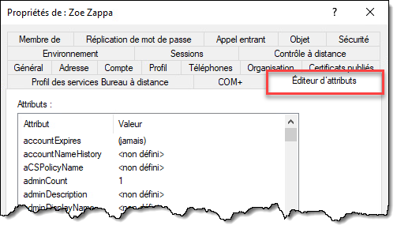
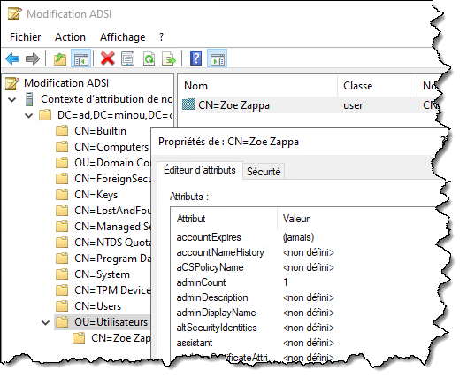

## Outils RSAT

Lorsqu'on fait la promotion d'un serveur Windows en contrôleur de domaine, les outils d'administration d'Active Directory s'installent automatiquement sur cette machine. Les outils d'administration AD font partie d'une collection de consoles MMC connue sous le nom de RSAT (Remote Server Administration Tools).

Il existe plusieurs outils RSAT, qui sont normalement activés lorsqu'on installe le rôle ou la fonctionnalité sur un serveur, afin d'être utilisés localement sur ce serveur. Ce sont des composants optionnels de Windows, qui sont prêts à être installés lorsque nécessaire. Ainsi, la console RSAT DNS est installée automatiquement sur un serveur lorsqu'on active le rôle DNS, et la console DHCP s'installe automatiquement sur un serveur DHCP, etc. On n'est pas obligé d'installer toutes les consoles RSAT, seulement celles dont on a besoin.

Lorsqu'on installe un rôle (par exemple, Active Directory Domain Services), les consoles pour AD s'installent automatiquement. Mais il arrive qu'on souhaite installer une console RSAT sur une machine pour l'administration à distance. On peut donc installer les consoles indépendamment, ce qui nous permet d'utiliser ce serveur pour administrer un service hébergé sur un autre serveur.

Par exemple, il est rare que les administrateurs AD démarrent une session interactive RDP ou locale sur un contrôleur de domaine pour y créer des utilisateurs. Ce n'est pas une bonne pratique. Généralement, les administrateurs vont opérer la console sur une autre machine, soit leur poste de travail ou sur un serveur tiers qu'on qualifie de "jump station".

Les consoles qui font partie des outils RSAT pour Active Directory sont:

- Active Directory Users and Computers (dsa.msc)
- Active Directory Sites and Services (dssite.msc)
- Active Directory Domains and Trusts (domain.msc)
- ADSIEdit (adsiedit.msc)
- Active Directory Administrative Center (dsac.exe)
- Group Policy Managament Tool (gpmc.msc)

Lorsqu'on installe les outils RSAT pour Active Directory, un module PowerShell pour manipuler Active Directory s'installe également. On peut utiliser ce module pour accéder à des commandes PowerShell utilisable dans nos scripts pour automatiser ce que nous ferions normalement à la main via les consoles MMC. Les outils RSAT installés sont exposés via l'élément Administrative Tools du menu Démarrer ou du vieux panneau de configuration de Windows (control.exe).

Les procédures et les commandes pour installer les outils RSAT ne sont pas les mêmes pour les éditions client et serveur de Windows.

### Installer RSAT sous Windows Server

Sur un serveur Windows, par défaut, lorsqu'on installe un rôle ou une fonctionnalité, les outils RSAT correspondants s'installent aussi. Pour installer un outil RSAT sans installer le rôle ou la fonctionnalité, on peut utiliser les commandes dont le nom est *WindowsFeature*.

La commande `Get-WindowsFeature` permet d'obtenir la liste des rôles et fonctionnalités (dans la même liste, contrairement à l'interface graphique). Chaque fonctionnalité a son nom qui respecte une convention de nommage, et toutes les consoles d'administrations commencent par le préfixe RSAT (à l'exception de la console de gestion des stratégies de groupe).

Pour voir tous les outils d'administration disponibles, on peut lancer:

```powershell
Get-WindowsFeature -Name "RSAT-*", "GPMC"
```

Pour installer toutes les consoles de gestion pour Active Directory DS, y compris la console de gestion des stratégies de groupe (GPMC) et le module PowerShell, lancez la commande suivante:

```powershell
Install-WindowsFeature -Name RSAT-AD-Tools, GPMC -IncludeAllSubFeature
```

### Installer RSAT sous Windows 10/11

Sur un client Windows, les outils RSAT sont considérés comme des composants optionnels, aussi appelés "Feature-on-Demand", qui peuvent être installés à la demande. Contrairement aux serveurs, les éditions clientes de Windows doivent télécharger les composants RSAT d'Internet sur les serveurs de mises à jour de Microsoft.

Pour gérer ces composants optionnels, on peut utiliser les commande PowerShell dont le nom est "WindowsCapability".

Pour installer toutes les consoles de gestion pour Active Directory DS, y compris la console de gestion des stratégies de groupe (GPMC) et le module PowerShell, lancez la commande suivante:

```powershell
Get-WindowsCapability -Online | Where-Object { $_.Name -Match "^rsat\.activedirectory|grouppolicy.*$" } | Add-WindowsCapability -Online
```

### Module PowerShell pour ADDS

Les outils RSAT pour administrer Active Directory comprennent un module PowerShell qui offre une panoplie de commandes pour contrôler AD.

Pour l'utiliser, il faut importer le module.

```powershell
Import-Module ActiveDirectory
```

:::info
Il n'est pas nécessaire d'exécuter ces commandes à partir d'un contrôleur de domaine. En fait, il est préférable de le faire à partir d'un autre ordinateur, pourvu qu'il soit membre du domaine. C'est le compte utilisé pour lancer les commandes qui importe, pas la machine sur laquelle elles sont lancées.
:::

On peut ensuite lister toutes les commandes qui sont offertes par ce module.

```powershell
Get-Command -Module ActiveDirectory
```

On peut vérifier les modules installés qui sont disponibles pour être importés. Pour vérifier quels modules sont importés dans la session PowerShell en cours, on utilise la commande `Get-Module`.

```powershell
Get-Module -ListAvailable
```

:::tip

Pour charger le module Active Directory dans un script, on doit lancer la commande `Import-Module` au début du script (plus précisément, avant de lancer toute commande de ce module).

Il est aussi recommandé d'ajouter une instruction `#Requires`, pour faire planter le script automatiquement avant même le début de son exécution si le module Active Directory n'est pas installé. On évite ainsi des erreurs plus tard dans le script.

```powershell
#Requires -Module ActiveDirectory
Import-Module ActiveDirectory
```

Plus de détails sur l'instruction `#Requires` ici: https://docs.microsoft.com/en-us/powershell/module/microsoft.powershell.core/about/about_requires?view=powershell-5.1

:::

## Outils supplémentaires

Pour parcourir graphiquement les attributs des objets, on peut utiliser divers outils.


### Fonctionnalités avancées de la console ADUC

Tout d'abord, la console Utilisateurs et ordinateurs Active Directory (*dsa.msc*) offre un onglet **Éditeur d'attributs**. Il n'est pas visible par défaut; il faut d'abord activer les **fonctionnalités avancées** de la console via le menu **Affichage**.

 




### ADSI Edit

Il existe également un autre outil provenant des outils RSAT: l'outil de modification ADSI (adsiedit.msc). Il permet de parcourir la base de données LDAP du domaine et permet un meilleur contrôle du domaine, à plus bas niveau. 




### ADExplorer (Sysinternals)

Finalement, l'outil [ADExplorer](https://learn.microsoft.com/fr-ca/sysinternals/downloads/adexplorer), provenant de la suite [SysInternals](https://learn.microsoft.com/fr-ca/sysinternals) de Microsoft, permet de parcourir le domaine à très bas niveau, tout comme ADSIEdit, mais ne nécessite pas l'installation des outils RSAT. Il permet une navigation plus fluide que ADSIEdit, en montrant l'arborescence LDAP dans le panneau de gauche et les attributs de l'objet sélectionné dans le panneau de droite. Cet outil n'est pas inclus dans Windows, il faut le [télécharger à partir du site Web de Microsoft](https://learn.microsoft.com/fr-ca/sysinternals/downloads/adexplorer).


### Module AdsiPS

Le module Active Directory de Windows est très pratique mais présente deux inconvénients:
- Il nécessite l'installation des outils RSAT (donc des droits admin locaux et un accès à Microsoft Update)
- Ses commandes n'emploient pas le protocole LDAP standard (port 389/tcp) mais plutôt ADWS (port 9389/tcp)

Mon collègue François-Xavier Cat a développé un module PowerShell qui se veut une alternative au module Active Directory. Il ne nécessite pas d'installation de RSAT et passe par le protocole LDAP.

Voici le lien vers son module: https://github.com/lazywinadmin/AdsiPS 

La manière la plus simple d'installer le module est avec la commande Install-Module

```powershell
Install-Module -Name AdsiPS
```

Si vous ne disposez pas de droits d'administration sur votre machine, vous pouvez alors le faire seulement pour votre profil utilisateur

```powershell
Install-Module -Name AdsiPS -Scope CurrentUser
```

Consultez cette page pour connaître la syntaxe des commandes de ce module: https://github.com/lazywinadmin/AdsiPS/blob/master/docs/doc_functions.md 

