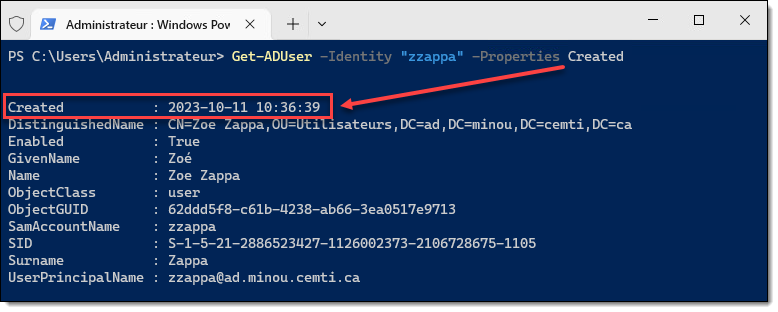

### Comptes utilisateurs

#### Recherche d'un compte utilisateur 

Pour rechercher un utilisateur dans Active Directory, la commande à utiliser est `Get-ADUser`.

Pour rechercher un utilisateur spécifique, on peut spécifier le paramètre `-Identity`. Ce paramètre peut admettre comme valeur le nom d'utilisateur court (sAMAccountName), le nom distinctif (DN), le SID ou le GUID.

```powershell
Get-ADUser -Identity "zzappa"
```

Pour rechercher les utilisateurs obéissant à certains critères, on peut utiliser le paramètre `-Filter`.

```powershell
Get-ADUser -Filter 'sAMAccountName -like "z*"'
```

#### Vérification de l'existence d'un compte utilisateur

Pour tester l'existence d'un utilisateur dans le domaine, voici un exemple:

```powershell
if (Get-ADUser -Filter 'sAMAccountName -eq "zzappa"') {
    Write-Host "L'utilisateur existe."
}
else {
    Write-Host "L'utilisateur n'existe pas."
}
```


#### Création d'un nouveau compte utilisateur

Pour créer un nouvel utilisateur, on peut utiliser la commande `New-ADUser`. Étant donné la quantité d'attributs disponibles dans les objets utilisateurs, cette commande admet un très grand nombre d'arguments. Voici un exemple de création d'un compte utilisateur (la plupart de ces attributs sont facultatifs; en fait, seul le paramètre `Name` est obligatoire).

```powershell
$ADUserSplat = @{
    Path = "OU=Utilisateurs,DC=ad,DC=mondomaine,DC=com"
    Name = "Zoe Zappa"
    GivenName = "Zoé"
    Surname = "Zappa"
    Initials = "Z."
    Title = "Dr."
    DisplayName = "Dr. Zoé Zappa, Ph.D."
    Description = "VP de chépoquoi"
    SamAccountName = "zzappa"
    UserPrincipalName = "zzappa@ad.mondomaine.com"
    AccountPassword = "Passw0rd" | ConvertTo-SecureString -AsPlainText -Force
    ChangePasswordAtLogon = $true
    StreetAddress = "42 rue des timinous"
    City = "Minoupolis"
    Country = "CA"
    PostalCode = "H0H 0H0"
    MobilePhone = "(555) 555-5555"
    EmployeeNumber = "2546011"
    EmailAddress = "zzappa@mondomaine.com"
    Enabled = $true
}

New-ADUser @ADUserSplat
```

Vous pouvez consulter la liste des paramètres de cette commande sur [sa page de documentation](https://learn.microsoft.com/fr-ca/powershell/module/activedirectory/new-aduser).

#### Modification d'un compte utilisateur existant

On peut utiliser la commande `Set-ADUser` pour modifier un attribut d'un compte utilisateur existant. L'exemple suivant modifie l'adresse courriel de l'utilisateur Bob.

```powershell
$ADSetUserSplat = @{
    Identity = "Bob"
    EmailAddress = "bob@mondomaine.com"
}

Set-ADUser @ADSetUserSplat
```


#### Suppression d'un compte utilisateur

On peut utiliser la commande `Remove-ADUser` pour supprimer un compte utilisateur. Voici un exemple en lui passant un compte utilisateur par le pipeline.

```powershell
Get-ADUser -Identity "zzappa" | Remove-ADUser
```

:::tip
Dans son comportement par défaut, `Remove-ADUser` demande une confirmation. Pour rendre l'opération complètement automatique, on peut désactiver le switch `-Confirm`, qui est activé par défaut (étrangement).

```powershell
Remove-ADUser -Identity "zzappa" -Confirm:$false
```
:::


### Groupes

#### Recherche d'un groupe

Pour obtenir de l'information sur un groupe, on peut utiliser la commande `Get-ADGroup`. Cette commande s'emploie de la même manière que pour les utilisateurs.

```powershell
Get-ADGroup -Identity "Comptables"
```

Le paramètre `-Identity` peut admettre le nom du compte (*sAMAccountName*) mais aussi son *SID*, son *GUID* ou son nom distinctif (*DN*).

```powershell
Get-ADGroup -Identity "CN=Comptables,OU=Groupes,DC=ad,DC=mondomaine,DC=com"
```

#### Vérification de l'existence d'un groupe

Pour vérifier si un groupe existe, on peut employer la même logique que pour les utilisateurs.

```powershell
if (Get-ADGroup -Filter 'sAMAccountName -eq "Comptables"') {
    Write-Host "L'utilisateur existe."
}
else {
    Write-Host "L'utilisateur n'existe pas."
}
```

#### Création d'un nouveau groupe

Pour créer un nouveau groupe, voici un exemple. Il faut minimalement spécifier son nom, sa portée (global, domaine local ou universel) ainsi que le nom distinctif complet du conteneur dans lequel le créer.

```powershell
$ADGroupSplat = @{
    Name = "Gestionnaires"
    GroupScope = "Global"
    Path = "OU=Groupes,DC=ad,DC=mondomaine,DC=com"
}

New-ADGroup @ADGroupSplat
```


### Membres de groupes

Un groupe possède des membres, qui peuvent être soit des utilisateurs, des ordinateurs ou d'autres groupes. On nomme ces objets des *principaux de sécurité*. 

#### Obtention des membres d'un groupe

Pour consulter quels principaux de sécurité sont membres d'un groupe spécifique, voici un exemple:

```powershell
Get-ADGroupMember -Identity "Comptables"
```

On peut aussi passer un groupe par le pipeline.

```powershell
Get-ADGroup -Identity "Comptables" | Get-ADGroupMember
```

#### Ajout de membres à un groupe

Pour ajouter un utilisateur à un groupe, voici un exemple:

```powershell
Add-ADGroupMember -Identity "Admins du domaine" -Members "zzappa"
```

On peut également ajouter un autre type de principal de sécurité, comme un compte ordinateur ou un groupe. Le procédé est alors exactement le même; il suffit de donner le nom du groupe ou de l'ordinateur dans l'argument `-Members`. Par ailleurs, puisque le paramètre `-Members` admet un tableau, il est possible de lui passer un tableaux de membres, qui seront tous ajoutés d'un coup au groupe.


#### Retrait de membres à un groupe

Pour retirer un compte d'un groupe, il suffit d'utiliser cette commande:

```powershell
Remove-ADGroupMember -Identity "Admins du domaine" -Members "zzappa"
```

:::tip
Pour éviter de dépendre de la langue du système et de la traduction de ses noms de groupes, on peut utiliser le SID des groupes bien connus, comme le groupe des admins du domaine.

Le SID du groupe des admins du domaine est constitué du SID du domaine suivi du RID 512. Ainsi, voici comment on peut le trouver dynamiquement.

```powershell
$DomainSID = (Get-ADDomain).DomainSID.Value
$DomainAdminSID = "$DomainSID-512"
Add-ADGroupMember -Identity $DomainAdminSID -Members "zzappa"
```
:::


### Attributs

Lorsqu'on utilise des commandes *Get* comme `Get-ADUser` ou `Get-ADComputer`, ce ne sont pas tous les attributs des objets qui sont interrogés, et ce, même si on le passe dans un `Select-Object *`. Pour interroger un attribut qui ne l'est pas par défaut, il faut le spécifier au moyen du paramètre `-Properties`.

```powershell
Get-ADUser -Identity "zzappa" -Properties *
```

Par exemple, pour obtenir la date de création, on peut ajouter la propriété `Created`, qui n'est pas incluse dans l'objet par défaut.




