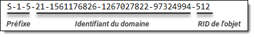

Dans les services de domaine Active Directory, certains objets ont la propriété de pouvoir se faire attribuer des droits à des ressources. Ce sont ces types d'objets qui peuvent, par exemple, être ajoutés à une liste de contrôle d'accès (ACL). Ces objets se nomment les principaux de sécurité. 

Active Directory compte quatre types de principaux de sécurité: les comptes utilisateurs, les comptes d'ordinateurs, les groupes, ainsi que les comptes de service gérés, plus rarement utilisés. Ces objets possèdent un numéro unique de sécurité, le SID, et c'est ce numéro qui est référencé dans les listes de permissions.


### Principaux de sécurité Active Directory

Certains utilisateurs et groupes dans un domaine Active Directory sont créés automatiquement dès la création du domaine. Leur nom peut varier d'un domaine à l'autre, en fonction de la langue du premier contrôleur de domaine ayant été promu. Dans un domaine en anglais, le groupe des admins du domaine se nomme "Domain Admins", alors que dans un domaine en français, il se nomme "Admins du domaine". Même chose pour le compte Administrateur, qui se nomme Administrateur en français, et qu'il est même possible de renommer au moyen d'une GPO. Cela peut compliquer le développement de scripts, qu'on a avantage à rendre le plus général possible.

À titre d'exemple, voici le SID du groupe des admins du domaine sur un domaine donné. Il est composé de l'identifiant du domaine, auquel on greffe un identifiant relatif, le RID, à la fin de celui-ci. Le contrôleur de domaine qui détient le rôle FSMO de RID Master est responsable de la gestion de ces RID, afin de s'assurer qu'ils sont uniques dans tout le domaine.



Les principaux de domaine, quant à eux, sont relatifs au domaine, mais leur RID est toujours le même d'un domaine à l'autre. Le groupe des admins du domaine possède le RID 512, donc leur SID est équivalent au SID du domaine, suivi de "-512". On peut donc obtenir le SID de tout principal de domaine simplement en connaissant son RID ainsi que le SID du domaine, qui peut être obtenu par la commande Get-ADDomain. Les identifiants sont documentés sur le site de Microsoft.

En voici quelques exemples:

| Nom                             | Type             | RID (décimal) | RID (hexadécimal) |
| ------------------------------- | ---------------- | ------------- | ------------------|
| Administrateur                  | Utilisateur      | 500           | 0x000001F4        |
| Admins du domaine               | Groupe global    | 512           | 0x00000200        |
| Utilisateurs du domaine         | Groupe global    | 513           | 0x00000201        |
| Ordinateurs du domaine          | Groupe global    | 515           | 0x00000203        |
| Contrôleurs de domaine          | Groupe global    | 516           | 0x00000204        |
| Administrateurs du schéma       | Groupe universel | 518           | 0x00000206        |
| Administrateurs de l'entreprise | Groupe universel | 519           | 0x00000207        |


Il est préférable d'utiliser le SID d'un de ces principaux, plutôt que son nom, car ainsi, le script peut fonctionner indépendamment de la langue. Il suffit de réunir le SID du domaine et le RID du principal pour obtenir son SID.

```powershell
$DOMAIN_GROUP_RID_ADMINS = 512
$DomainSID = (Get-ADDomain).DomainSid.Value
$DomainAdminSID = "$DomainSID-$DOMAIN_GROUP_RID_ADMINS"
Get-ADGroup -Identity $DomainAdminSID
```

### Groupes de sécurité locaux

Windows dispose de groupes créés automatiquement dès son installation, ainsi que des principaux spéciaux, comme les "utilisateurs authentifiés" ou le groupe "tout le monde". Ces principaux ont toujours le même SID peu importe la machine et peu importe la langue. Les principaux locaux possèdent toujours le même SID. 

| Nom                               | SID            |
| --------------------------------- | -------------- |
| Administrateurs                   | `S-1-5-32-544` |
| Utilisateurs                      | `S-1-5-32-545` |
| Utilisateurs du bureau à distance | `S-1-5-32-555` |
| Invités                           | `S-1-5-32-546` |
| Utilisateurs authentifiés         | `S-1-5-11    ` |
| SYSTÈME                           | `S-1-5-18    ` |
| Tout le monde                     | `S-1-1-0     ` |


Référence: [Security identifiers (Windows 10) - Windows security | Microsoft Docs](https://docs.microsoft.com/en-us/windows/security/identity-protection/access-control/security-identifiers)
