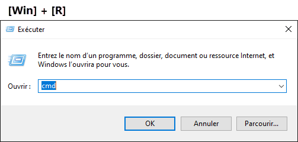
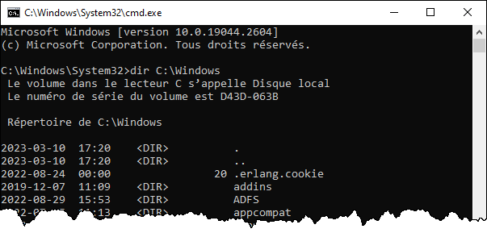

# Introduction

## Les scripts et l'automatisation de tâches

Les scripts et les outils d'automatisation sont un atout considérable en administration réseau. Ils procurent de nombreux avantages, notamment:

- Éliminer les tâches répétitives sans valeur ajoutée
- Exécuter la même tâche sur un grand nombre de machines
- Rentabiliser le temps des équipes TI
- Faire des choses beaucoup plus amusantes et moins routinières!
- Consacrer plus de temps pour l’évolution et l’amélioration continue
- Réduire les risques d’erreurs humaines

## Qu'est-ce qu'une coque logicielle (shell)?

Le shell est l’interface personne-machine d’un système d’exploitation. Il permet à l’utilisateur d’exploiter les fonctionnalités offertes par le système.

Sous Windows, l'interpréteur de commande classique (cmd.exe), l'interface graphique (explorer.exe) et PowerShell constituent les principaux shells. Sous Linux et les autres systèmes basés sur UNIX, le plus connu est bash, mais il en existe aussi plusieurs variantes (sh, csh, ksh, zsh, etc.)

## Qu'est-ce qu'un script d'administration

Contrairement aux langages de programmation comme C++, C# ou Java, les langages de scripts ont généralement ces caractéristiques:
- Centrés sur une tâche précise
- Interprétés (ne nécessitent pas de compilation)
- Ne possèdent pas d’interface graphique
- Utilisent des commandes ou des librairies du système
- Mais possèdent tout de même des structures de contrôle

Souvent, les scripts d'administration sont liés à un shell. Ils exploitent les commandes de celui-ci d’une manière programmatique.

## Principaux langages de script sous Windows

- DOS Batch (.bat, .cmd)
- PowerShell (.ps1)
- VBScript (.vbs, .wsf)
- Python (.py)
- KiXtart (.kix)
- JavaScript (.js, .wsf)

## L'invite de commande Windows

Le shell textuel principal de Windows est l'invite de commande (command prompt en anglais). Son interpréteur est situé dans les fichiers système de Windows:

	C:\Windows\System32\cmd.exe

On peut le lancer par le menu Démarrer, ou simplement en lançant la commande "cmd".

La console démarre avec un invite qui indique le répertoire de travail (le répertoire dans lequel on se trouve). On peut lancer des commandes, une à la fois. Lorsque les commandes interagissent avec le système de fichiers, elles sont relatives au chemin de travail, à moins de spécifier un chemin spécifique en argument.

