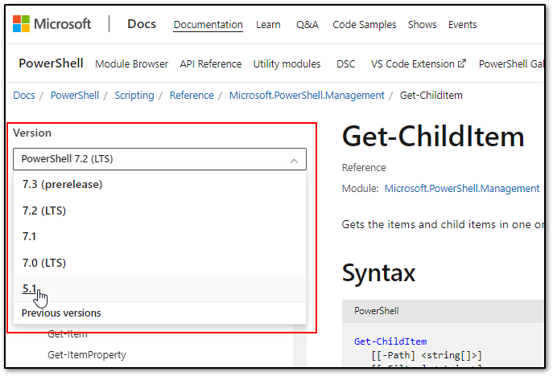
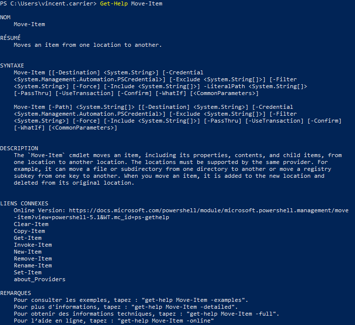
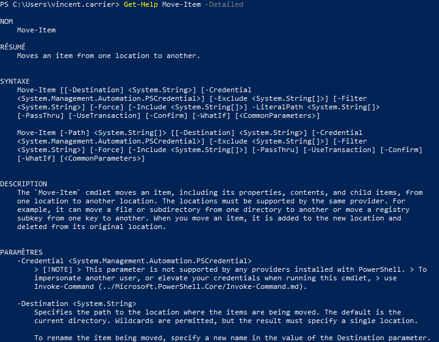
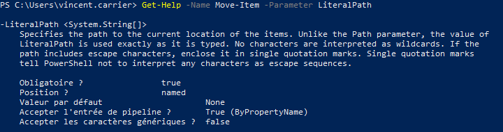
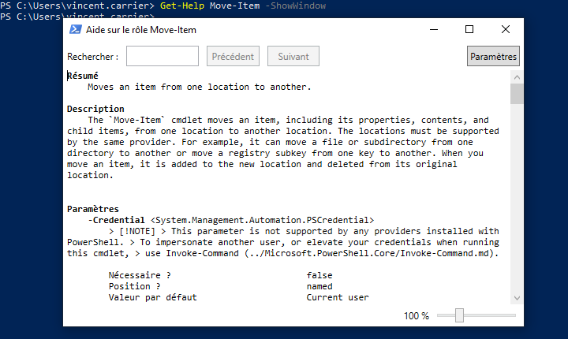
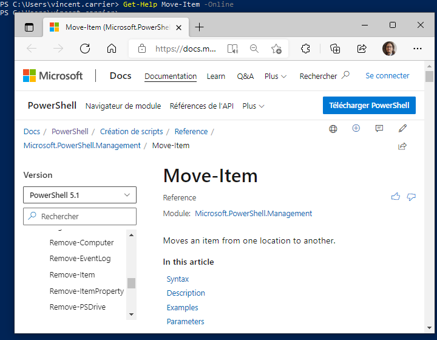
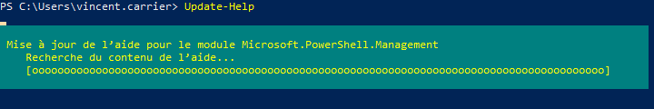
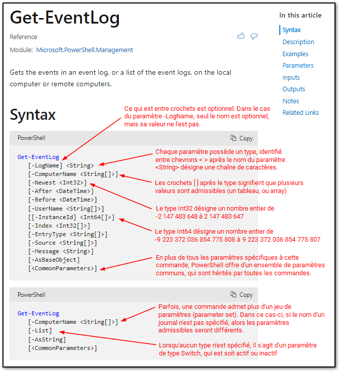
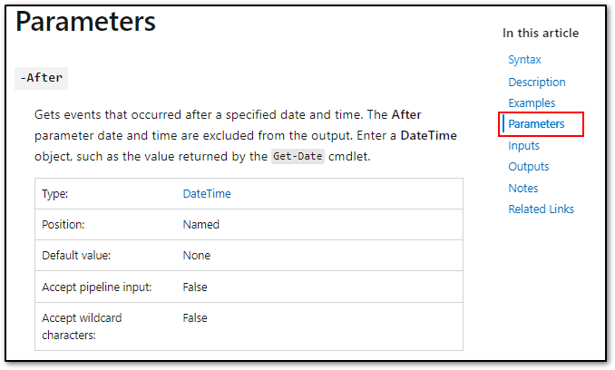

PowerShell est généralement très bien documenté. Vous pouvez avoir accès à la [documentation officielle](https://docs.microsoft.com/fr-ca/powershell/?view=powershell-5.1) sur le site de Microsoft.

:::tip Truc du prof
J'ai habituellement plus de facilité à trouver ce que je cherche sur Google que sur le site de Microsoft. Il suffit de taper "_PowerShell Get-Quelquechose_" pour tomber pile sur la page en question. Assurez-vous toutefois de modifier la version de PowerShell pour celle que vous utilisez (par exemple, Windows PowerShell 5.1).
:::

## Aide à la ligne de commande

En plus du site de Microsoft, PowerShell permet la consultation des rubriques d'aide directement à partir de la ligne de commande, à l'instar de la commande man sous Linux/UNIX. Sous PowerShell, la commande à utiliser est Get-Help.

On peut obtenir une définition plus complète avec le switch -Detailed, ou des exemples d'utilisation avec -Examples. On peut aussi obtenir toute l'information disponible avec le switch -Full.

Vous pouvez obtenir de l'information détaillée sur un paramètre particulier avec le paramètre -Parameter.

Il est possible d'afficher la rubrique d'aide dans une fenêtre séparée avec le switch -ShowWindow.

Finalement, vous pouvez simplement demander à ce que PowerShell ouvre la rubrique d'aide dans votre navigateur Web par défaut, à l'aide du switch -Online.

## Mise à jour de l'aide

Pour pouvoir consulter les rubriques d'aide les plus récente, il faut procéder à la mise à jour de ces dernières. On peut le faire à l'aide de la commande Update-Help. Cette commande se connecte sur Internet pour obtenir la définition la plus à jour de la documentation pour chacun des modules installés sur le système. Notez que cette commande doit se faire avec des privilège d'admin local.

Il se peut qu'il y ait quelques erreurs affichées en rouge. Cela arrive parfois, car pour certaines (rares) commandes, les rubriques d'aide n'existent pas encore. 

## Paramètres disponibles

Pour avoir la liste des paramètres disponibles, vous pouvez consulter l'aide… ou simplement écrire le nom de la commande, puis le trait d'union et appuyer sur la touche de tabulation pour alterner entre chaque paramètre disponible.

Vous pouvez aussi obtenir une liste de sélection des paramètres. Pour cela, il suffit d'écrire le nom de la commande, espace, trait d'union, et appuyer sur Ctrl+Espace pour afficher une liste dans la console. Naviguez dans la liste avec les flèches sur le clavier pour écrire le nom du paramètre. Remarquez qu'en bas de la liste, le type du paramètre est affiché.

## Comprendre la documentation

Les détails des paramètres admis par une commande sont documentés en ligne sur le site de Microsoft. 

La section Syntaxe indique le sommaire de tous les paramètres utilisables.

Source: [Get-EventLog (Microsoft.PowerShell.Management) - PowerShell | Microsoft Docs](https://docs.microsoft.com/en-us/powershell/module/microsoft.powershell.management/get-eventlog?view=powershell-5.1#syntax)

Plus loin dans l'article, on peut trouver la liste des paramètres, en ordre alphabétique. On y spécifie à quoi sert le paramètre, son type, sa position (dans le cas d'un paramètre positionnel), sa valeur par défaut, si ce paramètre peut être fourni par le pipeline, et si des caractères de types wildcard (* et ?) peuvent être spécifiés.

