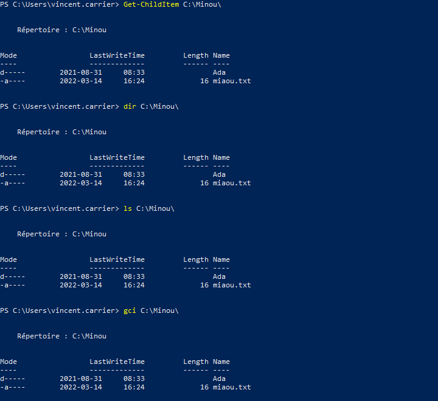
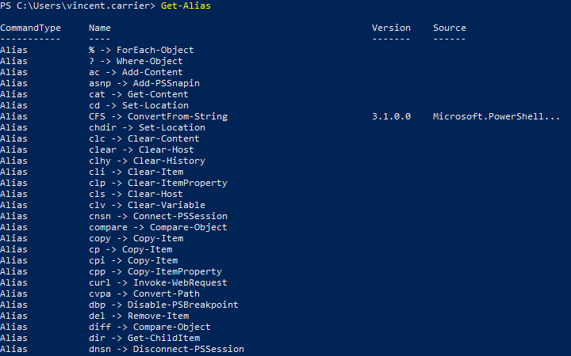
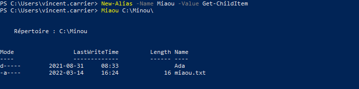

La forme `Verbe-Nom` des commandes a l'avantage d'être explicite et claire, mais a aussi l'inconvénient d'être encombrante dans la ligne de commande. Pour pallier ce problème, PowerShell permet de substituer des alias aux commandes. Ces alias peuvent faire gagner du temps, par le nombre réduit de caractères à taper mais aussi en préservant nos réflexes provenant de la ligne de commande Windows ou Linux.

Par exemple, `Get-ChildItem` dispose de trois alias par défaut: `dir`, `ls` et `gci`. Utiliser ces trois commandes a le même effet que d'utiliser `Get-ChildItem`; on peut voir ça comme un raccourci.

C'est bien pratique dans la ligne de commande, mais il est tout de même préférable d'utiliser le vrai nom de la commande dans un script, car cela aide à la compréhension du script.

Pour voir la liste des alias, il suffit de lancer la commande `Get-Alias`.

Pour créer un nouvel alias, la commande à utiliser est `New-Alias`. 

Il faut faire attention cependant, car cet alias sera détruit lorsque votre session PowerShell se terminera (soit en fermant la console, soit à la fin d'un script). Pour qu'un alias soit permanent, il faut le définir dans un profil. Vous pouvez lire cet article pour en apprendre plus au sujet des profils PowerShell: [à propos des profils - PowerShell | Microsoft Docs](https://docs.microsoft.com/fr-ca/powershell/module/microsoft.powershell.core/about/about_profiles?view=powershell-5.1)

