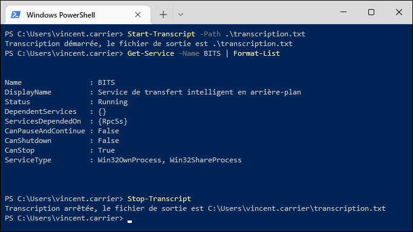
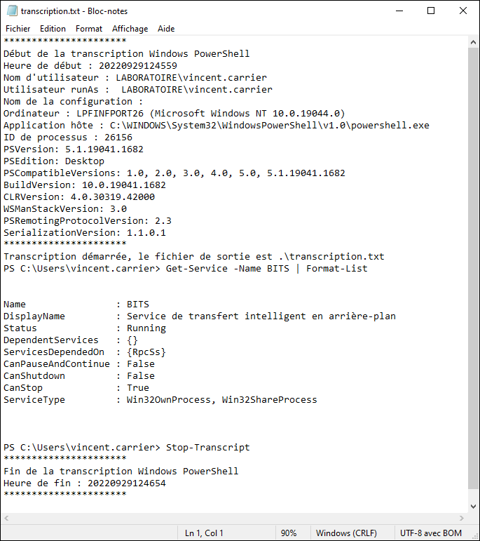

Voici quelques exemples de commandes fréquemment utilisées par les administrateurs de système. Ce n'est qu'un aperçu, car il en existe des centaines. Par ailleurs, vous verrez dans les prochains cours des techniques qui vous permettront de maximiser leur utilisation.

## Système de fichiers

`Get-Item` : Obtient de l'information sur un élément du système de fichiers.

`Get-ChildItem` : Obtient de l'information sur le contenu du répertoire courant.

`Get-ChildItem -Path "C:\Windows"` : Obtient la liste des éléments contenus dans le répertoire _C:\Windows_.

`Get-ChildItem -Recurse` : Obtient la liste des éléments contenus dans le répertoire courant et tous ses sous-répertoires.

`Get-ChildItem -Path "C:\Windows\w*.exe"` : Obtient la liste des éléments dans _C:\Windows_ qui commencent par "_w_" et se terminent par "_.exe_". Le paramètre `-Path` est implicite.

`Get-ChildItem -Directory` : Obtient la liste des *répertoires* contenus dans le répertoire courant.

`Get-ChildItem -File` : Obtient la liste des *fichiers* contenus dans le répertoire courant.

`New-Item "Minou.txt"` : Crée un nouveau fichier vide nommé _Minou.txt_ dans le répertoire courant. Le paramètre `-Path` est implicite.

`New-Item -Path "Minou" -ItemType Directory` : Crée un nouveau dossier nommé _Minou_ dans le répertoire courant.

`New-Item "C:\Temp\Minou.txt"` : Crée un nouveau fichier vide nommé Minou.txt dans le répertoire _C:\Temp_. Le paramètre `-Path` est implicite.

`Remove-Item "C:\Temp\Minou.txt"` : Supprime le fichier _C:\Temp\Minou.txt_. Le paramètre `-Path` est implicite.

`Copy-Item "C:\Temp\Minou.txt" "C:\Temp2\Minou2.txt` : Copie le fichier _C:\Temp\Minou.txt_ vers _C:\Temp2\Minou2.txt_. Les paramètres `-Path` et `-Destination` sont implicites.

`Move-Item "C:\Temp\Minou.txt" "C:\Temp2\Minou2.txt` : Déplace le fichier _C:\Temp\Minou.txt_ vers _C:\Temp2\Minou2.txt_. Les paramètres `-Path` et `-Destination` sont implicites.

`Set-Location "C:\Windows"` : Modifie le répertoire de travail vers _C:\Windows_. Le paramètre `-Path` est implicite.

`Push-Location "C:\Windows"` : Modifie le répertoire de travail vers _C:\Windows_ en gardant en mémoire l'emplacement courant. Le paramètre `-Path` est implicite.

`Pop-Location` : Rétablit le répertoire de travail précédent (celui d'avant le dernier appel de `Push-Location`)

`Get-Content "C:\Windows\System32\drivers\etc\HOSTS"` : Affiche le contenu du fichier HOSTS dans la console.

## Gestion des services

Les services sont des logiciels gérés par Windows qui sont exécutés en arrière-plan et bénificient d'accès privilégiés sur le système. Par l'interface graphique, on peut administrer les services à travers la console MMC du gestionnaire de services (services.msc, compmgmt.msc, etc.) ou par le gestionnaire des tâches (taskmgr.exe). Par la ligne de commande classique, ils peuvent être contrôlés par les commandes NET (contrôle de base) ou SC (contrôle avancé). Voici des exemples de commandes PowerShell pour les manipuler:

`Get-Service` : Obtient la liste des services installés sur le système.

`Get-Service -Name "spooler"` : Obtient l'information sur le service "spooler". Le nom du paramètre `-Name` peut être omis.

`Get-Service "s*"` : Obtient la liste des services dont le nom commence par "_s_". Le paramètre `-Name` est implicite.

`Start-Service -Name "spooler"` : Démarre le service "spooler".

`Stop-Service "spooler"` : Arrête le service "spooler". Le paramètre `-Name` est implicite.

`Restart-Service -Name "spooler"` : Arrête puis démarre le service "spooler" en une seule opération.

`Set-Service -Name "spooler" -StartupType Disabled` : Désactive le service "spooler" (il ne pourra plus démarrer).

## Gestion des processus

Les processus sont des objets logiques servant à attribuer des ressources système à un programme (mémoire, temps de processeur, contexte de sécurité, etc.) afin qu'il puisse s'exécuter. Chaque fois qu'un fichier exécutable est lancé, un processus est créé à son image. Chaque processus dispose d'un identifiant numérique, le PID. Lorsque le programme a terminé son exécution, le processus "meurt" et est détruit, ce qui libère les ressources qui lui étaient réservées. Il est possible d'obtenir de l'information sur les processus en cours d'exécution ou les terminer de force par l'interface graphique à travers le gestionnaire des tâches (taskmgr.exe), ou par la ligne de commande classique au moyen des utilitaires TASKLIST et TASKKILL. Voici des examples de commandes PowerShell permettant de manipuler les processus:

`Get-Process` : Obtient la liste des processus en cours d'exécution sur le système.

`Get-Process 123` : Obtient de l'information sur le processus dont le PID est 123.

`Get-Process -Name "notepad"` : Obtient la liste des processus en cours d'exécution sur le système dont l'image est "notepad". On ne peut pas omettre le nom du paramètre `-Name`, car le paramètre positionnel à la position 0 est `-Id`.

`Start-Process "notepad.exe"` : Démarre une instance de notepad.exe. Le paramètre `-FilePath` est implicite.

`Start-Process -FilePath "notepad.exe" -ArgumentList "C:\Windows\System32\Drivers\etc\hosts" -Verb RunAs` : Ouvre le fichier HOSTS dans Notepad avec des privilèges administrateur.

`Stop-Process -Id 123` : Termine (tue) le processus numéro 123. Cette commande échoue s'il n'y a pas de processus à ce numéro. Le paramètre `-Id` peut être omis.

`Stop-Process -Name "notepad"` : Termine tous les processus qui s'appellent notepad.

## Gestion du stockage

`Get-Volume` : Obtient de l'information sur les volumes de stockage (disque dur, clé USB, etc.) accessibles à Windows.

`Get-Partition` : Obtient de l'information sur les partitions des disques durs et médiums physiques de stockage installés sur le système.

`Get-Disk` : Obtient de l'information sur les périphériques de stockage matériels installés sur le système.

## Gestion des utilisateurs et groupes locaux

`Get-LocalUser` : Obtient la liste des utilisateurs locaux du système.

`Get-LocalGroup` : Obtient la liste des groupes locaux du système.

`Get-LocalGroupMember -Group Administrateurs` : Obtient la liste des membres du groupe local Administrateurs.

`Get-LocalGroupMember -SID "S-1-5-32-544"` : Obtient la liste des membres du groupe local Administrateurs peu importe la langue du système.

## Configuration réseau

`Get-NetAdapter` : Obtient la liste des adapteurs réseau installés (physiques ou virtuels).

`Get-NetAdapter -Physical` : Obtient la liste des adapteurs réseau installés (physiques seulement).

`Get-NetAdapterHardwareInfo` : Obtient la liste des adapteurs réseau matérielles et des informations sur leur connexion physique à l'ordinateur.

`Get-NetIPInterface` : Obtient la liste des interfaces réseau

`Get-NetIPAddress` : Obtient la liste des adresses IP

`Get-NetIPAddress -AddressFamily IPv4` : Obtient la liste des adresses IPv4

`Get-NetIPInterface` : Obtient la liste des interfaces réseau

`New-NetIPAddress –IPAddress 192.168.1.10 -DefaultGateway 192.168.1.1 -PrefixLength 24 -InterfaceIndex 5` : Définit la configuration IP sur l'interface réseau 5.

`Set-DNSClientServerAddress –InterfaceIndex 5 –ServerAddresses 192.168.1.10` : Définit 192.168.1.10 comme résolveur DNS sur l'interface réseau 5.

## Autres commandes

`Clear-Host` : Efface l'affichage dans le programme hôte.

`Get-EventLog -LogName Application -Newest 20` : Obtient la liste des 20 derniers événements du journal Application (dans l'observateur d'événements)

`Get-Date` : Obtient la date et l'heure dans le format localisé du système

`Get-Date -Format "yyyy-MM-dd"` : Obtient la date en format ISO 8601. Vous pouvez consulter [l'article concernant les formats de date](https://learn.microsoft.com/fr-ca/dotnet/standard/base-types/custom-date-and-time-format-strings?view=netframework-4.8) du framework .NET sur le site de Microsoft.

`Get-Date -UFormat "%Y-%m-%d"` : Obtient la date en format ISO 8601. Le résultat est le même que dans l'exemple précédent, mais utilise la notation UNIX au lieu de la notation .NET. Vous pouvez [consulter la documentation](https://learn.microsoft.com/en-us/powershell/module/microsoft.powershell.utility/get-date?view=powershell-5.1#notes) pour en savoir plus.

`Invoke-Item -Path C:\Temp\MonDocument.docx` : Ouvre le fichier spécifié dans le logiciel par défaut traitant ce type de fichier (dans ce cas, Microsoft Word).

`Test-NetConnection -ComputerName "10.10.7.110" -Port 3000` : Teste la connectivité au port 3000/tcp sur la machine 10.10.7.110.

`Restart-Computer` : Redémarre l'ordinateur

`Rename-Computer -NewName "MIAOUMIAOU" -Restart` : Renomme l'ordinateur et redémarre automatiquement

`Install-WindowsFeature -Name "AD-Domain-Services" -IncludeManagementTools` : Installe le rôle Active Directory Domain Services sur Windows Server avec ses outils de gestion.

`Install-ADDSForest -DomainName "ad.minou.net" -DomainNetBIOSName "MINOU" -InstallDNS` : Effectue la promotion du serveur comme premier contrôleur de domaine de sa forêt et installe automatiquement le serveur DNS.

`Add-Computer -DomainName "ad.minou.net" -Restart` : Effectue la jonction du système au domaine ad.minou.net et redémarre automatiquement.

`Add-Computer -DomainName "ad.minou.net" -OUPath "OU=Postes de travail,DC=ad,DC=minou,DC=net"` : Effectue la jonction du système au domaine ad.minou.net et crée le compte utilisateur dans l'OU _Postes de travail_ plutôt que dans le conteneur _computer_ par défaut.

`Install-Module -Name "AdsiPS"` : Installe le module AdsiPS à partir du dépôt PowerShell Gallery.

`Get-Command -Module AdsiPS` : Liste toutes les commandes offertes par le module AdsiPS

## Transcription

Il est possible de demander à PowerShell d'enregistrer automatiquement dans un fichier tout ce qui se fait dans la fenêtre. C'est pratique pour garder des traces de ce qu'on fait. La commande pour tirer profit de cette fonctionnalité est `Start-Transcript`. On fournit à la commande le chemin vers un fichier, et tout ce qui est écrit et affiché dans la console y est sauvegardé. Pour terminer l'enregistrement, il suffit de lancer `Stop-Transcript`, ou simplement de mettre fin à la session PowerShell.

