PowerShell est à la fois un langage de script et un interpréteur de commandes (à l'instar de l'interpréteur classique, cmd.exe).

Non seulement PowerShell permet le développement de scripts, il est également optimisé pour la ligne de commande. Sans même écrire un fichier de script, on peut faire à la ligne de commande ce qui aurait autrement nécessité un script dans plusieurs autres shells.

## Commandes PowerShell (cmdlets)

Dans la plupart des interpréteurs (cmd, bash, etc.), la très grande majorité des commandes qu'on emploie à la ligne de commande ou par script sont essentiellement des exécutables qui se trouvent dans un répertoire spécial. Lorsqu'on utilise des commandes comme Ping ou Ipconfig dans la console, cela ne fait que lancer l'exécutable ping.exe ou ipconfig.exe qui se trouvent dans C:\Windows\system32\ et afficher le texte qui en résulte dans la console.

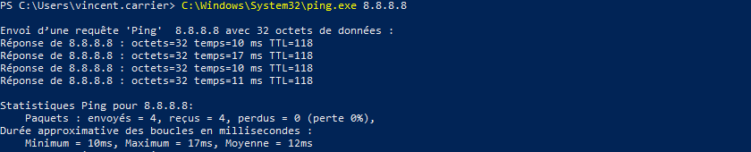

Les données en format textuel sont particulièrement difficiles à interpréter, en supposant par exemple qu'on veuille en extraire certaines valeurs. 

PowerShell fonctionne différemment. En PowerShell, une commande "native" est appelée "cmdlet" et retournent des objets plutôt que du texte. Cela procure plusieurs avantages.

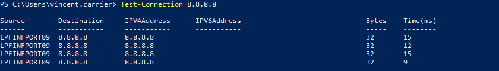

Ce qui est affiché dans la console est une conversion automatique de l'objet en texte. Mais PowerShell permet toute une panoplie de manipulations qu'on peut effectuer sur l'objet avant sa conversion. Par exemple, on peut spécifier le format d'affichage de l'objet, et les propriétés à afficher.

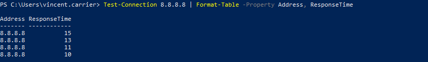

Ou encore, effectuer un calcul sur l'objet. Par exemple, calculer la somme des temps réponse de chacune des 4 tentatives de ping.

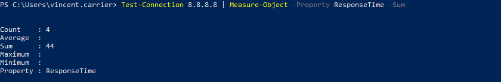

On peut aussi extraire une valeur spécifique.

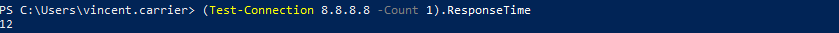

## Appellation d'une commande PowerShell

L'appellation d'une commande (cmdlet) est toujours définie sous la forme `Verbe-Nom`.

### Le verbe (_verb_)

Le verbe décrit une action posée sur un certain élément accessible par le système d'exploitation.

| Verbe     | Description                                 |
| --------- | ------------------------------------------- |
| `Get`     | Obtenir de l'information                    |
| `Set`     | Écrire (remplacer) des données ou attributs |
| `New`     | Créer un nouvel objet                       |
| `Copy`    | Copier un objet                             |
| `Stop`    | Arrêter un objet                            |
| `Restart` | Redémarrer un objet                         |

### Le nom (_noun_)

Le nom décrit un objet sur lequel l'action sera posée.

| Nom | Description |
| -- | -- |
| `Process` | Un ou plusieurs processus en cours d'exécution |
| `Service` | Un ou plusieurs services enregistrés par le gestionnaire de services de Windows |
| `Command` | Une commande PowerShell enregistrée |
| `Location` | Le répertoire courant |
| `Item` | Les éléments du provider (généralement, les fichiers et dossiers du système de fichiers) |
| `Computer` | L'ordinateur |
| `Help` | Les rubriques d'aide |

### Exemples de commandes

Une commande sert à poser une action sur quelque chose. Son nom est donc la combinaison d'un verbe et d'un nom.

| Commande | Description |
| -- | -- |
| `Get-Process` | Obtient l'information sur un ou plusieurs processus en cours d'exécution |
| `Get-Item` | Obtient de l'information sur un élément  (fichier ou dossier) |
| `Get-ChildItem` | Obtient de l'information sur un ou plusieurs éléments enfant (fichier ou dossier, équivalent à la commande DIR ou LS) |
| `Copy-Item` | Copie un élément (fichier ou dossier) |
| `Stop-Service` | Arrête un service en cours d'exécution |
| `Start-Service` | Démarre un service enregistré |
| `Restart-Service` | Redémarre un service en cours d'exécution |
| `Set-Location` | Modifie le répertoire courant (équivalent à CD) |
| `New-LocalUser` | Crée un nouvel utilisateur local sous Windows |
| `Get-EventLog` | Obtient un ou plusieurs événements au journal de Windows |
| `Restart-Computer` | Redémarre un ordinateur (local ou distant) |

## Anatomie d'une commande

En plus de son nom, la commande doit admettre certaines informations en entrée, afin de bien décrire l'action qui doit être posée. On peut ainsi lui spécifier un certain nombre d'arguments.

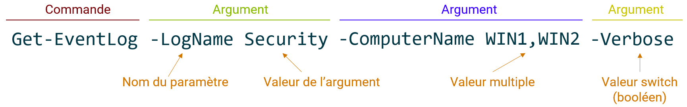

Les arguments viennent s'insérer dans les paramètres qui sont admis par la commande. Chaque commande comporte son jeu de paramètres, et chaque paramètre a un nom, qu'on identifie en les préfixant par un trait d'union. Il en existe plusieurs grands types:

- Les paramètres qui admettent une valeur
- Les paramètres qui admettent une ou plusieurs valeurs (séparées par des virgules)
- Les paramètres booléens, qu'on appelle switch, et qui activent une option lorsqu'on les spécifie

## Paramètres positionnels

Il est possible de spécifier des paramètres sans toujours identifier leur nom. C'est particulièrement pratique à la ligne de commande, pour sauver du temps et des frappes de touches.

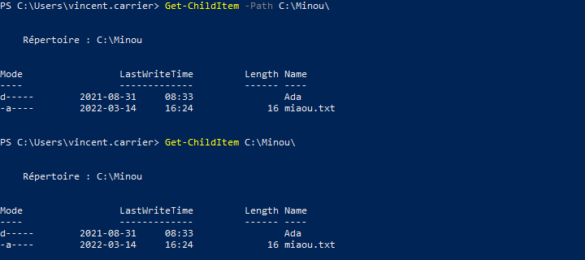

L'utilisation de paramètres positionnels nuit toutefois à la lisibilité, puisqu'il faut connaître par cœur ce que signifie la première position, la seconde, etc. 

Par exemple, lorsqu'on utilise la commande Copy-Item avec deux paramètres positionnels, le premier représente le chemin de la source et le second, le chemin de destination; bien que cet ordre soit intuitif et bien ancré dans nos réflexes, il faut néanmoins le connaître par cœur. En spécifiant les noms des paramètres, non seulement la signification de chaque argument est explicite, mais en plus, ils peuvent être disposés dans n'importe quel ordre.

Par exemple, `Copy-Item -Path C:\Minou\miaou.txt -Destination C:\Pitou\wouf.txt` a le même effet que `Copy-Item -Destination C:\Pitou\wouf.txt -Path C:\Minou\miaou.txt`

La signification des paramètres positionnels varie selon le type des valeurs qu'on spécifie, et sont documentés en ligne sur le site Web de Microsoft. La position 0 désigne le premier argument, la position 1 désigne le deuxième, et ainsi de suite.

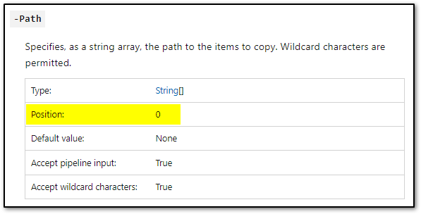

Source: [Copy-Item (Microsoft.PowerShell.Management) - PowerShell | Microsoft Docs](https://docs.microsoft.com/en-us/powershell/module/microsoft.powershell.management/copy-item?view=powershell-5.1#parameters)

Pour en savoir plus sur les paramètres: [à propos des paramètres - PowerShell | Microsoft Docs](https://docs.microsoft.com/fr-ca/powershell/module/microsoft.powershell.core/about/about_parameters?view=powershell-5.1)

## Commandes disponibles

Il y a un grand nombre de commandes disponibles dans PowerShell. Non seulement il y a les commandes qui font partie intégrante de la base de PowerShell, mais il est possible d'en enregistrer des nouvelles en installant des modules supplémentaires.

Il existe plusieurs manières d'obtenir la liste des commande disponibles.

### Get-Command

La commande `Get-Command` retourne un objet qui énumère toutes les commandes disponibles dans la session PowerShell.

Attention, y'en a beaucoup!

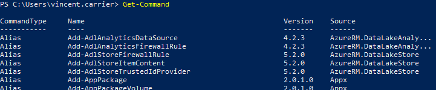

On peut savoir combien il y en a avec la commande Measure-Object. Cette commande sert à effectuer une analyse d'un objet, comme pour compter ses éléments (lorsqu'il s'agit d'une collection d'objets).

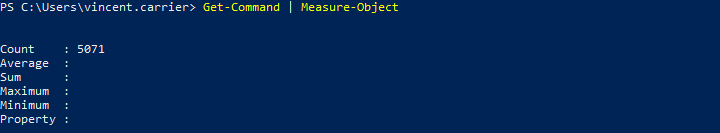

On peut rechercher toutes les commandes qui concernent un type d'objet en particulier, à l'aide du paramètre -Noun.

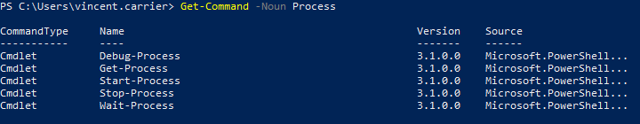

Ou encore, toutes les commandes qui font partie d'un module précis (dans cet exemple, le module Defender qui permet de contrôler l'anti-virus Microsoft Defender)

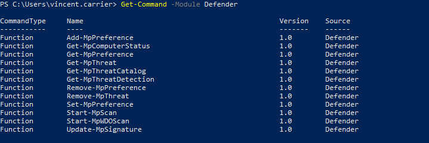

### Show-Command

La commande `Show-Command` affiche à l'écran une interface graphique (GUI) pour vous aider à trouver une commande et à la construire avec tous ses paramètres.

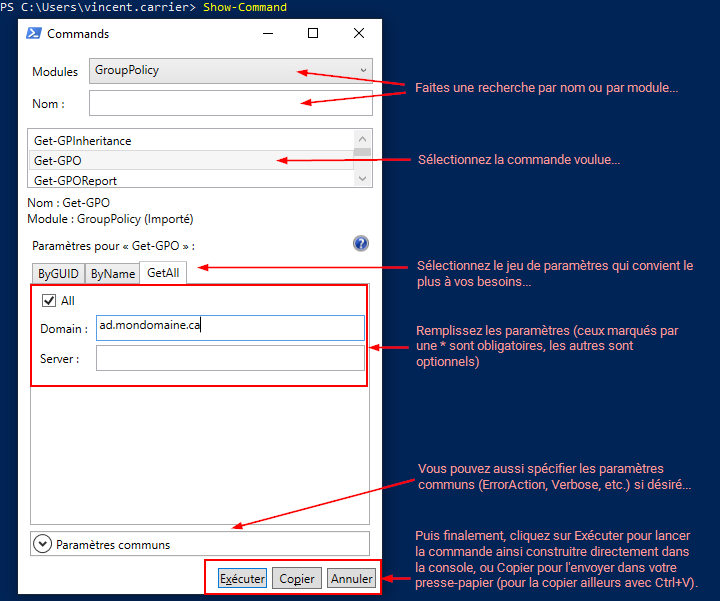

