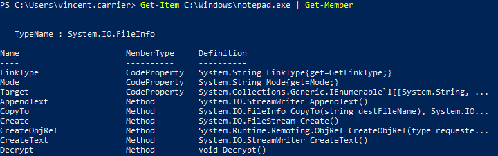
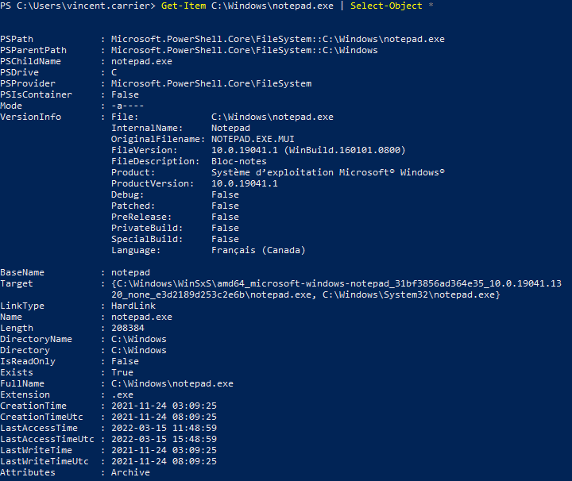
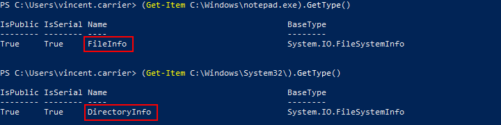

Les commandes PowerShell retournent un ou plusieurs objets. Un objet est une structure de données, un élément logique d'information d'une structure définie par une classe (ou type). Il est composé de plusieurs membres, soit des propriétés (ou méthodes), qui représentent de l'information décrivant l'objet, et des méthodes (ou fonctions) qui posent une action sur cet objet.

## Connaître les membres d'un objet

La commande `Get-Member` permet d'obtenir la liste des propriétés et des méthodes offertes par cet objet. Dans le cas d'une collection d'objets, elle analyse le type d'objet dans la collection.

On peut spécifier le type de membre pour une recherche plus ciblée.

## Obtenir une propriété

Par exemple, la commande `Get-Item` retourne l'information sur un fichier ou un dossier. Le résultat de cette commande est un objet qui décrit le fichier ou le dossier correspondant.

Si l'objet représente un fichier, il possèdera une propriété `.Length` qui représente sa taille, en octets. Pour accéder à un membre d'un objet, on utilise le caractère point. Il y a plusieurs manières d'identifier l'objet, soit avec des parenthèses, soit en le passant dans une variable.

## Explorer les propriétés d'un objet

Pour explorer un objet, il est également utile de demander à lister toutes ses propriétés.

Il est ainsi plus facile de trouver des propriétés intéressantes.

## Appeler une méthode

L'appel d'une méthode se fait de la même manière que pour une propriété, sauf que la méthode peut accepter des paramètres. Comme une méthode n'est pas une commande PowerShell, les paramètres n'obéissent pas aux même règles: ils ne sont pas nommés, et doivent être spécifiés en parenthèses.

Si la méthode qu'on appelle n'a pas de paramètre, il faut écrire les parenthèses quand même.

## Connaître le type d'un objet

Une manière de connaître le type d'un objet est d'appeler sa méthode GetType(). Cette méthode existe dans tous les types d'objets, et retourne un objet qui décrit le type de cet objet.

Par exemple, la commande Get-Item peut retourner des fichiers et des dossiers, qui sont des structures très différentes. Selon l'élément que l'on tente d'obtenir, le type de l'objet résultant sera différent.

Si la commande retourne plusieurs objets, alors le type de l'objet retourné sera un array, c'est-à-dire un objet qui contient plusieurs objets. On les identifie avec des crochets [ ] à la fin de leur type.

