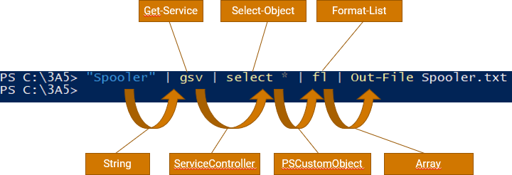
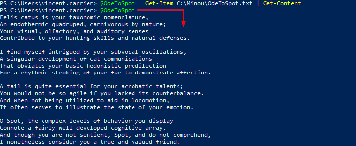
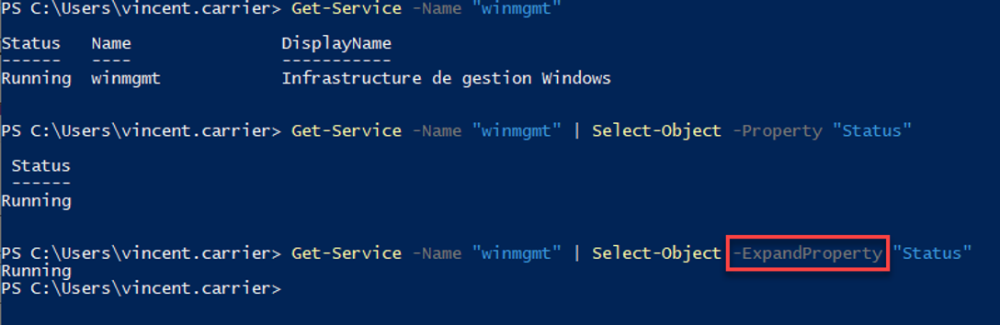
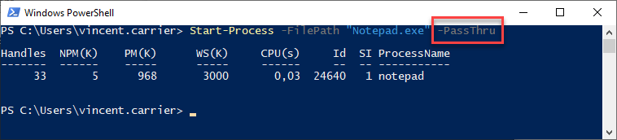
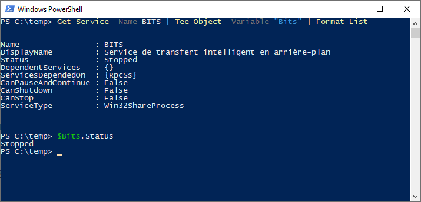

Le _pipeline_ est le mécanisme par lequel l'information circule dans une session PowerShell. Il permet de chaîner des commandes afin que l'objet sortant d'une commande entre dans la prochaine pour y être traité. Le caractère pour chaîner les commande est la barre verticale `|` (appelée "_pipe_" ou "_tube_").

Pour mieux conceptualiser le _pipeline_, on peut voir chaque commande comme une machine qui prend un ou plusieurs objets en entrée (_input_), effectue un traitement en tenant compte de ces intrants (qui peuvent impliquer des appels au système d'exploitation), puis produit un objet en sortie (_output_) et le jette dans le _pipeline_.


Une commande produisant un objet en sortie (ou un objet déposé directement dans le _pipeline_) sera donc passé en entrée à la commande suivante, qui le passera dans un de ses paramètres, le traitera et produira un autre objet de type différent, qui pourra être passé à la prochaine commande, et ainsi de suite.



À la fin du _pipeline_, l'objet qui s'y trouve "tombe" dans la console (le host), où il sera automatiquement converti en texte selon plusieurs règles régies à la fois par la configuration de PowerShell et par la nature de cet objet.


On peut éviter à l'objet de tomber dans la console en le "pipant" dans une autre commande (habituellement, avec le verbe Out-), ou bien en l'affectant à une variable.



Si on souhaite se débarrasser de l'objet résultant, il suffit de terminer la chaîne de _pipeline_ par la commande Out-Null, qui désigne simplement une sortie vers rien du tout.


## Sélection

Plusieurs commandes, et particulièrement celles dont le verbe est `Get`, produisent des objets en sortie dans le pipeline, qui possèdent des propriétés. Certains objets en possèdent un grand nombre, et lorsqu'ils sont affichés sous forme de texte dans la console, parfois seules les propriétés principales sont affichées. Une opération simple consiste à "extraire" de cet objet certaines propriétés. Cette opération se nomme la "sélection" et peut être réalisée avec la commande `Select-Object`. 

La sélection ne "transforme" pas vraiment l'objet, elle en produit plutôt une copie transformée.

On peut créer des objets composés de certaines propriétés en spécifiant le paramètre `-Property` de la commande `Select-Object`.

Par exemple, la commande suivante permet de "transformer" l'objet représentant le service "winmgmt" en objet composé uniquement de ses propriétés `Name`et `Status`.

```powershell
Get-Service -Name "winmgmt" | Select-Object -Property "Name", "Status"
```

On remarque qu'à l'exécution de cette commande, il reste des entêtes de colonnes. Alternativement, on peut extraire seulement la **valeur** de la propriété en spécifiant le paramètre `-ExpandProperty`.

```powershell
Get-Service -Name "winmgmt" | Select-Object -ExpandProperty "Status"
```




## Commandes de formatage

Lorsqu'un objet arrive au bout du _pipeline_, il est automatiquement converti en texte par PowerShell afin d'être affiché dans la console dans un format lisible par l'utilisateur. Comme un objet possède des données brutes, PowerShell doit faire un choix dans sa manière de représenter textuellement l'objet à l'écran. Le formatage se fait en fonction de plusieurs facteurs, dont la nature de la commande, le nombre de propriétés de l'objet, etc. On peut utiliser des commandes de formatage (typiquement, des commandes débutant par le verbe `Format-`.)

| Commande | Alias | Description |
| -- | -- | -- |
| `Format-List` | `fl` | Convertit l'objet en texte sous forme de liste |
| `Format-Table` | `ft` | Convertit l’objet en texte sous forme de tableau (moins détaillé) |
| `Format-Wide` | `fw` | Convertit l’objet en texte réparti sur la largeur (très sommaire) |
| `Format-Hex` | `fhx` | Convertit des données en texte montrant leur valeur hexadécimale |

On peut également effectuer des sélections à l'intérieur même de la commande de formatage. 


C'est pratique pour explorer toutes les propriétés d'un objet. On peut le formater sous forme de liste et forcer l'affichage de toutes ses propriétés avec le symbole *.


:::caution
Une fois un objet passé dans la commande de formatage, il est automatiquement converti en texte. C'est pourquoi le formatage est généralement utilisé à la toute fin du pipeline, ou avant une commande de sortie (`Out-`).
:::

## Commandes de sortie

Par défaut, lorsqu'un objet arrive au bout du _pipeline_, il est affiché dans la console (_host_) après avoir été converti en texte. On peut rediriger l'objet vers une autre sortie, comme un fichier ou une imprimante. Voici quelques commandes de sortie disponibles:

| Commande | Alias | Description |
| -- | -- | -- |
| `Out-Default` |  | Envoie l’objet vers la sortie par défaut (implicite, par défaut Out-Host) |
| `Out-Host` | `oh` | Envoie l’objet vers la console (il sera converti automatiquement en texte) |
| `Out-File` |  | Envoie l’objet vers un fichier (il sera converti automatiquement en texte) |
| `Out-Null` |  | Envoie l’objet vers le néant (l’objet sera détruit) |
| `Out-String` | `oss` | Convertit les objets en chaîne de caractères |
| `Out-Printer` | `lp` | Envoie l’objet vers une imprimante |
| `Out-GridView` | `ogv` | Sort l’objet vers une grille graphique (dans une fenêtre séparée) |


## Paramètre PassThru

Ce ne sont pas toutes les commandes qui produisent un objet sur le pipeline. Certaines commandes n'en produisent pas, soit parce qu'elles n'ont pas à le faire, soit parce que la plupart du temps, on n'a pas besoin de cet objet.

Par exemple, la commande `Start-Process` sert à démarrer un processus (un exécutable). Par défaut, lorsqu'on lance cette commande, elle se contente de demander à Windows de créer un processus et ne retourne rien. 


Mais il peut arriver qu'on souhaite enregistrer des informations sur le processus nouvellement créé. Certaines commandes offrent un paramètre `-PassThru`, qui permettent de forcer la production d'un objet décrivant le résultat de la commande. Dans ce cas, la commande `Start-Process` produit un objet décrivant le processus.




## Commande Tee-Object

La commande `Tee-Object` sert à enregistrer un objet dans une variable ou un fichier, en le relayant en même temps sur le pipeline.




