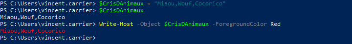
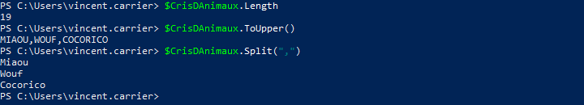
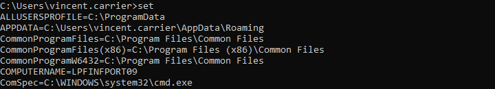
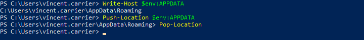
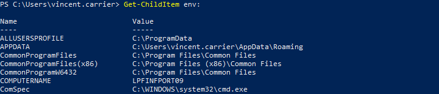
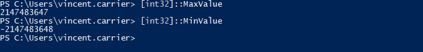
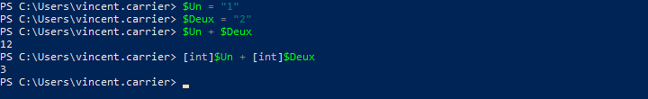
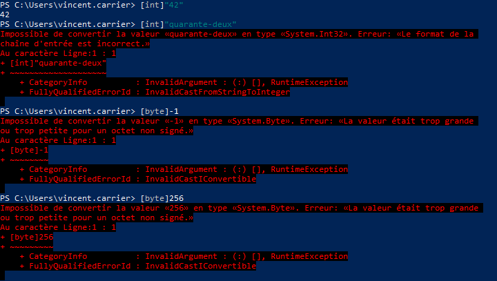
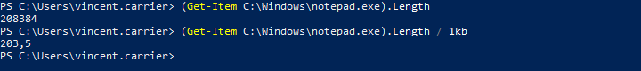

Les variables en PowerShell sont identifiées avec le préfixe `$`. Par exemple, la variable _Foo_ s'écrit `$Foo` dans le code PowerShell. Le nom de la variable est _Foo_, et le caractère `$` indique à PowerShell qu'il s'agit d'une variable.

Une variable contient un objet. L'opération consistant à mettre un objet dans une variable se nomme une affectation, et on la réalise à l'aide de l'opérateur d'affectation, `=`. Cet opérateur récupère l'objet résultant à la fin du _pipeline_ afin de le stocker dans la variable, plutôt que de le laisser tomber dans la console.

Pour obtenir le contenu d'une variable, on utilise simplement son nom avec le caractère `$`. Cela a pour effet d'envoyer son contenu dans le _pipeline_. On peut aussi utiliser cette variable pour passer un objet dans un paramètre.

Une variable contient un objet, donc on peut l'utiliser pour accéder à toutes les méthodes et tous les attributs offerts par cet objet.

On peut connaître la liste de toutes les variables déclarées avec la commande `Get-Variable`.

## Variables prédéfinies

Certaines variables sont prédéfinies par PowerShell.

| Variable | Description |
| -- | -- |
| `$true` | Représente la valeur booléenne vraie |
| `$false` | Représente la valeur booléenne fausse |
| `$null` | Représente la valeur nulle |
| `$PID` | Le numéro d'identification du processus courant |
| `$PWD` | Représente le répertoire courant |
| `$args` | Contient un tableau des arguments passés à l'appel d'une fonction ou d'un script |
| `$error` | Liste des erreurs lors de la session |
| `$PSVersionTable` | Tableau des versions de PowerShell |
| `$Host` | Objet qui permet de modifier l'interface PowerShell |
| `$Home` | Le chemin du répertoire de l'utilisateur (typiquement `C:\Users\nomdutilisateur`) |
| `$PSHome` | Le chemin dans lequel PowerShell est installé |
| `$PSCulture` | La culture de la session PowerShell (`fr-CA`, `en-US`, etc.) |
| `$_` ou `$PSItem` | Valeur courante dans le _pipeline_ |
| ... | |

## Variables d'environnement

Le système d'exploitation offre à tous les processus un ensemble de variables gérées par le système et qui procurent de l'information sur l'environnement d'exécution. 

Voici quelques variables d'environnement (mais il y en a plusieurs autres).

| Variable (PoSH) | Description |
| -- | -- |
| `$env:COMPUTERNAME` | Le nom d'hôte de l'ordinateur |
| `$env:USERNAME` | Le nom de l'utilisateur |
| `$env:USERDOMAIN` | Le nom du domaine de l'utilisateur courant (format NetBIOS) |
| `$env:USERDNSDOMAIN` | Le nom du domaine de l'utilisateur courant (format FQDN) |
| `$env:LOGONSERVER` | Le nom du contrôleur de domaine ayant authentifié l'utilisateur lors de son logon |
| `$env:UserProfile` | Le chemin vers le profil de l'utilisateur (typiquement C:\Users\nomdutilisateur) |
| `$env:APPDATA` | Chemin vers le répertoire AppData/Roaming de l'utilisateur courant |
| `$env:LocalAppData` | Chemin vers le répertoire AppData/Local de l'utilisateur courant |
| `$env:HOMEDRIVE` | Le lecteur sur lequel est situé le profil de l'utilisateur |
| `$env:HOMEPATH` | Le chemin relatif du profil utilisateur sur le lecteur HOMEDRIVE |
| `$env:TEMP` | Le chemin vers le répertoire temporaire de l'utilisateur (même que TMP) |
| `$env:TMP` | Le chemin vers le répertoire temporaire de l'utilisateur (même que TEMP) |
| `$env:ALLUSERSPROFILE` | Le chemin vers le profil utilisateur commun à tous les utilisateurs (programdata) |
| `$env:ProgramData` | Le chemin du répertoire qui contiennent les configurations du système |
| `$env:ProgramFiles` | Le chemin vers le répertoire contenant les fichiers de programme |
| `$env:{ProgramFiles (x86)}` | Le chemin vers le répertoire des fichiers de programme 32-bits (WoW64) |
| `$env:Path` | La liste des chemins qui contiennent des commandes exécutables |
| `$env:PATHEXT` | La liste des extensions à considérer comme exécutables |
| `$env:PUBLIC` | Le chemin vers le répertoire public (partagé par tous les profils) |
| `$env:NUMBER_OF_PROCESSORS` | Le nombre de processeurs logiques installés dans le système |
| `$env:PROCESSOR_ARCHITECTURE` | L'architecture du processeur (x86, amd64, ia64, arm64, etc.) |
| `$env:ComSpec` | Le chemin vers l'interpréteur de commande par défaut |
| `$env:OneDrive` | Le chemin vers le répertoire de synchronisation de OneDrive |
| `$env:OneDriveCommercial` | Le chemin vers le répertoire de synchronisation de OneDrive For Business |
| `$env:SystemDrive` | Le lecteur sur lequel Windows est installé (typiquement C:) |
| `$env:SystemRoot` | Le chemin vers le répertoire où Windows est installé (typiquement C:\Windows) |
| `$env:PSModulePath` | La liste des chemins qui contiennent des modules PowerShell |

Dans l'interpréteur de commande classique (cmd), et à plusieurs autres endroits du système (comme dans le shell graphique, le registre, etc.), les variables d'environnement sont accessibles en les entourant de deux symboles `%`.

La commande Set permet d'obtenir la liste des variables d'environnement.

Sous PowerShell, la syntaxe est différente. On utilise le préfixe `$env:` pour y accéder.

Pour obtenir la liste, on fait un `Get-ChildItem` sur le lecteur `env:`, qui contient toutes les variables d'environnement du processus.

:::caution

Les variables d'environnement sont rattachées à un processus particulier, et chaque processus créé hérite des variables d'environnement du processus parent. Ainsi, si on fait des modification à une variable d'environnement, celle-ci ne sera modifiée que dans ce processus et pas les autres. De plus, le changement sera détruit après la fin du processus, lorsque la fenêtre PowerShell est fermée. Il est possible de modifier une variable d'environnement de manière permanente, mais nous verrons cela dans une séance ultérieure.

:::

## Types de données

Tout objet en PowerShell possède un type, et s'il est dans une variable, celle-ci possède également ce type. Il existe plusieurs types distincts.

### Nombres entiers

| Type                    | Description                 | Valeur minimale            | Valeur maximale            |
| ----------------------- | --------------------------- | -------------------------- | -------------------------- |
| `[byte]`                | Entier non signé de 8 bits  | 0                          | 255                        |
| `[sbyte]`               | Entier signé de 8 bits      | -128                       | 127                        |
| `[int16]`               | Entier signé de 16 bits     | -32 768                    | 32 767                     |
| `[uint16]`              | Entier non signé de 16 bits | 0                          | 65 535                     |
| `[int32]` _ou_ `[int]`  | Entier signé de 32 bits     | -2 147 483 648             | 2 147 483 647              |
| `[uint32]`              | Entier non signé de 32 bits | 0                          | 4 294 967 295              |
| `[int64]` _ou_ `[long]` | Entier signé de 64 bits     | -9 223 372 036 854 775 808 | 9 223 372 036 854 775 807  |
| `[uint64]`              | Entier non signé de 64 bits | 0                          | 18 446 744 073 709 551 615 |

:::info
Par défaut, les nombres entiers sont de type `[int32]` (ou `[int64]` s'il sont trop grands). Pour qu'ils soient de type différent, il faut le spécifier devant la valeur. (Par exemple, `[uint32]42`).
:::

### Nombre à virgule flottante (décimaux)

| Type                      | Description                                                 | Précision | Valeur minimale/maximale                 |
| ------------------------- | ----------------------------------------------------------- | --------- | ---------------------------------------- |
| `[single]` _ou_ `[float]` | Nombre à virgule flottante de précision simple              | 32 bits   | ± 3,402 823 E+38                         |
| `[double]`                | Nombre à virgule flottante de précision double (par défaut) | 64 bits   | ± 1,79 769 313 486 232 E+308             |
| `[decimal]`               | Nombre décimal                                              | 128 bits  | ± 79 228 162 514 264 337 593 543 950 335 |

:::info
Par défaut, les nombres non entiers sont de type `[double]`. Pour qu'ils soient d'un autre type, il faut le spécifier devant la valeur (par exemple, `[single] 3.14`).

Les nombres à virgule flottante sont la méthode qu'emploient les ordinateurs pour représenter les nombres non entiers. Ils combinent une mantisse et un exposant, comme dans la notation scientifique, ce qui permet de représenter de très grands nombres mais en sacrifiant de la précision. Vous pouvez suivre ce lien pour en apprendre davantage sur la virgule flottante en informatique.
:::

### Autres types de données

| Type                      | Description                                                                      | Example                                                    |
| ------------------------- | -------------------------------------------------------------------------------- | ---------------------------------------------------------- |
| `[boolean]` _ou_ `[bool]` | Valeur booléenne (`$true` ou `$false`)                                           | `$true`                                                    |
| `[string]`                | Chaîne de caractères à taille fixe                                               | `"allo"`                                                   |
| `[char]`                  | Caractère unicode de 16 bits                                                     | `[char]"X"`                                                |
| `[datetime]`              | Date et heure                                                                    | `Get-Date`                                                 |
| `[hashtable]`             | Table de hachage                                                                 | `@{a = 1; b = 2; c = 3}`                                   |
| `[pscustomobject]`        | Objet dictionnaire                                                               | `[pscustomobject]@{a = 1; b = 2; c = 3}`                   |
| `[object]`                | Type qui décrit n'importe quel objet (toutes les classes dérivent de `[object]`) |                                                            |
| `[array]` _ou_ `[type[]]` | Tableau (contient plusieurs objets, dans un ordre précis)                        | `@(1, 2, 3)`                                               |
| `[scriptblock]`           | Bloc de script précompilé                                                        | `$script = [scriptblock]{ # une ou plusieurs commandes… }` |
| `[math]`                  | Expose des fonctions mathématiques                                               | `[math]::Pow(10,2)`                                        |

Pour en savoir plus sur les types de données PowerShell, consultez [cette page](https://learn.microsoft.com/fr-fr/powershell/scripting/lang-spec/chapter-04?view=powershell-5.1).

### Valeurs minimum et maximum

Toute donnée est un objet, et un objet possède un type. Dans le paradigme orienté objet, un type est une classe, et un objet de ce type est une instance de cette classe. Les classes sont en quelque sorte des plans, ou modèles, qui dictent à quoi une donnée doit ressembler. Une classe est représentée entre crochets `[` et `]`.

La classe elle-même expose des méthodes et des attributs, dits statiques, qui décrivent certains aspects de ce type. Alors qu'on peut accéder aux méthodes et attributs d'un objet (ou instance de classe) avec un point `.` , on accède les méthodes et attributs d'une classe avec un double deux points `::`.

Dans le cas des types numériques, des attributs de la classe correspondant au type nous permettent d'obtenir les valeurs minimum et maximum que ce type supporte.

### Conversion de types

On peut convertir les valeurs d'un type à l'autre, et les castant, c’est-à-dire en forçant le type.

Il faut toutefois faire attention que la valeur soit compatible avec le type vers lequel on souhaite la convertir.

### Suffixes de multiplication des octets

PowerShell nous offre un moyen de calculer facilement les grandeurs (Ko, Mo, Go, etc.)

| Suffixe | Signification | Valeur                                                    |
| ------- | ------------- | --------------------------------------------------------- |
| Kb      | Kibioctet     | 210 = 1024                                     |
| Mb      | Mébioctet     | 220 = 10242 = 1 048 576             |
| Gb      | Gibioctet     | 230 = 10243 = 1 073 741 824         |
| Tb      | Tébioctet     | 240 = 10244 = 1 099 511 627 776     |
| Pb      | Pébioctet     | 250 = 10245 = 1 125 899 906 842 624 |

Cela peut s'avérer très pratique pour, par exemple, calculer les tailles de fichiers.

