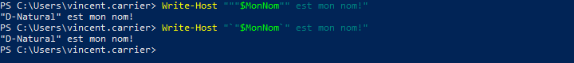
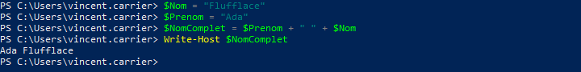

## Chaînes de caractères

Les chaînes de caractères sont un type de données particulièrement commun dans tous les langages de programmation, et PowerShell ne fait pas exception.

### Guillemets

En PowerShell, les chaînes de caractères sont balisées par des guillemets. Les guillemets simples et doubles sont acceptés.


Un type de guillemet compris dans une chaîne balisée par l'autre type de guillemets sera affiché tel quel.


Par contre, les deux types de guillemets se comportent différemment avec les variables. Le variables écrites dans une chaîne à guillemets doubles sont résolues, alors que celles dans une chaîne à guillemets simples ne le sont pas.


Pour écrire à la fois des guillemets doubles dans une chaîne et résoudre une variable, on peut soit doubler les guillemets doubles (un double-double-guillemet représente le caractère du double-guillemet), ou encore mettre un caractère d'échappement (le backtick) juste avant pour le forcer à être représenté comme caractère dans la chaîne.



Pour les cas plus complexes, on peut construire une variable temporaire au sein d'une chaîne de caractères, avec la formule $(). C'est pratique si on veut non pas résoudre une variable dans une chaîne, mais plutôt résoudre une expression.


De cette manière, on peut résoudre n'importe quelle expression au sein de la chaîne de caractères.


### Concaténation

On peut aussi concaténer deux chaînes de caractères avec l'opérateur de concaténation `+`.



Une autre option pour unir plusieurs éléments d'une chaîne est d'utiliser l'opérateur de formatage `-f`. On écrit la chaîne de caractères mais en y insérant des jetons \{n\}. Ceux-ci seront remplacés par le contenu des variables spécifiées après l'opérateur `-f`.


Ou encore, on peut toujours insérer les variables directement dans la chaîne, lorsqu'on utilise des guillemets doubles.


```powershell
$prenom = "Yvon"
$nom = "Rocher"

"Bonjour $prenom $nom!"
#retourne: "Bonjour Yvon Rocher!"

"Bonjour {0} {1}!" -f $prenom $nom
#retourne: "Bonjour Yvon Rocher!"

"Bonjour " + $prenom + " " + $nom + "!"
#retourne: "Bonjour Yvon Rocher!"

[String]::Concat("Bonjour ",$prenom," ",$nom,"!")
#retourne: "Bonjour Yvon Rocher!"
```

### Nettoyage

Il arrive que des chaînes de caractères comprennent des espaces de trop au début ou à la fin. Les méthodes `Trim()`, `TrimStart()` et `TrimEnd()` les éliminent.

```powershell
$miaou = "          miaou          "  # 10 espaces avant et après

"[" + $miaou.Trim() + "]"
#retourne: "[miaou]"

"[" + $miaou.TrimStart() + "]"
#retourne: "[miaou          ]"

"[" + $miaou.TrimEnd() + "]"
#retourne: "[          miaou]"
```

### Padding

Le padding est une opération qui consiste à ajouter des espaces au début ou à la fin d’une chaîne.

Les méthodes `PadRight(<n>)` et `PadLeft(<n>)` permettent d’ajouter assez d’espaces à droite ou à gauche pour que la longueur totale de la chaîne soit de `n`.

```powershell
$pitou = "Wouf!"

"["+ $pitou.PadLeft(10) +"]"
#retourne: "[     Wouf!]" (5 espaces avant + 5 caractères = 10)

"["+ $pitou.PadRight(10) +"]"
#retourne: "[Wouf!     ]" (5 caractères + 5 espaces après = 10)
```

### Fractionnement (split)

La méthode `Split()` permet séparer une chaîne en plusieurs morceaux. Elle produit donc un array de chaînes plus petites, séparées par un délimiteur commun. Le délimiteur par défaut est l’espace, mais on peut en spécifier un en paramètre.

```powershell
$fruits = "pomme banane kiwi"
$fruits.Split()
#retourne un array contenant les chaînes "pomme", "banane" et "kiwi"

$legumes = "oignon;carotte;celeri"
$legumes.Split(';')
#retourne un array contenant les chaînes "oignon", "carotte" et "celeri"
```

On peut aussi spécifier le nombre maximum de fractions.

```powershell
$legumes = "oignon;carotte;celeri"
$legumes.Split(';',2)
#retourne un array contenant les chaînes "oignon" et "carotte;celeri"
```

Comme le résultat de la méthode `Split()` retourne un *array*, on peut le manipuler comme n'importe quelle collection. Voici un exemple:

```powershell
$fruits = "pomme banane kiwi"
$tabFruits = $fruits.Split()

$tabFruits[1]
#retourne la chaîne: "banane"

$tabFruits | Where-Object { $_ -like "b*" } | Write-Host -ForegroundColor Yellow
#écrit "banane" en jaune dans la console.
```

### Extraction

On peut extraire une partie d'une chaîne de caractères à l'aide de la méthode `Substring()`. 

Cette méthode prend deux paramètres:
- Le premier désigne le point de départ (le premier caractère est 0)
- Le deuxième désigne le nombre de caractères à l'inclure

```powershell
"Lorem ipsum".Substring(2,3)
# Retourne les 3 caractères à partir du caractère #2, soit "rem".
```

Suivant la même logique, la méthode `Remove()` permet de retirer une partie de la chaîne.

```powershell
"Lorem ipsum".Remove(2,3)
# Retourne la chaîne sans les 3 caractères à partir du caractère #2, soit "Lo ipsum".
```


### Remplacement

La méthode `Replace()` permet de remplacer toutes les occurrences d'une chaîne dans une autre.

Cette méthode prend deux paramètres:
- Le premier désigne le texte à remplacer
- Le deuxième désigne le texte de remplacement

```powershell
"Lorem ipsum".Replace("m","che")
# Retourne "Loreche ipsuche"
```

### Recherche

La méthode `IndexOf()` retourne le numéro du caractère (le premier étant 0) où débute un certain texte. Cette méthode retourne uniquement la position de la première occurrence, mais on peut spécifier un point de départ; dans ce cas, elle retourne la première occurrence à partir de cette position.

```powershell
"Lorem ipsum".IndexOf("m")
#retourne: 4

"Lorem ipsum".IndexOf("m",6)
#retourne: 10
```

### Comparaison

PowerShell offre déjà les opérateurs `-eq`, `-ieq` et `-ceq` pour comparer les chaînes de caractères.
- Les opérateurs `-eq` (sous Windows) et `-ieq` ignorent la casse.
- L’opérateur `-ceq`, lui, est sensible à la casse.

```powershell
"Lorem ipsum" -eq "lorem ipsum"
#retourne: True

"Lorem ipsum" -ieq "lorem ipsum"
#retourne: False
```

On peut aussi utiliser la méthode `Equals()`.
- Par défaut, elle est sensible à la casse.
- On peut spécifier 1 au deuxième paramètre pour qu'elle ignore la casse.

```powershell
"Lorem ipsum".Equals("lorem ipsum")
#retourne: False

"Lorem ipsum".Equals("lorem ipsum",1)
#retourne: True
```

### Correspondance

Pour savoir si une chaîne contient une autre chaîne, on peut utiliser la méthode `Contains()`.

```powershell
"Lorem ipsum".Contains("rem")
#retourne: True
```

On peut aussi arriver au même résultat avec l'opérateur `-like` et les wildcards `*`.

```powershell
"Lorem ipsum" -like "*rem*"
#retourne: True
```


## Expressions régulières (regex)

Les expressions régulières sont des chaînes de caractères qui décrivent une multitude de chaînes de caractères possibles. C’est comme les wildcards, mais beaucoup plus précis.

On utilise un regex en construisant un **pattern** suivant une syntaxe particulière afin de décrire les règles de correspondance d’un chaîne de caractères.

PowerShell supporte nativement les regex, par le biais de plusieurs commandes ou opérateurs, notamment:
- Les opérateurs `-match` et `-replace`
- La commande `Select-String`

L'opérateur `-match` est l'équivalent de `-like`, mais permet des patterns regex, qui sont beaucoup plus complexes et précis. L'opérande de gauche représente la chaîne à tester, celle de droite représente le **pattern regex**. Le résultat de l'opérateur est une valeur booléenne.

L'exemple suivant teste si la chaîne de caractère contient "oo".

```powershell
"google" -match "oo"
#retourne: True
```

Les patterns regex permettent des validation beaucoup plus précises. Voici quelques possibilités que permettent les expressions régulières.


### Sélection de lettres

Si on spécifie plusieurs lettres entre crochets, cela signifie qu'on permet une de ces lettres. Par exemple, pour le pattern `cr[iao]c`, on permet les chaînes `cric`, `crac`, `croc`, mais pas `cruc`.

```powershell
"cric" -match "cr[iao]c"
# Retourne: True

"crac" -match "cr[iao]c"
# Retourne: True

"croc" -match "cr[iao]c"
# Retourne: True

"cruc" -match "cr[iao]c"
# Retourne: False
```

À l'inverse, le pattern `cr[^iao]c` permet `cruc` mais pas `cric`. La lettre représentée par `[^iao]` peut être n'importe quel caractère SAUF i, a et o.

```powershell
"cric" -match "cr[^iao]c"
# Retourne: False

"crac" -match "cr[^iao]c"
# Retourne: False

"croc" -match "cr[^iao]c"
# Retourne: False

"cruc" -match "cr[^iao]c"
# Retourne: True
```

### Début et fin de ligne

Par défaut, un pattern s'applique à n'importe quelle partie de la chaîne. Par exemple, le pattern `cr[iao]c` signifie que la chaîne est valide si, à n'importe quel endroit dans la chaîne, on retrouve un **c**, suivi d'un **r**, suivi d'un **i** ou d'un **a** ou d'un **o**, suivi d'un **c**.

```powershell
"cric" -match "cr[iao]c"
# Retourne: True

"crachat" -match "cr[iao]c"
# Retourne: True

"escroc" -match "cr[iao]c"
# Retourne: True
```

On peut spécifier le début ou la fin de la chaîne avec les caractères `^` et `$` respectivement.

```powershell
"cric" -match "^cr[iao]c$"
# Retourne: True

"crachat" -match "^cr[iao]c$"
# Retourne: False

"escroc" -match "^cr[iao]c$"
# Retourne: False
```

### Caractères spécifiques

On peut spécifier des catégories de caractères spécifiques.

| Code | Description |
| -- | -- |
| `\w` (minuscule) | Caractère alphanumérique (tous les chiffres et les lettres) |
| `\W` (majuscule) | Caractère non alphanumérique (caractères spéciaux) |
| `\d` (minuscule) | Caractère numérique (chiffres de 0 à 9) |
| `\D` (majuscule) | Caractère non numérique (lettres et caractères spéciaux) |
| `\s` (minuscule) | Caractère blanc (espace, espace insécable, etc.) |
| `\S` (majuscule) | Caractère non blanc |
| `[0-9]` | Plage de chiffres |
| `[a-z]` | Plage de lettres |
| `[a-zA-Z]` | Plage de lettres majuscule et minuscule |
| `.` | N'importe quel caractère |
| `\t` | Le caractère de tabulation (`U+0009`) |
| `\r` | Le caractère de retour de chariot (`U+000D`) |
| `\n` | Le caractère de saut de ligne (`U+000A`) |

```powershell
"42" -match "^\d\d$"
# Retourne: True

"42" -match "^\D\D$"
# Retourne: False

"42" -match "^[0-9][1-4]$"
# Retourne: True

"4x" -match "^\w\w$"
# Retourne: True

"&%" -match "^\W\W$"
# Retourne: True

"lol" -match "^[a-z][a-z][a-z]$"
# Retourne: True

"l0l" -match "^[a-z][a-z][a-z]$"
# Retourne: False

"cr&c" -match "^cr.c$"
# Retourne: True

"cr c" -match "^cr.c$"
# Retourne: True

"A 1" -match "^\S\s\S$"
# Retourne: True

"A-1" -match "^\S\s\S$"
# Retourne: False
```

### Valeurs énumérées

Le caractère `|` permet d'énumérer certaines valeurs possibles.

```powershell
"Il y a une erreur!" -match "erreur|error"
# Retourne: True

"There is an error!" -match "erreur|error"
# Retourne: True

"Il y a un problème!" -match "erreur|error"
# Retourne: False
```


### Quantification

On peut définir des répétitions de caractères dans un pattern regex. Voici la syntaxe à utiliser:

| Code | Description |
| -- | -- |
| `*` | Répétition de 0 fois ou plus |
| `+` | Répétition de 1 fois ou plus |
| `?` | Présence 0 ou 1 fois seulement |
| `{n}` | Présent exactement n fois |
| `{n,m}` | Présent entre n et m fois |
| `{n,}` | Présent au minimum n fois |

Voici quelques exemples:

```powershell
$mots = @("Ggle", "Gogle", "Google", "Gooogle")

$mots | Where-Object { $_ -match '^Go*gle$'}
# Retourne: Ggle, Gogle, Google, Gooogle

$mots | Where-Object { $_ -match '^Go+gle$'}
# Retourne: Gogle, Google, Gooogle

$mots | Where-Object { $_ -match '^Go?gle$'}
# Retourne: Ggle, Gogle

$mots | Where-Object { $_ -match '^Go{2}gle$'}
# Retourne: Google

$mots | Where-Object { $_ -match '^Go{1,2}gle$'}
# Retourne: Gogle, Google

$mots | Where-Object { $_ -match '^Go{2,}gle$'}
# Retourne: Google, Gooogle
```


### Groupes de capture

Les patterns regex permettent de définir des groupes de caractères, pour la répétition ou encore l'extraction de leur valeur. On identifie les groupes entre parenthèses et leur valeur est répertoriée dans le *hashtable* contenu dans la variable `$Matches`.

```powershell
$Message = "The last logged on user was CONTOSO\jsmith"

$Message -match '(.+was )(.+)'
# Retourne: True

$Matches.0
# Retourne: la chaîne complète

$Matches.1
# Retourne: "The last logged on user was "

$Matches.2
# Retourne: "CONTOSO\jsmith"
```

On peut donner des noms aux groupes. La syntaxe est alors: `(?<nomdugroupe>pattern)`.

```powershell
$Message = "The last logged on user was CONTOSO\jsmith"

$Message -match 'was (?<domain>.+)\\(?<user>.+)'
# Retourne: True

$Matches.domain
# Retourne: "CONTOSO"

$Matches.user
# Retourne: "jsmith"
```

Un groupe peut aussi servir d'unité de répétition.

```powershell
"poutpout" -match '^(pout){3,}$'
# Retourne: False

"poutpoutpout" -match '^(pout){3,}$'
# Retourne: True

"poutpoutpoutpout" -match '^(pout){3,}$'
# Retourne: True
```

### Caractère d'échappement

Dans un pattern, on peut représenter la plupart des caractères, mais certains sont réservés en ont une signification particulière dans la syntaxe regex. Ces caractères sont: `[ ] ( ) . \ ^ $ | ? * + { }`

Pour utiliser ces caractères dans leur valeur litérale au sein d'un pattern, ils doivent être précédés d'un `\`. Ce caractère "annule" leur effet sur la syntaxe.

```powershell
"3.141" -match "3\.\d{2,}"
# Retourne: True

"C:\Windows" -match "^C:\\."
# Retourne: True
```

### Remplacement

L'opérateur -replace admet les expressions régulières. Il permet de remplacer toutes les occurrences d'un pattern par une chaîne de caractères de remplacement.

```powershell
$message = "Mon numéro de téléphone est 450-555-0168 et mon cellulaire est 514-555-0666"
$message -replace "\d{3}-\d{3}-\d{4}", "confidentiel"

# Retourne: "Mon numéro de téléphone est confidentiel et mon cellulaire est confidentiel."
```

On peut aussi faire un remplacement en préservant le contenu d'un groupe.

```powershell
'CONTOSO\jsmith' -replace '\w+\\(?<user>\w+)', 'MONDOMAINE\${user}'

# Retourne: "MONDOMAINE\jsmith"
```

