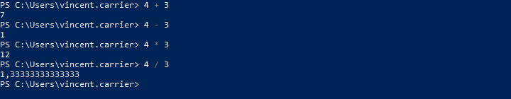

## Opérateurs arithmétiques

| Opérateur | Description    |
| --------- | -------------- |
| `+`       | Addition       |
| `-`       | Soustraction   |
| `*`       | Multiplication |
| `/`       | Division       |
| `%`       | Modulo         |

L'opérateur modulo sert à donner le reste de la division entière. En PowerShell, c'est le caractère `%` qui désigne cet opérateur. Pour la division entière par contre, PowerShell n'offre pas d'opérateur, à la différence de plusieurs autres langages. L'opérateur `/` produit une valeur de type `[double]` si le résultat n'est pas un nombre entier, et caster le résultat à `[int]` arrondit ce résultat à l'entier le plus proche. Par conséquent, la composante entière de la division peut être obtenue en appelant la fonction plancher de la classe utilitaire Math.

## Opérateurs de comparaison

Les opérateurs de comparaison retournent une valeur booléenne vraie ou fausse dans le pipeline, selon un critère précis. On les utilise entre deux valeurs.

| Opérateur       | Description               | Exemple                                       |
| --------------- | ------------------------- | --------------------------------------------- |
| `-eq`           | Égal à                    | `0 -eq 0`                                     |
| `-ne`           | Pas égal à                | `0 -ne "allo"`                                |
| `-gt`           | Plus grand que            | `1 -gt 0`                                     |
| `-ge`           | Plus grand ou égal à      | `0 -ge 0`                                     |
| `-lt`           | Plus petit que            | `-1 -lt 0`                                    |
| `-le`           | Plus petit ou égal à      | `0 -le 0`                                     |
| `-like`         | Comparaison avec wildcard | `"allo" -like "a*"`                           |
| `-notlike`      | Inverse de `-like`        | `"bonjour" -notlike "a*"`                     |
| `-match`        | Comparaison regex         | `"514-555-0123" -match "\d{3}-\d{3}-\d{4}"`   |
| `-nomatch`      | Inverse de `-match`       | `"(514) 555-0123" -match "\d{3}-\d{3}-\d{4}"` |
| `-is`           | Comparaison de type       | `1.1 -is [double]`                            |
| `-isnot`        | Inverse de `-is`          | `1 -isnot [double]`                           |
| `-and`          | Et logique                | `(0 -eq 0) -and ("pomme" -eq "pomme")`        |
| `-or`           | Ou logique                | `(0 -eq 0) -or ("pomme" -eq "banane")`        |
| `-not` _ou_ `!` | Non logique               | `-not (1 -eq 0)`   `!(1 -eq 0)`           |
| `-xor`          | Ou exclusif               | `$true -xor $false`                           |

## Opérateurs d'affectation

Les opérateurs d'affectation modifient l'opérande de gauche.

| Opérateur             | Description                      | Exemple    | Équivalent    |
| --------------------- | -------------------------------- | ---------- | ------------- |
| `=`                   | Affectation simple               | `$i = 2`   |               |
| `+=`                  | Affectation après addition       | `$i += 2`  | `$i = $i + 2` |
| `-=`                  | Affectation après soustraction   | `$i -= 2`  | `$i = $i - 2` |
| `*=`                  | Affectation après multiplication | `$i *= 2`  | `$i = $i * 2` |
| `/=`                  | Affectation après division       | `$i /= 2`  | `$i = $i / 2` |
| `%=`                  | Affectation après modulo         | `$i %= 2`  | `$i = $i % 2` |
| `++`                  | Incrémentation                   | `$i++`     | `$i = $i + 1` |
| `--`                  | Décrémentation                   | `$i--`     | `$i = $i - 1` |
