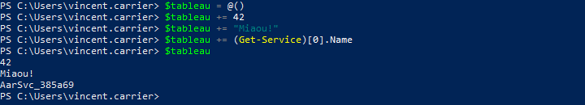
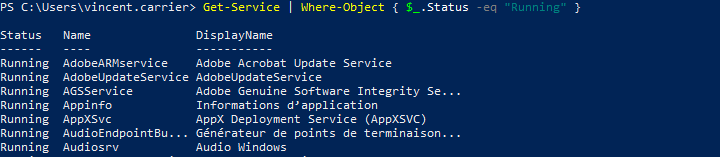
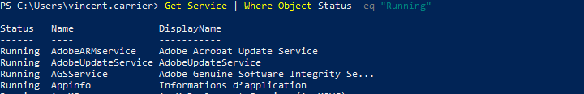
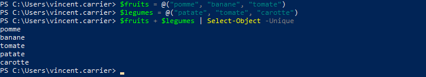
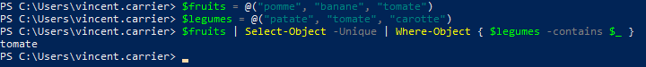
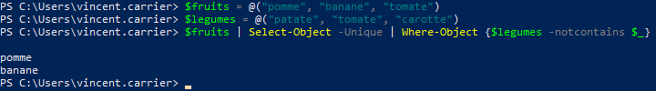
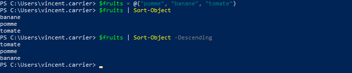

Les commandes PowerShell retournent souvent non pas un objet, mais plusieurs objets dans le pipeline. Par exemple, il est fréquent que la commande `Get-ChildItem` retourne plus d'un objet, car il y a généralement plusieurs fichiers et dossiers dans un dossier.

## Compter les objets d'une collection

On peut connaître le nombre d'éléments retournés par une commande à l'aide de la commande `Measure-Object`.

Et comme plusieurs objets mis ensemble constituent une collection d'objets, et que cette collection est également un objet, on peut aussi lire l'attribut `.Length` de cette collection.

## Accéder à un élément précis

Une collection dans PowerShell est une liste d'objet, qu'on appelle aussi Tableau ou Array, et qui est composé de plusieurs valeurs dans un ordre précis. Chaque élément occupe une position: le premier a la position 0, le deuxième 1, et ainsi de suite. Ces nombre s'appelle un indice (index). On peut obtenir l'élément correspondant en spécifiant l'indice voulu entre crochets.

## Créer un tableau

Un tableau vide est créé avec la formule `@()`. Pour initialiser un nouveau tableau, donc, il suffit d'affecter le tableau vide à une variable. On peut ensuit lui ajouter des éléments, avec un opérateur d'affectation.

Un tableau peut comprendre plusieurs éléments de types différents, mais habituellement, on il est plus logique d'y retrouver des éléments du même type.

On peut affecter directement des valeurs à la création d'un tableau. Dans ce cas, on n'est pas obligé de respecter la syntaxe `@(…)`; elle est implicite.

On peut aussi utiliser un raccourci pour créer rapidement un tableau d'entiers.

## Sélectionner des éléments

Lorsqu'on a un tableau d'objet qui circule dans le pipeline, on peut vouloir manipuler ce tableau pour en ressortir certains éléments et pas d'autres.

### Sélection des indices

### Sélection conditionnelle

Ou…

## Opérations sur un tableau

### Opérateur -Contains

Pour tester si un tableau contient une valeur spécifique, on peut utiliser l'opérateur `-Contains`.

### Concaténation

Donne tous les objets des deux collections (fusionne deux collections bout à bout)

### Union

Donne tous les objets de deux collections, mais sans doublons.

### Intersection

Donne tous les objets qui ont à la fois dans deux collections

### Différence

Retourne une collection moins tous les éléments semblables d'une deuxième collection

### Tri

On peut trier une collection à l'aide de la commande `Sort-Object`, par ordre croissant ou décroissant.

Par défaut, le tri s'effectue sur le nom d'affichage, mais il est possible de spécifier sur quelle propriété devra s'effectuer le tri.

## Boucle *ForEach-Object*

La commande `ForEach-Object` admet un bloc de script en paramètre, qui sera exécuté pour chaque élément du tableau qui lui est passé en entrée du pipeline. 

L’objet courant est représenté par la variable pipeline `$_` (ou alternativement, `$PSItem`).

<PowerShellWindow workdir="C:\" command="1..5 | ForEach-Object { Write-Host 'Numéro', $_ }" result="
Numéro 1
Numéro 2
Numéro 3
Numéro 4
Numéro 5" />

