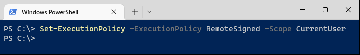
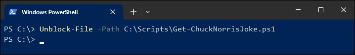
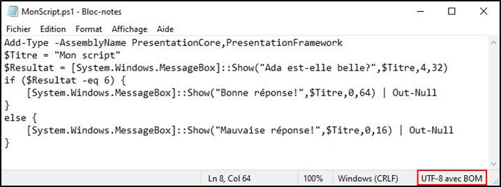
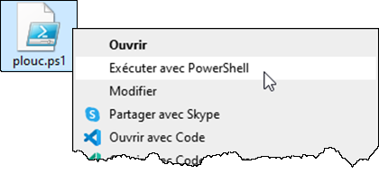
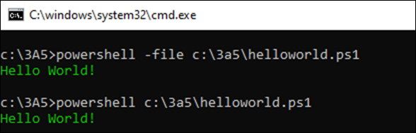

## Conditions d'exécution de scripts

Plusieurs conditions doivent être respectées afin d'exécuter un script PowerShell avec succès, que ce soit pour des raisons de sécurité ou de compatibilité.

### Stratégie d'exécution (*ExecutionPolicy*)

Par défaut, sous Windows 10/11, l'exécution de scripts PowerShell est interdite pour des raisons de sécurité. Seuls les scripts qui possèdent une signature numérique *AuthentiCode* sont autorisés. Les systèmes d'exploitation Windows Server, quant à eux, ne bloquent l'exécution de scripts que lorsqu'ils proviennent d'Internet. Dans tous les cas, il est possible de modifier ce comportement. Ces règles sont définies dans la **stratégie d'exécution** (*execution policy*).

Il existe plusieurs niveaux de stratégies d'exécution, et chacun détermine dans quelles condition le système d'exploitation peut refuser ou permettre l'exécution d'un script PowerShell. 

| Stratégie d'exécution | Caractéristiques |
| -- | -- |
| `Restricted` | Lorsque la stratégie d'exécution est Restricted, seuls les scripts portant une signature numérique (authenticode) sont approuvés et peuvent être exécutés par l'interpréteur PowerShell. C'est la stratégie par défaut sur les clients Windows. |
| `RemoteSigned` | Les scripts provenant d'un médium de stockage local, de l'intranet ou d'un site Internet de confiance sont autorisés. Ceux provenant d'Internet seront bloqués à moins de porter une signature numérique ou d'être débloqués avec la commande Unblock-File. C'est la stratégie par défaut sur les serveurs Windows, et la stratégie recommandée sur les clients Windows faisant partie d'un domaine ou utilisés pour développer des scripts. |
| `AllSigned` | Cette stratégie oblige tous les scripts à posséder une signature numérique. |
| `Unrestricted` | Les scripts non signés provenant d'Internet peuvent être exécutés, mais en demandant la permission à l'utilisateur. |
| `Bypass` | Cette stratégie est la plus permissive: tous les scripts peuvent s'exécuter sans restriction. |

Pour connaître la stratégie en vigueur, on peut lancer la commande `Get-ExecutionPolicy`.

Pour définir la stratégie, c'est la commande `Set-ExecutionPolicy` qu'il faut utiliser. 

Normalement, il faut être administrateur de sa machine pour pouvoir définir la stratégie d'exécution (la commande doit être lancée avec des privilèges **élevés**). Mais il est possible de la définir dans le contexte de l'utilisateur local avec l'argument `-Scope CurrentUser`.

Lorsque plusieurs stratégies sont définies, Windows utilise un ordre de priorité (appelé precedence) pour déterminer la valeur résultante. On peut voir la liste des stratégies d'exécution selon leur niveau de priorité en lançant la commande Get-ExecutionPolicy -List; la valeur effective est celle qui est retournée par Get-ExecutionPolicy sans spécifier d'argument.

Les niveaux de priorité (ou Scope) sont les suivants:

| Scope | Description |
| -- | -- |
| `MachinePolicy` | Configuration de la stratégie au moyen de GPO machine, dans Active Directory. Les GPO machine ont une priorité absolue. |
| `UserPolicy` | Configuration de la stratégie au moyen de GPO utilisateur, dans Active Directory. |
| `Process` | Configuration de la stratégie effective pour le processus seulement. On définit cette stratégie lors de l'appel du programme powershell.exe |
| `CurrentUser` | Configuration de la stratégie par défaut pour l'utilisateur courant. Cette stratégie peut être modifiée sans disposer de droits d'administration. |
| `LocalMachine` | Configuration de la stratégie par défaut pour l'ordinateur local. Cette stratégie peut être modifiée seulement par un administrateur de la machine. C'est le niveau le moins prioritaire. |

Lorsque l'un ou l'autre des scopes est non défini (undefined), cela signifie que ce niveau est ignoré. La stratégie effective sera la plus haute dans la liste de priorité parmi toutes celles qui ne sont pas "undefined".

:::tip

Lorsqu'on démarre une session PowerShell à l'aide du programme powershell.exe, on peut spécifier une ExecutionPolicy différente de la configuration du système, qui ne vaut que pour cette instance précise de PowerShell. Pour ce faire, on doit indiquer la stratégie voulue à l'aide du paramètre -ExecutionPolicy. Cela aura pour effet de définir le scope Process, dont la priorité dépasse celle des préférences machine et utilisateur. Seules les GPO ont une priorité supérieure.

:::

### Fichiers bloqués

Lorsqu'on télécharge un fichier sur Internet, Windows appose automatiquement une marque sur le fichier. Cette marque, appelée Zone Identifier, est conservée dans un champ alternatif (Alternate Data Stream), une structure dans le système de fichiers NTFS permettant de stocker des métadonnées. Si vous téléchargez un fichier script sur Internet et que vous le savez sécuritaire (par exemple, votre script que vous téléchargez sur OneDrive), vous pouvez le débloquer par l'interface graphique dans ses propriétés, ou encore à l'aide de la commande `Unblock-File`.

Un fichier ainsi bloqué sera impossible à exécuter si la stratégie d'exécution est AllSigned ou RemoteSigned, à moins d'avoir été dûment signé au moyen d'un certificat Authenticode en règle.

### Encodage

PowerShell 5.1 est assez capricieux sur l'encodage des caractères, surtout lorsqu'il est question de caractères accentués. Assurez-vous de sauvegarder les fichiers en format UTF8 avec BOM.

Si l'encodage n'est pas adéquat, vous pourrez vous retrouver avec des caractères bizarres au lieu des lettres accentuées.

## Exécution de scripts

Une fois toutes les conditions respectées, il existe plusieurs manières d'exécuter un script PowerShell 5.1 sous Windows.

### Par l'interface graphique de Windows

Vous pouvez lancer un script directement à partir de l'explorateur de fichiers sous Windows. Vous pourriez être tenté de double-cliquer sur le fichier de script, mais vous ne feriez qu'ouvrir le fichier dans le bloc-notes. Il faut plutôt cliquer avec le bouton de droite dans l'explorateur, puis sélectionner Exécuter avec PowerShell.

Cette méthode est certes intuitives, mais présente quelques inconvénients:
- Vous ne pouvez pas démarrer le script en tant qu'administrateur.
- La fenêtre se ferme toute seule une fois le script terminé, ce qui ne vous laisse pas le temps de voir s'il y a eu une erreur lors de l'exécution.
- Il est impossible de spécifier des arguments à la ligne de commande.

### Par la console PowerShell

C'est la méthode la plus utile, car elle permet de spécifier des arguments et de voir le résultat du script à la console.

Il suffit de démarrer une console PowerShell (en lançant le programme powershell.exe, par le menu démarrer, par le menu Win+X, etc.) puis exécuter un fichier .ps1. Si le chemin du fichier est relatif, vous devez démarrer le chemin par `.\` (comme sous Linux).

Si le script ne peut s'exécuter, lisez le message d'erreur. S'il est mention de la stratégie d'exécution (*ExecutionPolicy*), assurez-vous que votre stratégie soit définie à RemoteSigned ou plus permissif, et que votre fichier n'est pas bloqué (`Unblock-File`).

### À partir d'une commande classique

On peut lancer un script PowerShell à partir d'une commande classique, en lançant le programme `powershell.exe` avec l'argument `-file`.

Il est aussi possible de contourner la stratégie d'exécution, en spécifiant l'argument `-ExecutionPolicy`.

