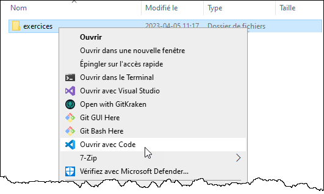
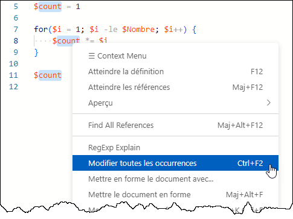

Les scripts PowerShell sont des fichiers texte, il est donc parfaitement possible de les développer à l'aide de n'importe quel éditeur de texte (le bloc-notes, Notepad++, Nano, etc.)

Il existe cependant des éditeurs qui sont faits spécialement pour développer en PowerShell. En voici quelques une:
- [Windows PowerShell ISE](https://learn.microsoft.com/fr-ca/powershell/scripting/windows-powershell/ise/introducing-the-windows-powershell-ise?view=powershell-5.1) (inclus dans Windows)
- [Microsoft Visual Studio Code](https://code.visualstudio.com/) (gratuit et *open-source*)
- [Idera PowerShell Plus](https://www.idera.com/productssolutions/freetools/powershellplus/)
- [SAPIEN PowerShell Studio](https://www.sapien.com/software/powershell_studio) ($$$)


## Visual Studio Code

Visual Studio Code est un environnement intégré de développement (IDE) offert gratuitement par Microsoft. Il possède de nombreuses fonctionnalités pour aider les programmeurs à écrire, gérer et tester leur code. Il supporte de nombreux langages de programmation, dont PowerShell. C'est cet outil de développement que vous utiliserez tout au long de ce cours.


### Espace de travail

Il est idéal de travailler dans VS Code en y ouvrant un dossier. Vous pouvez le faire soit en cliquant sur Ouvrir le dossier dans l'interface de VS Code, soit 



Dans le panneau de gauche, vous pouvez voir tous vos fichiers et dossiers et les ouvrir dans les onglets. Vous pouvez-même ouvrir plusieurs fichiers côte à côte.


### Palette de commandes

Vous pouvez ouvrir la palette de commandes en appuyant sur la touche F1 ou Ctrl+Maj+P. Vous pouvez rechercher des fonctionnalités et des actions.


### Terminal intégré et exécution PowerShell

Lorsque vous avez un fichier .PS1 ouvert, le terminal intégré PowerShell démarre automatiquement.

Vous pouvez utiliser ce terminal de la même manière qu'une invite PowerShell standard.

Si vous sélectionnez une partie de votre code et appuyez sur la touche F8, ce code sera automatiquement passé dans le terminal.


Pour lancer le script facilement, appuyez simplement sur F5. Cela exécute le script dans le terminal intégré en mode débogage.


Pour automatiquement sélectionner toutes les occurrences d'un même mot (par exemple, pour changer le nom d'une variable partout à la fois), sélectionner le texte à remplacer puis faites Ctrl+F2 (ou clic droit, Modifier toutes les occurrences).




### Installation

Dans les laboratoires du Collège, VS Code est déjà installé et configuré pour le développement de scripts en PowerShell. Si vous souhaitez l'utiliser sur votre ordinateur personnel ou sur une machine virtuelle, suivez ces directives.

Téléchargez l'application sur le site officiel (https://code.visualstudio.com/). Il en existe plusieurs variantes:
- Stable build: c'est la version la plus stable, et celle que vous devriez utiliser.
- Insider build: c'est une préversion pour tester les nouvelles fonctionnalités. Il peut y avoir des bogues.

Choisissez l'installateur qui convient à vos besoin.

- User Installer: c'est l'option par défaut. VS Code s'installe dans votre profil utilisateur, donc vous n'avez pas besoin de droits d'administration. Il sera installé seulement pour vous, pas pour les autres utilisateurs.
- System Installer: pour installer VS Code pour tous les utilisateurs du système. Ça prend des droits d'administration.


Puis, lancez l'installateur et répondez aux questions. Assurez-vous de déposer une icône sur le bureau et d'enregistrer les actions au menu contextuel.


### Configuration

Installez mon pack d'extensions. Cela installera tout ce qu'il vous faut pour développer en PowerShell!


Une fois terminé, vous devez redémarrer VS Code. Vous constaterez qu'il est maintenant en français.

Je vous recommande d'activer le thème de couleur "PowerShell ISE", car il est optimisé pour PowerShell. Mais s'il ne vous plait pas, vous pouvez en essayer d'autres, et même en installer de nouveaux.


Ajustez les paramètres de VS Code. Vous pouvez explorer les paramètres disponibles, mais voici minimalement ceux que je vous recommande:

Copiez-collez ceci dans le fichier settings.json, et sauvegardez-le.

```json
{
    "powershell.codeFormatting.preset": "Stroustrup",
    "powershell.codeFormatting.trimWhitespaceAroundPipe": true,
    "powershell.codeFormatting.useCorrectCasing": true,
    "powershell.integratedConsole.focusConsoleOnExecute": false,

    "[powershell]": {
        "files.encoding": "utf8bom",
        "editor.suggestSelection": "first",
        "editor.tabCompletion": "on",
        "editor.codeLens": false
    },

    "workbench.colorTheme": "PowerShell ISE"   
}
```


## Le caractère *BackTick*

Voici quelques caractères spéciaux qui doivent être spécifiés à l'aide du caractère d'échappement, le *backtick*, qui ressemble à un accent grave sans la lettre qui l'accompagne.

| Caractère | Hex. | Déc. | Description |
| -- | -- | -- | -- |
| \`r | 0x0D | 13 | Retour de chariot (carriage-return) |
| \`n | 0x0A | 10 | Saut de ligne (line-feed) - changement de ligne sur les systèmes UNIX
| \`r\`n | 0x0D, 0x0A | 13, 10 | CRLF (retour de chariot + saut de ligne) - changement de ligne sur Windows |
| \`t | 0x09 | 9 | Caractère de tabulation |
| \`f | 0x0C | 12 | Caractère de saut de page (pour les imprimantes) |


Le caractère *Backtick* agit également de caractère d'échappement, c'est-à-dire que tout caractère qui le suit dans une chaîne de caractères est interprété comme un caractère normal, sans égard à son utilité normale.

| Caractère | Hex. | Déc. | Description |
| -- | -- | -- | -- |
| \`\` | 0x60 | 96 | Le caractère *backtick* (accent grave) |
| \`" | 0x22 | 34 | Le guillemet double |
| \`' | 0x27 | 39 | Le guillemet simple |
| \`# | 0x23 | 35 | Le carré (pour marquer les commentaires) |
| \`$ | 0x24 | 36 | Le signe de piastre (pour marquer les variables) |

Finalement, le caractère *Backtick* peut aussi être utilisé pour couper une ligne en deux.

```powershell
Copy-Item -Path "C:\Minou\miaou.txt" `
          -Destination "C:\Pitou\wouf.txt" `
          -Force
```


:::tip

Ce caractère est difficile à trouver sur certains clavier, dont celui qui est le plus commun au Québec. Sur ce clavier (celui où on presse sur la touche de l'accent grave puis sur celle de la lettre), il suffit de faire un "espace accent grave".


:::

