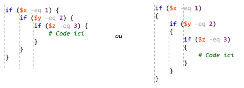

Certaines bonnes pratiques sont d'usage lorsqu'on développe un script en PowerShell.

### Alias et noms de paramètres

Dans un script, on cherche la lisibilité avant tout. On doit donc autant que possible **éviter d'utiliser les alias** et leur préférer les vrais noms des commandes (sous leur forme Verbe-Nom).

On doit aussi éviter les paramètres positionnels. On peut les utiliser dans certaines commandes où leur utilisation est évidente, comme `Write-Host`, `Where-Object` ou `ForEach-Object`, mais règle générale, on préfère voir le nom des paramètres.

```powershell
❌ dir C:\Windows

✅ Get-ChildItem -Path "C:\Windows"
```

### Commentaires

Il est important de bien documenter son code au moyen de commentaires pertinents. Un commentaire est du texte compris à l'intérieur du fichier mais qui est ignoré pendant l'exécution du script. La plupart des éditeurs de scripts afficheront les commentaires d'une couleur distinctive, généralement en vert.

En PowerShell, le caractère qui désigne les commentaires est le carré ou *hash* (`#`). Dès qu'un `#` est rencontré sur une ligne, tous les caractères jusqu'à la fin de la ligne sont ignorés. Si la ligne commence par un `#`, c'est la ligne au complet qui est ignorée.

Il est aussi possible de définir un bloc de commentaires sur plusieurs lignes. Dans ce cas, le bloc commence par `<#` et finit par `#>`.

```powershell
<#
    Ceci est un exemple. 
    Voici un bloc de commentaires.
#>

$Path = "C:\Minou" # le répertoire

If (-not (Test-Path -Path $Path)) {
    # Le répertoire n'existe pas, alors on le créée
    New-Item -Path "C:\Minou" -ItemType Directory
}
```

:::caution

N'en faites pas trop! Un commentaire est utile mais un code clair et lisible est mieux. C'est pour cela qu'on préfère utiliser les vrais noms des commandes et des paramètres; les commandes parlent d'elles-mêmes. Les commentaires devraient être utilisés lorsque la logique est complexe ou pour donner du contexte, pour expliquer **pourquoi** une commande est utilisé à cet endroit dans le script plutôt que ce qu'elle fait.

:::


### Indentation

L'indentation est importante en programmation, car elle permet de voir visuellement dans quel bloc se situe le code. C'est particulièrement utile dans une structure de contrôle, comme une condition ou une boucle.

Par convention, un niveau d'indentation est équivalent à quatre espaces. C'est cette taille de tabulation que Visual Studio Code insère lorsqu'on presse la touche de tabulation.



:::danger

PowerShell n'impose pas l'indentation, contrairement à Python par exemple. Elle sert uniquement à la lisibilité. Toutefois, même si votre code PowerShell fonctionne sans indentation, vous risquez de perdre des points dans vos évaluation si votre code est mal indenté.

:::

Il y a également des préférences quant à si l'ouverture d'accolades se fait sur la même ligne ou sur la ligne suivante. Certains programmeurs préfèrent la première forme, d'autres la deuxième. Les deux sont valides, mais celle qui est configurée par défaut dans VS Code dans les laboratoires est celle du professeur, où les accolades commencent à la fin de la ligne.

:::tip

Visual Studio Code est capable d'ajuster automatiquement les indentations en fonction des ouvertures et fermetures de blocs. Vous n'avez qu'à lancer la fonctionnalité de mise en forme par le menu contextuel ou avec le raccourci clavier `Maj+Alt+F`.


:::