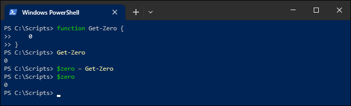
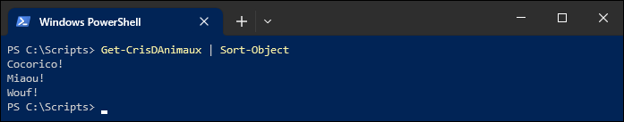

Une fonction PowerShell est un bloc de script qu'on enregistre dans la session en cours. On doit la déclarer en lui donnant un nom, et à l'instar d'un fichier de script, elle se comporte exactement comme un script ou une commande.

Pour déclarer une fonction, on utilise le mot-clé `function` suivi de son nom, et on définit le code de la fonction entre des accolades. Il est recommandé d'indenter le contenu de la fonction.

```powershell
function Get-Zero {
    0
}
```

:::caution
La déclaration d'une fonction n'a d'effet que dans la session en cours. Après l'exécution du script ou après fermeture de la fenêtre PowerShell, celle-ci n'existe plus et il faudra la déclarer à nouveau si on veut l'utiliser.
:::

:::tip
On peut obtenir la liste de toutes les fonctions qui sont déclarées dans la session PowerShell en cours à l'aide de la commande `Get-ChildItem Function:`.


:::

L'exemple ci-dessus montre la fonction déclarée sous le nom de `Get-Zero`, et qui sert simplement à obtenir la valeur 0. Celle-ci ne fait qu'envoyer l'objet `0` (un nombre entier) dans le pipeline, afin que cette valeur soit récupérée à la sortie de la fonction.




### Sortie dans le pipeline

Une fonction (tout comme un script, d'ailleurs), dispose en quelque sorte d'un "accumulateur" qui contient tous les objets qui tombent dans le pipeline. À la sortie de la fonction, les objets sortent sous forme de collection.

```
function Get-CrisDAnimaux {
    "Miaou!"
    "Wouf!"
    "Cocorico!"
}
```

Cette fonction laisse tomber trois objets `String` dans le pipeline. Ceux-ci sortent sous forme de collection. C'est la même chose avec un fichier PS1.




### Instruction *Return*

L'instruction `return` permet de sortir un objet sur le pipeline tout en interrompant immédiatement l'exécution de la fonction. 

```powershell
function Get-Zero {
    return 0
    Write-Host "Ce texte ne sera jamais écrit!"
}
```

:::info
Dans un script, on utilise souvent une fonction lorsque du code se répète souvent, pour éviter de copier-coller le même code à plusieurs endroits dans le script. Une fonction doit obligatoirement être définie avant d'être appelée, mais il est une bonne pratique de déclarer toutes les fonctions au début du script, juste après le bloc de paramètres, mais avant le code principal du script.
:::


