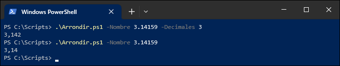

Lorsqu’il est démarré dans une session PowerShell, un fichier de script (.ps1) se comporte exactement comme une commande:
- Il retourne des objets sur le pipeline
- Il admet des objets en entrée du pipeline
- Il permet de spécifier des arguments

Par exemple, voici un script `MonScript.ps1` situé dans le répertoire `C:\Scripts`. 

```powershell
$reponse = Read-Host -Prompt "Entrez le nom d'un service"
$reponse | Get-Service   # Renvoie le service dans le pipeline
```

À la fin de l'exécution du script, un ou des objets sont envoyés sur le pipeline, résultat de `Get-Service`. Ces objets sortent donc du script comme s'il s'agissait d'une commande. Si on ne fait rien avec, les objets sont convertis en texte et affichés dans la console, mais on peut les intercepter en chaînant une autre commande dans le pipeline.


## Définition des paramètres

Il est possible de spécifier des paramètres à un script ou une fonction pour modifier son comportement. On peut déclarer les paramètres dans un bloc `param()`, qui doit se trouver obligatoirement **au tout début** du script ou de la fonction.

Une fonction et un script se comportent de la même manière en ce qui concerne les paramètres. La seule différence est que la fonction est enregistrée dans la session en cours, tandis que le script est défini sous forme de fichier. 


### Paramètres d'un script

Un script peut admettre un ou plusieurs paramètres pour modifier son fonctionnement. On peut déclarer les paramètres dans un bloc `param()`, qui doit se trouver obligatoirement **au tout début** du script.

```powershell
param (
    [double] $Param1,
    [string] $Param2,
    [int[]]  $Param3,
    [switch] $Param4
)
```

On y déclare les paramètres sous forme de variables typées. Le nom de la variable représente le nom du paramètre, et l'ordre de déclaration des paramètres devient sa position (lorsqu'on ne spécifie pas son nom à l'appel).

Lorsque le script sera appelé, les arguments spécifiés meubleront les variables qui leur sont associées, et on pourra les utiliser dans le script.

Par exemple, ce script, `division.ps1` prend en paramètre deux nombres, un dividende et un diviseur, effectue la division de ces deux nombres, et jette le résultat dans le pipeline.

```powershell
param (
    [double]$Dividende,
    [double]$Diviseur
)

$Dividende / $Diviseur
```


On remarquera aussi que PowerShell est conscient des paramètres déclarés dans le script car il nous permet de les compléter avec la touche de tabulation ou avec `Ctrl+Espace`.


### Paramètres d'une fonction

C'est le même principe pour une fonction. On déclare les paramètres dans un bloc `param()` au début de la fonction.

```powershell
function Division {
    param (
        [double] $Dividende,
        [double] $Diviseur
    )

    $Dividende / $Diviseur
}
```

Comme alternative plus légère, on peut aussi déclarer les paramètres directement dans la déclaration de la fonction, entre parenthèses. Cette forme est plus concise et est souvent utilisée pour les fonctions plus courtes.

```powershell
function Division ([double] $Dividende, [double] $Diviseur) {
    $Dividende / $Diviseur
}
```

## Validation des paramètres

Une fonction et un script `.PS1` se comportent comme une commande PowerShell. L'un est enregistré dans la session en cours, l'autre est défini sous forme de fichier. Mais dans les deux cas, on peut leur définir des paramètres au moyen d'un bloc `param()`.

Par exemple, le script `Division.ps1` vu précédemment aurait pu, à la place, être défini comme une fonction.

```powershell
function Division {
    param (
        [double] $Dividende,
        [double] $Diviseur
    )

    $Dividende / $Diviseur
}
```

Lorsqu'on déclare des paramètres, il y a le risque que celui-ci soit mal utilisé. Par exemple, qu'arrive-t-il si on appelle la fonction de division pour diviser "Chat" par trois? Qu'arrive-t-il si on demande de diviser un nombre par zéro?

Et surtout, qu'arrive-t-il si, dans un script assez long et qui effectue plusieurs tâches, un paramètre non conforme fait planter le script à mi-chemin de son exécution?

PowerShell nous offre diverses méthodes pour valider les paramètres à la source, afin de s'assurer que toutes les valeurs sont conformes à ce qui est attendu avant de commencer son exécution.


### Validation de type

Lorsqu'on spécifie un type à un paramètre, le script valide d'abord si la valeur correspond au type attendu.

```powershell
param (
    [double] $Dividende,
    [double] $Diviseur
)

$Dividende / $Diviseur
```

Si la valeur attendue ne correspond pas au type du paramètre, le script plante (et c'est ce qu'on veut; mieux vaut un script qui plante qu'un script qui fait n'importe quoi).


### Critères de validation

PowerShell offre, en plus de la validation de type, différents critères de validation pour identifier au maximum les risques de valeurs illégales spécifiées en paramètre.

Par exemple, si on souhaite éviter que la fonction ou le script puisse être appelé avec un diviseur égal à zéro, on peut ajouter un critère de validation dans la déclaration du paramètre. Dans l'exemple suivant, on définit un script qui, s'il est évalué `False`, refusera d'exécuter le code.

```powershell
param (
    [double] $Dividende,

    [ValidateScript( { $_ -ne 0 } )]
    [double] $Diviseur
)

$Dividende / $Diviseur
```

On peut clairement voir, à l'analyse du message d'erreur, que le script ou la fonction a planté en raison d'un échec de validation du paramètre `Diviseur`.


Il existe plusieurs types de validation de paramètre. En voici quelques exemples:

#### ValidateSet

La clause `ValidateSet` permet de s'assurer que la valeur passée en paramètre fait partie d'une liste de valeurs admissibles.

```powershell
param( 
    [ValidateSet('Rouge','Vert','Bleu’)]
    [string] $Couleur 
)

# Accepte seulement les chaînes de caractères "Rouge", "Vert" ou "Bleu"
```

:::tip
Lorsqu'on utilise la clause `ValidateSet`, cela permet à PowerShell d'énumérer les valeurs admissibles lors de l'appel de la fonction ou du script, au moyen de la touche de tabulation ou de `Ctrl+Espace`.


:::

#### ValidateRange

La clause `ValidateRange` permet de s'assurer qu'un nombre passé en paramètre est situé entre deux valeurs inclusivement.

```powershell
param(
    [ValidateRange(7,120)]
    [Int] $Age
)

# Accepte un nombre entier de 7 à 120 incl.
```

:::tip
`ValidateRange` exige de spécifier les valeurs minimum et maximum. Mais lorsqu'on souhaite seulement spécifier une valeur maximum ou minimum, on peut faire appel aux propriétés MaxValue et MinValue du type en question.

Par exemple, pour attendre un nombre de type `[int]` de 7 ou plus, il suffit de spécifier un *range* de 7 à la valeur maximale du type `[int]`, soit `[int]::MaxValue`.

```powershell
param(
    [ValidateRange(7, [int]::MaxValue)]
    [Int] $Age
)

# Accepte un nombre entier de 7 ou plus.
```
:::


#### ValidateLength

La clause `ValidateLength` valide la taille minimum et maximum d'une chaîne de caractères.

```powershell
param(
    [ValidateLength(0,15)]
    [String] $NoTel
)

# Accepte une chaîne de 0 à 15 caractères incl.
```


#### ValidateCount

La clause `ValidateCount` valide le nombre d'éléments minimum et maximum d'une collection d'objets passée en paramètre.

```powershell
param(
    [ValidateCount(1,5)]
    [String[]] $ComputerName
)

# Accepte un tableau de 1 à 5 éléments incl.
```

#### ValidatePattern

La clause `ValidatePattern` permet de valider une chaîne de caractères selon une expression régulière (*regex*).

```powershell
param(
    [ValidatePattern('^\d{3}-\d{3}-\d{4}$')]
    [string] $NumeroTelephone
)

# Accepte un pattern de 10 chiffres séparés par des tirets (###-###-####).
```

#### ValidateScript

La clause `ValidateScript` est la plus versatile et peut être utilisée pour les validations plus complexes qui ne peuvent être faites par les autres méthodes. Elle permet de spécifier un script à exécuter avec la valeur passée en paramètre (représentée par la variable pipeline `$_`). Si le script retourne `True`, l'argument est validé; s'il retourne `False`, la validation échoue et le script plante.

```powershell
param(
    [ValidateScript( { Test-Path $_ } )]
    [String] $Path
)

# Permet de créer un script qui retourne vrai ou faux. Si faux, le paramètre est rejeté.
```

### Paramètres obligatoires

Par défaut, tous les paramètres sont optionnels. S'ils ne sont pas spécifiés lors de l'appel de la fonction ou du script, alors ils prennent automatiquement leur valeur neutre.

- La valeur 0 pour les types numériques (`int`, `double`...)
- Une chaîne vide (`""`) pour le type `string`
- Une valeur nulle (`$null`) pour les collections
- etc.

Pour s'assurer qu'un paramètre soit spécifié à l'appel de la fonction ou du script, on peut ajouter un bloc `[Parameter()]` à la déclaration du paramètre. Ce bloc permet de définir certaines propriétés du paramètre. Pour rendre le paramètre obligatoire, il faut activer la propriété Mandatory du paramètre.

```powershell
function Soustraction {
    param(
        [Parameter(Mandatory)]
        [double] $op1,

        [Parameter(Mandatory)]
        [double] $op2
    )

    $op1 - $op2
}
```

Si un paramètre obligatoire n'est pas spécifié, le script refusera de s'exécuter. À la place, il demandera à l'utilisateur de spécifier les paramètres manquants à la ligne de commande. L'appelant peut alors soit saisir manuellement l'argument manquant, soit annuler l'exécution du script avec les touches `Ctrl+C`.


### Valeur par défaut d'un paramètre

Une alternative à rendre obligatoire un paramètre consiste à lui attribuer une valeur par défaut. Ainsi, ce paramètre prendra automatiquement la valeur spécifiée si l'utilisateur ne le spécifie pas à l'appel du script ou de la fonction.

Par exemple, voici le script `Arrondir.ps1`.

```powershell
Param(
    [Parameter(Mandatory)]
    [double] $Nombre,

    [int] $Decimales = 2
)

[Math]::Round($Nombre, $Decimales)
```

La valeur du paramètre `Decimales` prend la valeur 2 à moins d'être spécifiée explicitement.




### Paramètres de type Switch

Les paramètres de type Switch prennent une valeur booléenne (vraie ou fausse) selon qu'ils soient spécifiés ou non. On les identifie avec le type [switch].

```powershell
param (
    [Parameter(Mandatory)]
    [double] $op1,
    
    [Parameter(Mandatory)]
    [double] $op2,
    
    [switch] $Miauler
)

$op1 - $op2

if ($Miauler) {
    Write-Host "Miaou!"
}
```

### Paramètres de type collection

Il est possible de faire en sorte qu'un paramètre admette plus d'une valeur. Il suffit de faire de son type une collection. Si par exemple, on souhaite que le paramètre permette de passer une ou plusieurs valeurs entières, on va donner au paramètre le type `[int[]]`, soit un tableau d'entier.

```powershell
param ( 
    [int[]] $Nombres 
)

$total = 0

foreach ($nombre in $Nombres) {
    $total += $nombre
}

# On renvoie le total dans le pipeline!
$total    
```

:::tip
Les paramètres qui admettent un tableau de valeurs se combinent très bien avec la clause de validation `[ValidateCount()]`, pour spécifier un nombre minimum et maximum d'éléments dans le tableau.
:::


### Entrée par le pipeline

On peut permettre à une fonction ou un script de traiter l'entrée du pipeline.

Par exemple, le script Saluer.ps1 accepte deux paramètres, un nom et un titre. Mais lorsqu'une valeur admissible entre par le pipeline, celle-ci entrera dans le paramètre Nom.

```powershell
Param(
    [Parameter(Mandatory, ValueFromPipeline)]
    [string] $Nom,

    [ValidateSet("M.","Mme.","Mlle.","Dr.","Me.")]
    [string] $Titre
)

"Bonjour, $Titre $Nom!"
```

De cette manière, le paramètre Nom peut soit être spécifié par le paramètre, soit par l'entrée du pipeline. Dans les deux cas, l'effet est le même.


