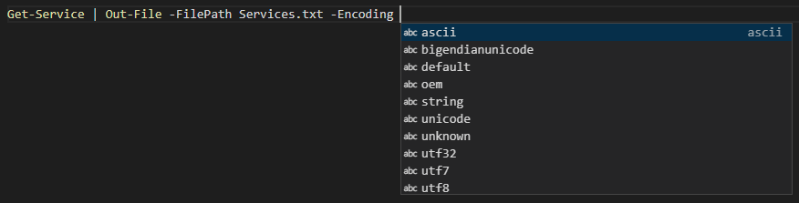

Un **fichier** est une unité logique de stockage de données, contenue sur un **volume** (aussi appelé **disque logique**). Un volume, sous Windows, est généralement identifié par une lettre (C:, D:, etc.) et occupe une région plus ou moins grande sur un médium physique de stockage. Sur un disque dur, cette région se nomme une **partition**. Pour pouvoir stocker les fichiers, un volume doit être **formaté** dans un **système de fichiers**, qui détermine la structure des fichiers et des répertoires ainsi que des fonctionnalités connexes (sécurité, taille de blocs, résilience, métadonnées, etc.). Les systèmes de fichiers les plus répendus sous Windows sont *NTFS*, *FAT32*, *ExFAT* ou *ReFS*, alors que les plus répendus sous Linux sont *Ext4* et *ZFS*. 

Certains volumes sont stockés sur un système distant, et sont accessibles par le biais d'un protocole de partage de fichiers sur le réseau (par exemple, SMB sous Windows, NFS sous Linux). On les appelle les volumes réseaux, ou lecteurs réseaux (*network drive*), par opposition aux volumes locaux, ou lecteurs locaux (*local drives*), qui sont directement connectés à l'ordinateur.

Un système de fichiers possède typiquement une table d'allocation, une sorte de table des matières qui dispose chaque fichier dans l'arborescence et indique à quel endroit de la surface du médium les données comprises dans le fichier se trouvent physiquement. Ces données sont simplement une suite d'octets, et le format de fichier permet à un programme de lire le fichier et interpréter correctement ces octets. Sous Windows, l'extension du nom du fichier aide le système d'exploitation et les applications à savoir quel est le format du fichier et comment interpréter ses données.

Il existe deux grandes catégories de fichiers:
- Les fichiers **texte**, dont les octets encodent des caractères en utilisant une table de caractères standardisée telle que UTF-8 ou ANSI. C'est le cas des fichiers TXT, PS1, JSON, HTML, CSV, etc.

    

- Les fichiers **binaires**, qui contiennent des données numériques brutes. C'est le cas des fichiers ZIP, JPG, PNG, DOCX, XLSX, etc.

    

PowerShell offre plusieurs commandes pour traiter avec des fichiers de différents formats.


## Navigation dans le système de fichiers

Vous connaissez déjà la commande `Get-ChildItem`. C'est un peu l'équivalent de DIR dans l'invite de commandes classique. Cette commande, lorsqu'elle est lancée sur le système de fichiers, retourne le contenu d'un répertoire.

Nous avons déjà dit que `Get-ChildItem`, lorsqu'il retourne plusieurs objets, retourne un tableau d'objets. Comme les fichiers et les dossiers sont des structures différentes, et que ces deux types d'objets peuvent se retrouver dans un même tableau, le tableau est donc constitué de deux types d'objets:

- Chaque fichier est de type `System.IO.FileInfo`
- Chaque répertoire est de type `System.IO.DirectoryInfo`

On peut aussi utiliser la commande `Get-Item` pour obtenir l'objet qui représente un fichier ou un répertoire, contrairement à `Get-ChildItem` qui retourne plusieurs objets enfants.


## Fichiers texte

Il est très fréquent qu'un script doive lire dans un fichier. Un usage typique de lecture d'un fichier texte est pour traiter des entrées multiples.

Par exemple, votre employeur vient de faire l'acquisition d'une entreprise concurrente, et votre patron vous demande de créer des comptes utilisateurs pour chacun des 3000 employés visés par l'acquisition. La manière la plus simple de procéder est de faire un script qui lit un fichier contenant les informations de chacun des employés ligne par ligne.

La principale commande pour lire un fichier est `Get-Content`.


`Get-Content` lit le fichier ligne par ligne. Donc, cette commande retourne un tableau de string.


On peut facilement traiter le fichier dans une boucle.


Ou par un filtre.


Et on peut passer un fichier par le pipeline.


Et faire toutes les manipulations souhaitées.

```powershell
Get-Item -Path ".\Utilisateurs.txt" | Get-Content | Where-Object { $_ -like 'A*' } | ForEach-Object {
    $split = $_.Split(',')
    [PSCustomObject]@{
        Nom = $split[0]
        Tel = $split[1]
    }
} | Sort-Object | Format-Table
```

Pour écrire dans un fichier, vous pouvez utiliser plusieurs commandes.

La commande `Out-File` exporte un objet vers un fichier. Tout ce qui entre dans cette commande par le pipeline sera sortie vers un fichier, ce qui implique une conversion en texte. Si le fichier de destination n'existe pas, il sera automatiquement créé.

On peut activer le switch `-Append` si on veut que les objets soient ajoutés à la fin du fichier s'il existe déjà, sinon le contenu sera remplacé.


On peut aussi spécifier divers encodages.



Si le fichier n'existe pas, il sera créé automatiquement. Si on souhaite plutôt que le script plante si le fichier existe déjà, on peut activer le switch `-NoClobber`.

Alternativement, les commandes `Set-Content` et `Add-Content` écrivent du contenu dans un fichier texte. Si le fichier n'existe pas, il sera automatiquement créé. Son fonctionnement est très semblable à celui de `Out-File`, et dans la majorité des cas, on peut utiliser l'une ou l'autre des méthodes.

- La commande `Set-Content` **remplace** le contenu du fichier.
- La commande `Add-Content` **ajoute** le contenu à la fin du fichier.


## Fichiers CSV

Un fichier CSV (pour Comma Separated Values) est un fichier texte où chaque valeur est délimitée par une virgule (ou un point-virgule dans les régions où les décimales sont représentées par des virgules et non des points). 


C'est un format utilisé, entre autres, pour importer des données dans Excel. En effet, le contenu du fichier CSV peut facilement être vu comme un tableau composé de champs (colonnes) et de rangées. La première ligne désigne le titre des colonnes.

Pour lire un fichier CSV, on peut utiliser la commande `Import-CSV`. Permet de transformer le contenu d'un fichier CSV en tableau de PSCustomObject.


Pour écrire un fichier CSV à partir d'une structure de données (comme un tableau d'objets), on fait appel à `Export-Csv`.


Finalement, les commandes `ConvertTo-Csv` et `ConvertFrom-Csv` sont comme les commandes `Export-Csv` et `Import-Csv`, mais au lieu de travailler avec les fichiers CSV, elles travaillent avec des chaînes de caractères CSV. C'est pratique dans certains cas, si on veut envoyer les données CSV dans une base de données ou sur le réseau.


:::info Note
Par défaut, lorsque PowerShell produit du texte formaté en CSV, une ligne #TYPE s'ajoute automatiquement au début du fichier. Cette ligne n'est pas reconnus par plusieurs logiciels traitant avec des fichiers CSV, comme Excel. Pour l'enlever, il suffit d'activer le switch `-NoTypeInformation` lors de l'appel de `Export-Csv` ou `ConvertTo-Csv`.


:::

### Délimiteur

Il faut faire attention au délimiteur. Souvent c'est la virgule, mais dans certaines régions, c'est autre chose. En français, comme la virgule est déjà utilisée comme séparateur décimale, par défaut c'est le point-virgule qui est utilisé. Ainsi, sur une machine configurée en français, lorsqu'on tente d'importer un CSV produit sur une machine en anglais, Excel n'arrive pas à séparer les colonnes. 

On peut connaître le caractère utilisé par Windows pour séparer les listes par l'interface graphique ou encore grâce à `Get-Culture`.


```powershell
(Get-Culture).TextInfo.ListSeparator
```

PowerShell prend toujours la virgule par défaut, peu importe la langue du système, contrairement à Excel qui prend le séparateur de liste défini dans les options régionales.

- Pour prendre le caractère de séparation défini dans les options régionales, il faut utiliser le switch `-UseCulture`.
- Pour spécifier le caractère de séparation, on peut le faire avec le paramètre `-Delimiter` et lui passer un caractère en argument.


## Fichiers JSON

PowerShell offre aussi des commandes qui permettent de convertir des objets en JSON et vice-versa. Il n'existe toutefois pas de commandes d'exportation et d'importation comme pour les CSV; il faut alors procéder en deux étapes.

Pour lire un fichier JSON et le convertir en une structure complexe de listes et de dictionnaires, on peut récupérer le texte brut du fichier avec `Get-Content`, puis passer le résultat par le pipeline dans la commande `ConvertFrom-Json`.

```powershell
$canadiens = Get-Content -Path ".\canadiens.json" | ConvertFrom-Json
```

Pour écrire une structure dans un fichier JSON, il suffit de passer l'objet par le pipeline dans `ConvertTo-Json` puis écrire le résultat dans un fichier à l'aide de `Set-Content` ou `Out-File`.

```powershell
$canadiens | ConvertTo-Json | Set-Content -Path ".\canadiens.json"
```

:::info Note
Lorsque vous tentez de convertir en JSON des objets complexes, vous pouvez préciser le niveau de profondeur de la conversion en JSON à l'aide du paramètre `-Depth`.
:::


## Journalisation

Il est généralement une bonne pratique de programmer nos scripts de telle sorte qu'ils documentent leur déroulement dans un fichier journal (ou log). Ainsi, lorsqu'on suspecte qu'un script a failli à sa tâche, on peut se référer au fichier log pour investiguer les causes de la défaillance.

### Format

Un fichier log type est en format texte brut et porte l'extension .log. Chaque fois que le script rencontre une action importante au cours de son exécution, il ajoute une ligne à la fin du fichier pour documenter cette action. Chaque ligne est horodatée avec précision afin de déceler d'éventuelles lenteurs dans l'exécution d'une action.

:::info Note
Certains logs adoptent un format particulier, qui correspondent à un outil qui en facilite la lecture. Par exemple, SCCM produit ses logs dans un format difficilement lisible avec un éditeur de texte, mais parfaitement adaptés à l'outil CMtrace, qui vient avec. 
:::

### Niveau de détail

Les logs peuvent être très détaillés ou très sommaires, dépendant du besoin et de la criticité du service impacté. Il est même possible de permettre différents niveaux de verbosité, au besoin. 

### Emplacement du fichier log

Il est important de sauvegarder le fichier log à un endroit judicieux. Il n'est habituellement pas recommandé de le sauvegarder dans le répertoire de travail, puisque celui-ci tend à être imprévisible. De plus, il n'est pas toujours approprié de choisir le répertoire sur lequel le script est exécuté, puisque rien ne garantit que l'utilisateur possède des droits d'écriture à cet emplacement, particulièrement si le script n'a pas besoin de privilèges d'administration.

Généralement, on choisit un emplacement où l'on sait que l'utilisateur possède des droits d'écriture. On privilégie donc les emplacements à l'intérieur du profil de l'utilisateur, comme ceux représentés par les variables d'environnement `LOCALAPPDATA`, `APPDATA` ou `TMP`.

Il n'est pas rare que l'emplacement du fichier journal puisse être définie par un paramètre.

### Activation du log

Plusieurs scripts utilisent un paramètre pour activer la journalisation. Il peut s'agir d'un paramètre de type Switch, ou encore simplement d'un paramètre qui permet de spécifier le nom du fichier log (s'il n'est pas spécifié, la journalisation est désactivée).

### Rotation

La taille des fichiers log est un problème commun. En effet, les fichiers log peuvent prendre une taille considérable avec le temps. Il est donc important de prendre ce fait en considération, particulièrement si le script est très verbeux.

La stratégie classique consiste à définir une taille maximale au fichier log (par exemple, 10 Mo). Dès que cette taille sera atteinte, le fichier est renommé différemment (par exemple, `journal.log` est renommé en `journal.lo_`). Et si le fichier `journal.lo_` existe déjà, il est détruit pour laisser la place au nouveau `journal.lo_`.


## Fichiers Zip

PowerShell offre la possibilité de compresser ou décompresser des fichiers. Les commandes sont `Compress-Archive` et `Expand-Archive`.

Cependant, ces commandes souffrent d'une très mauvaise performance. On peut améliorer nettement la performance en faisant appel aux méthodes de *.NET Framework*.

```powershell
# Déclarer la classe .NET offrant les méthodes de compression
Add-Type -Assembly "System.IO.Compression.Filesystem"

# Pour compresser
[System.IO.Compression.ZipFile]::CreateFromDirectory("C:\vers\RepertoireSource","C:\vers\destination.zip")

# Pour décompresser
[System.IO.Compression.ZipFile]::ExtractToDirectory("C:\vers\source.zip", "C:\vers\RepertoireDestination")
```


## Sécurité

On peut utiliser PowerShell pour consulter et modifier les listes d'accès aux fichiers.


Il existe plusieurs manière d'obtenir les listes d'accès avec PowerShell.

Les objets de type `FileInfo` et `DirectoryInfo` possèdent une méthode `GetAccessControl()`, qui retourne un objet de type `System.Security.AccessControl.FileSecurity` (ou `System.Security.AccessControl.DirectorySecurity`, pour les répertoires). 


Cet objet contient l'information de sécurité de ce fichier ou dossier.

On peut aussi obtenir ce même objet avec la commande `Get-Acl`.

```powershell
Get-Item -Path "C:\Users\Administrator\Desktop\MonFichier.txt" | Get-Acl
  # ou
Get-Acl -Path "C:\Users\Administrator\Desktop\MonFichier.txt"
```

Dans tous les cas, l'objet retourné est le même.

On peut obtenir les propriétés que l'on peut interroger sur l'objet de type FileSecurity. 


Vous pouvez, par exemple, obtenir les accès au fichier ou au dossier avec la propriété Access.


Vous pouvez aussi obtenir l'information sur le propriétaire, et ce, de deux manières différentes.

Par la propriété Owner (ça retourne un String)


Par la méthode GetOwner (ça retourne un objet plus utile)


Voir la documentation pour les classes:
https://docs.microsoft.com/en-us/dotnet/api/system.security.accesscontrol.filesecurity
https://docs.microsoft.com/en-us/dotnet/api/system.security.accesscontrol.directorysecurity


### Modifier des permissions

Modifier des permissions est un peu plus complexe que les lire. On peut modifier la table de permissions d'un fichier à l'aide de la commande `Set-Acl`.

`Set-Acl` permet de modifier la table de permissions d'un item. Comme la plupart des commandes dont le verbe est Set, cette commande remplace la table de permissions existante par une nouvelle.

Lorsqu'on veut modifier la table de permissions d'un fichier ou d'un dossier, on doit:

1. Obtenir un objet représentant la table de permissions (une copie), grâce à `Get-Acl`
2. Modifier cet objet à notre guise
3. Remplacer la table de permission existante par notre copie modifiée, avec `Set-Acl`

Dans l'exemple ci-dessous, on veut ajouter une permission de contrôle total pour l'utilisateur *yvon.rocher* dans le répertoire *C:\Plouc\\*.

```powershell
# Premièrement, on crée une nouvelle règle d'accès
$Identity = "yvon.rocher"
$FileSystemRights = "FullControl"
$InheritanceFlags = "ContainerInherit,ObjectInherit"
$PropagationFlags = "None"
$AccessControlType = "Allow"

$Rule = New-Object System.Security.AccessControl.FileSystemAccessRule(
    $Identity, $FileSystemRights, $InheritanceFlags, $PropagationFlags, $AccessControlType
)

# On obtient une copie de la table de permissions du dossier
$Path = "C:\Plouc"
$ACL = Get-Acl -Path $Path

# On ajoute la nouvelle règle à la copie de la table de permissions
$ACL.AddAccessRule($Rule)

# Finalement, on remplace la liste d'accès du dossier par notre nouvelle règle modifiée
Set-ACL -Path $Path -AclObject $ACL
```

