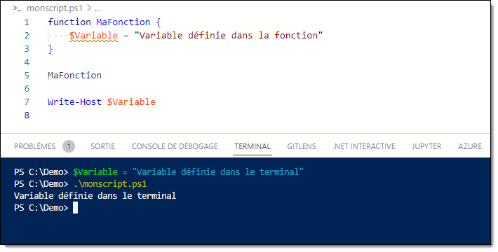
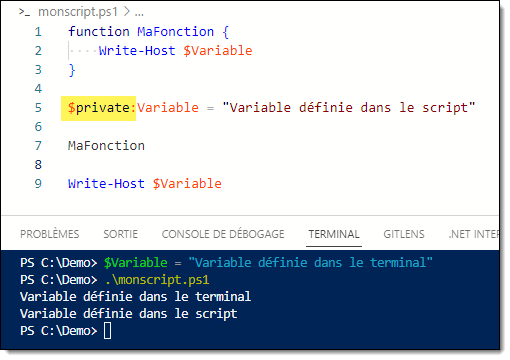
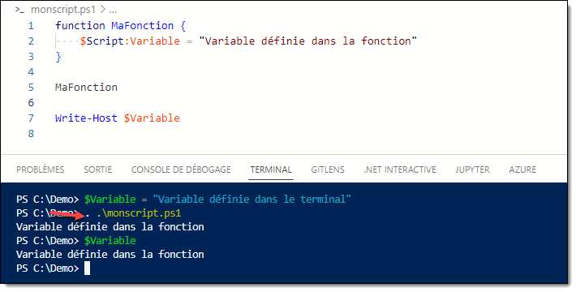

La portée, ou étendue, ou *scope* en anglais, est le mécanisme qui définit dans quel cas une ressource PowerShell, comme une variable, une fonction ou un alias, est accessible à l'extérieur du script ou de la fonction duquel il a été créé.

La portée **globale** réfère à la session PowerShell. Lorsqu'on démarre une session, par exemple en démarrant une fenêtre PowerShell, tout ce qui y est créé est dans la portée globale.

Lorsqu'on démarre un script à partir de cette session, les objets créés dans le script sont contenus ne sont pas accessibles dans la session PowerShell après la fin de l'exécution du script.

Lorsqu'on tente d'accéder à un objet (comme la lecture d'une variable ou l'appel d'une fonction), PowerShell tente de trouver cet objet dans la portée courante (locale). S'il n'est pas déclaré dans cette portée, PowerShell tentera de le trouver en remontant la hiérarchie jusqu'à ce qu'il en trouve un qui soit défini.


## Portée locale

Lorsqu'une variable est déclarée dans un script ou une fonction, elle possède par défaut une portée **locale**, c'est à dire qu'elle cessera d'exister lorsque son exécution sera terminée.


Si on tente d'accéder à une variable qui n'est pas définie, alors PowerShell recherchera cette variable dans la portée du parent. Si plusieurs variables du même nom existent dans différentes portées, c'est la plus proche qui est obtenue.




## Portée script

On peut déclarer une variable dans une portée supérieure en spécifiant un préfixe de portée. Par exemple, si on souhaite qu'une variable définie dans une fonction de script puisse être lue dans le script, à l'extérieur de la fonction, on lui ajoute un préfixe `$script:`.


Si la variable existe à la fois dans la portée globale et dans la portée du script, la plus proche l'emporte.


## Portée globale

Une variable globale existe partout dans la session PowerShell, y compris dans le terminal, dans le code d'un script ou dans une fonction comprise dans le script. On définit une variable globale en lui donnant le préfixe `$global:`.


## Visibilité privée

Quand on définit une variable de portée locale, celle-ci sera quand même accessible à une portée enfant. Pour bloquer ce mécanisme, on peut forcer une variable à ce qu'elle soit inaccessible à une portée enfant.




## Dotsourcing

Il arrive qu'on veuille exécuter un script ou une fonction dans la portée locale, de sorte que toutes les variables et fonctions qui y sont déclarées persistent après leur exécution. On doit alors indiquer le caractère `.` avant de lancer le script. Cette opération s'appelle le ***dotsourcing***.



On peut également *dotsourcer* une fonction de la même manière, même si cette manoeuvre est très peu utile dans la majorité des cas.


## Bonnes pratiques

Bien qu'il puisse être tentant de permettre à des fonctions ou des scripts de déclarer des variables qui puissent être lues à l'extérieur, on doit autant que possible éviter d'interférer avec les portées PowerShell.

Rappelez-vous le principe de la boîte noire. 

- Si votre script (ou votre fonction) a besoin d'une information extérieure pour faire son travail, passez-lui en **paramètre**;
- Si votre script (ou votre fonction) doit communiquer une information à l'extérieur, faites-la sortir par le pipeline.

:::tip
Si une fonction ou un script doit sortir plusieurs informations de nature différente, vous devriez encapsuler ces valeurs dans un `PSCustomObject` et sortir cet objet par le pipeline.

Au lieu de faire ceci:

```powershell
function Get-Bob {
    $global:Nom = "Bob"
    $global:Age = 42
}

Get-Bob

Write-Host ($global:Nom + " a " + $global:Age + " ans.")
```

Faites plutôt ceci:

```powershell
function Get-Bob {
    [PSCustomObject]@{
        Nom = "Bob"
        Age = 42
    }
}

$Bob = Get-Bob

Write-Host ($Bob.Nom + " a " + $Bob.Age + " ans.")
```
:::

Aussi, **affectez toujours vos variables** avant de les appeler. Si votre script assume qu'au début de son exécution, les variables n'existent pas, il pourrait arriver une situation problématique lorsque celle-ci a été affectée dans la session en cours.


:::tip
Si vous voulez savoir si une variable existe à la portée locale, vous pouvez tester son égalité à `$null`. Dans ce cas, par précaution, utilisez le préfixe `$local:` pour forcer l'utilisation de la variable locale.

```powershell
if ($null -ne $local:MaVariable) {
    # La variable $MaVariable existe dans la portée locale.
}
```
:::


:::danger
Définir des objets PowerShell, comme des variables, des fonctions et des alias, à l'extérieur de la portée locale peut conduire à des problèmes. En voici une illustration:


En l'apparence anodin, ce script définit une fonction Get-ChildItem dans la portée global, ce qui a pour effet de surcharger la commande Get-ChildItem. Voici le code du script:

```powershell
Function global:Get-ChildItem {
    Write-Host "Mouahahaha j'ai hacké PowerShell!!!" -ForegroundColor Red
}

Write-Host "Bonjour!"
```
:::


## Références

Voici quelques sites intéressants pour mieux comprendre le fonction des portées en PowerShell:

- [about Scopes - PowerShell | Microsoft Learn](https://learn.microsoft.com/en-us/powershell/module/microsoft.powershell.core/about/about_scopes?view=powershell-5.1)
  
- [Guide de portée des variables dans PowerShell : Utilisation de la portée dans les scripts et les modules | Varonis](https://www.varonis.com/fr/blog/portee-variable-powershell)
  
- [Windows PowerShell Fundamentals Chapter 13 - Scope - YouTube](https://www.youtube.com/watch?v=0CutdM6B_6U)
