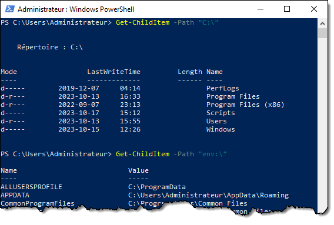

## *PSProvider* et *PSDrive*

Les **fournisseurs PowerShell** (appelés *PSProvider*) sont des couches d'abstraction permettant d'obtenir des données de différentes natures de manière uniforme.

Par exemple, le système de fichiers, les variables d'environnement et le registre sont des systèmes de données très différents. Grâce aux providers, on peut les interroger de la même manière et avec les mêmes commandes.


Voici les principaux providers

| Nom         | Description |
| ----------- | ----------- |
| FileSystem  | Ce provider procure un accès au système de fichiers. |
| Registry    | Ce provider permet de manipuler la base de registre. |
| Alias       | Ce provider permet de manipuler les alias PowerShell |
| Variable    | Ce provider permet d'interroger et gérer les variables PowerShell |
| Function    | Ce provider permet d'interroger et gérer les fonctions PowerShell |
| Environment | Ce provider donne accès aux variables d'environnement de la session en cours |


Les **lecteurs PowerShell** (*PSDrive*) sont des points d'entrée vers une ressource gérée par un *PSProvider*. Par exemple, les lecteurs C: et D: sont des lecteurs contenant un système de fichiers, accessible via le fournisseur *FileSystem*.


Plusieurs commandes PowerShell adoptent un comportement différent en fonction du fournisseur duquel le chemin spécifié est issu. 

Dans l'exemple ci-dessous, on peut voir que le type d'élément retourné par `Get-ChildItem` est différent selon que le lecteur spécifié en est un exposé par le fournisseur `FileSystem` ou par le fournisseur `Environment` (qui contient les variables d'environnement).




## Le registre de Windows

Le registre de Windows est une base de données interne à Windows qui sert à **centraliser la configuration** du système d'exploitation et de ses applications afin d'éviter l'éparpillement de fichiers de configuration.

Le registre est un composant fondamental du système d'exploitation. Windows offre diverses méthodes permettant aux applications et aux scripts de lire et d'écrire des valeurs dans le registre.

L'éditeur de registre (regedit.exe) est un outil intégré à Windows qui permet d'explorer le registre à l'aide d'une interface graphique, à l'instar de l'explorateur de fichiers permet d'explorer graphiquement le système de fichiers.


### Structure du registre

Le registre de Windows est composé de deux types d'éléments: les **clés** (*keys*) et les **valeurs** (*values*).


### Clés

Les **clés** sont des conteneurs, un peu comme les répertoires dans un système de fichiers. Elles peuvent contenir des valeurs ainsi que d'autres clés (qu'un appellera sous-clés, ou *subkeys*). Les premières clés, situées au premier niveau de l'arborescence, sont appelés des **clés de ruche** (*hive key*) ou des **clés racine** (*root key*) et ont pour préfixe HKEY_ (un diminutif de *hive key*).


### Valeurs

Les **valeurs** sont des éléments porteurs de données utilisables. Ils sont comparables aux fichiers dans un système de fichiers, mais leur contenu tend à être beaucoup plus petit et circonscrit à une propriété ou à une configuration unique. 

Chaque valeur de registre est contenue dans une clé et possède trois attributs: un **nom**, un **type** et une **donnée**.


Les données inscrite dans une clé doivent être d'un type précis. Voici les principaux types de données admissibles pour une valeur de registre:

| Type | Nom | Description |
| -- | -- | -- |
| REG_SZ | String | Une chaîne de caractères |
| REG_MULTI_SZ | MultiString | Un tableau de chaînes de caractères |
| REG_EXPAND_SZ | ExpandString | Une chaîne de caractères avec variables d'environnement (ex. %APPDATA%) |
| REG_DWORD | DWord | Une valeur numérique de 32 bits (équivalent à [uint32]) |
| REG_QWORD | QWord | Une valeur numérique de 64 bits (équivalent à [uint64]) |
| REG_BINARY | Binary | Des données binaires brutes |


### Fichiers du registre

La base de registre est composée de plusieurs fichiers, appelés **ruches** (*hive*). Au démarrage de Windows (ou d'une session utilisateur), Voici les principaux fichiers qui sont chargés:

| Clé | Fichier | Portée |
| -- | -- | -- |
| HKEY_LOCAL_MACHINE\SOFTWARE | C:\Windows\System32\config\SOFTWARE | Système |
| HKEY_LOCAL_MACHINE\SECURITY | C:\Windows\System32\config\SECURITY | Système |
| HKEY_LOCAL_MACHINE\SYSTEM | C:\Windows\System32\config\SYSTEM | Système |
| HKEY_LOCAL_MACHINE\SAM | C:\Windows\System32\config\SAM | Système |
| HKEY_USERS\\.DEFAULT | C:\Windows\System32\config\DEFAULT | Système |
| HKEY_CURRENT_USER | %UserProfile%\NTUSER.DAT | Utilisateur |


### Principales racines

Dans le registre, il y a deux racines fondamentales. 

- **`HKEY_LOCAL_MACHINE (HKLM)`** rassemble la configuration globale du système
- **`HKEY_USERS (HKU)`** rassemble la configuration des utilisateurs

Il y a aussi plusieurs racines alias, sorte de raccourcis vers certaines parties des racines fondamentales.

- **`HKEY_CURRENT_USER (HKCU)`** contient la configuration du profil de l'utilisateur courant. Elle est un raccourci vers `HKU\SID_de_l'utilisateur`.
- **`HKEY_CLASSES_ROOT (HKCR)`** contient la configuration des classes de fichiers et de protocoles, issue de la superposition de `HKCU\SOFTWARE\Classes` et `HKLM\SOFTWARE\Classes`
- **`HKEY_CURRENT_CONFIG (HKCC)`** contient de l'information sur le profil matériel du système. 


#### HKEY_CURRENT_USER (HKCU)

La clé racine `HKEY_CURRENT_USER`, ou `HKCU` en abrégé, contient les données de configuration **propres à l'utilisateur**. Chaque utilisateur possède sa propre ruche. Ces données sont comprises dans le fichier `NTUSER`.DAT situé dans le profil utilisateur sous `C:\Users\`. 

L'utilisateur n'a pas besoin d'être administrateur local pour écrire ou modifier des valeurs dans cette ruche, puisque celle-ci appartient à l'utilisateur.


#### HKEY_LOCAL_MACHINE (HKLM)

La clé racine `HKEY_LOCAL_MACHINE`, ou `HKLM` en abrégé, contient les données de configuration **globales du système**. Ces configurations sont les mêmes peu importe l'utilisateur connecté.

On doit obligatoirement posséder des droits d'administration pour modifier les valeurs contenues dans cette ruche.

La plupart des paramètres propres aux éléments logiciels (y compris les paramètres du système d'exploitation) sont situés dans la clé SOFTWARE.

:::tip
De nos jours, Windows est presque toujours installé dans son édition 64 bits. Cependant, certaines applications plus vieilles ont été compilées pour une architecture de processeur 32 bits. Windows 10/11 et Windows Server possèdent un sous-système d'émulation permettant d'exécuter des programmes 32 bits. Ce sous-système s'appelle "WoW64", pour "*Windows-on-Windows 64-bit*". 

Les fichiers des logiciels 32-bits installés dans une éditions 64-bits de Windows sont situés dans le répertoire `C:\Program Files (x86)\` (référencé par la variable d'environnement `%ProgramFiles(x86)%`, ou `$env:{ProgramFiles(x86)}` en PowerShell). Leurs paramètres dans le registre sont situés sous la clé `HKLM\SOFTWARE\WOW6432Node\`.
:::

#### HKEY_USERS (HKU)

La clé racine `HKEY_USERS` (en abrégé `HKU`) est une des racines fondamentales de Windows et comprend tous les utilisateurs qui ont une session ouverte.

La clé `.DEFAULT` représente le profil utilisateur du compte SYSTEM, et les autres clés sont identifiées par le SID de l'utilisateur.

La ruche de l'utilisateur courant est accessible par `HKEY_CURRENT_USER`.


#### HKEY_CLASSES_ROOT (HKCR)

La clé racine `HKEY_CLASSES_ROOT` (en abrégé `HKCR`) contient la configuration des types de documents, d'extensions et des protocoles pris en charge par Windows. L'organisation de cette racine est assez complexe, mais essentielle à Windows puisque c'est là qu'est rassemblée toute l'information qui permet à Windows de savoir, par exemple, quelle application démarrer si on double-clique sur un fichier portant une extension, quelles sont les options disponibles dans le menu contextuel, etc.

Cette racine est en fait une combinaisaison de deux clés:
- `HKEY_LOCAL_MACHINE\SOFTWARE\Classes` (la configuration système)
- `HKU\(sid)_CLASSES` (la configuration utilisateur)

Un paramètre défini dans la configuration utilisateur a préséance sur le même paramètre défini dans la configuration système.

:::tip
La partie *Classes* du profil utilisateur n'est pas sauvegardée dans `%USERPROFILE%\NTUSER.DAT` comme le reste de sa ruche, elle est dans un fichier différent: `%LOCALAPPDATA%\Microsoft\Windows\UsrClass.dat`
:::


## Accès au registre avec PowerShell

On peut facilement lire et écrire des informations dans le registre de Windows via le fournisseur `Registry`.

### Obtenir la liste des sous-clés d'une clé

On obtient la liste des sous-clé d'une clé avec la commande `Get-ChildItem`.


Pour voir seulement la liste des clés, sans montrer aussi les valeurs qui y sont contenues, on peut ajouter le *switch* `-Name`.


### Tester si une clé existe

Pour tester si une clé existe, c'est très simple: il suffit d'utiliser `Test-Path`.


### Créer une clé

Pour créer une nouvelle clé, on peut utiliser la commande `New-Item`.

```powershell
New-Item -Path "HKCU:\SOFTWARE\MaNouvelleClé"
```


Pour que ça fonctionne, la clé parente doit exister. On peut cependant spécifier le switch `-Force` pour que l'arborescence de clé soit automatiquement créée.


### Effacer une clé

Pour effacer une clé, il suffit d'utiliser la commande `Remove-Item`.

```powershell
Remove-Item -Path "HKCU:\SOFTWARE\MaNouvelleClé"
```


Si cette clé contient des sous-clés, on peut spécifier le switch `-Recurse` pour effacer récursivement toutes les sous-clés.

```powershell
Remove-Item -Path "HKCU:\SOFTWARE\UneClé" -Recurse
```


### Obtenir les valeurs dans une clé

Pour obtenir toutes les valeurs dans une certaine clé, on peut utiliser la commande `Get-ItemProperty`.


Pour obtenir une valeur spécifique, on peut utiliser la commande `Get-ItemPropertyValue` en spécifiant la clé comme chemin et le nom de la valeur.


Il existe plusieurs autres manières d'obtenir les données dans une valeur de registre. Voici quelques autres exemples:


On peut aussi utiliser la méthode `.GetValue()` d'une clé, comme le montre l'exemple ci-dessous:


### Tester si une valeur existe

Voici une manière de tester si une valeur existe.


### Créer une valeur

Pour créer une valeur dans le registre, on peut utiliser la commande `New-ItemProperty`.

Voici un exemple qui modifie la configuration du bloc-notes de Windows pour que la police de caractères soit "Comic Sans MS".

```powershell
$NewRegValSplat = @{
    Path = "HKCU:\SOFTWARE\Microsoft\Notepad\"
    Name = "lfFaceName"
    PropertyType = "String"
    Value = "Comic Sans MS"
}

New-ItemProperty @NewRegValSplat
```


### Modifier une valeur existante

Pour modifier une valeur de registre existante, on peut utiliser la commande `Set-ItemProperty`. La valeur doit déjà exister pour que cette commande fonction

```powershell
$SetRegValSplat = @{
    Path = "HKCU:\SOFTWARE\Microsoft\Notepad\"
    Name = "lfFaceName"
    Value = "Wingdings"
}

Set-ItemProperty @SetRegValSplat
```

### Effacer une valeur

Pour effacer une valeur de registre, on peut utiliser la commande `Remove-ItemProperty`.


