WMI (Windows Management Instrumentation) est l'implémentation par Microsoft du standard ouvert WBEM (Web-Based Enterprise Management) permettant la gestion centralisée et unifiée d'équipements informatiques en entreprise, lui-même dérivé d'un autre standard ouvert, CIM (Common Information Model).

WMI a été introduit nativement dans Windows depuis Windows 2000, et est encore activement utilisé aujourd'hui par des administrateurs de système afin de gérer des parcs informatiques de manière centralisée et automatisée.

## À quoi sert WMI?

Grâce à WMI, on peut interroger et contrôler le système d'exploitation Windows. WMI est en quelque sorte une librairie de classes servant à accéder différentes ressources du système. Ces ressources sont, par exemple, les propriétés de notre ordinateur (modèle, fabricant, numéro de série, etc.), les différents composants matériels, les applications installées, la configuration réseau, etc.

Bien sûr, PowerShell offre certaines commandes servant à obtenir des informations sur le système. Par exemple, Get-Process, Get-Service, Get-LocalUser, etc. Mais souvent, ces commandes utilisent WMI en arrière-plan. WMI est beaucoup plus grand et vaste que ce que les commandes PowerShell peuvent nous offrir.

Voici quelques exemples de ce qu'on peut faire avec WMI dans un script:

- Savoir si le PC est un portable, un ordinateur de table, un serveur tour, un serveur en rack, etc.
- Connaître le modèle du PC, son fabricant, son numéro de série, etc.
- Obtenir la liste de tous les périphériques branchés
- Obtenir le modèle et le numéro de série de la batterie d'un laptop
- Obtenir la configuration de la table de routage interne de Windows
- Obtenir la liste et la date d'installation de toutes les mises à jour de Windows installées
- Obtenir la liste des imprimantes configurées
- Obtenir la liste des partages réseau
- Obtenir la liste de toutes les cartes réseau configurées, avec leur adresses MAC et IP
- Et de nombreuses autres choses, dont certaines impossibles à faire avec les consoles et les commandes existantes.

Et encore là, ce n'est que la superficie de ce que WMI permet de réaliser. Autrement dit, WMI donne à nos script la possibilité d'administrer le système sur lequel il est lancé… et même sur des ordinateurs distants!

Connaître comment utiliser WMI est vraiment essentiel pour tout administrateur Windows.

## Architecture du service WMI

WMI est structurée en trois principales couches: Les fournisseurs (providers), l'infrastructure et les consommateurs (consumers).

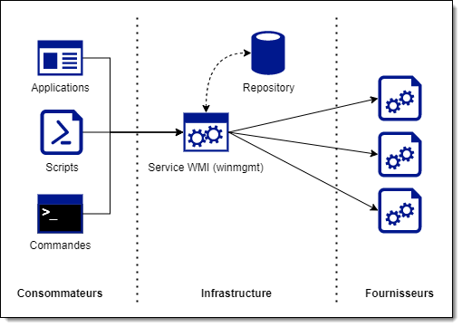

### Les objets gérés et les providers WMI

Un objet géré (_managed object_) est un composant logiciel ou matériel, tel qu'un disque dur, une carte réseau, un processus, un service, une application, etc. Ces objets sont accédés par un fournisseur (_WMI provider_) qui, à la manière d'un driver, rendent accessibles certaines informations et fonctions les concernant, sous forme de classes. Ces classes possèdent des propriétés et des méthodes, et définissent la nature des objets, lesquels peuvent être présents en plusieurs instances.

Sous Windows, plusieurs fournisseurs WMI de base sont préinstallés. Ainsi, le fournisseur `StrRegProv` permet d'interroger la base de registre de Windows à travers WMI, et le fournisseur Win32 permet de manipuler et d'interroger les propriétés du système d'exploitation (processus, services, etc.)

### Infrastructure WMI

L'infrastructure WMI est un composant de Windows servant à rendre accessibles les objets gérés WMI aux consommateurs. À l'instar d'un système de base de données, elle comprend un repository (une sorte de base de données) ainsi qu'un service pour traiter les requêtes.

Le repository est organisé sous forme de namespaces, de sorte à former une arborescence sous une racine appelée `ROOT`. Dans ces namespaces se retrouvent les différentes classes offertes par les providers. Certains namespaces sont créés automatiquement par le service WMI, mais la plupart sont créés par les différents providers enregistrés dans le système.

À la manière d'une base de données, on peut interroger le repository en envoyant des requêtes à un service chargé de les traiter. Ce service se nomme winmgmt et fait partie des services de base de Windows. De plus, le service WMI peut être accédé à distance à travers le réseau (à condition que le consommateur dispose de droits d'administration sur la machine distante et que le pare-feu soit correctement configuré).

### Consommateurs WMI

Le consommateur WMI est toute application ou script qui souhaite interroger la base WMI. Il peut énumérer les _namespaces_, les classes et leurs instances (objets), interroger leurs propriétés et exécuter leurs méthodes. Les scripts d'administration sous Windows sont très fréquemment des consommateurs WMI, puisque c'est souvent l'unique manière d'interagir avec certaines propriétés du système d'exploitation.

### Le _WMI Repository_

Essentiellement, la base WMI est composée d'espaces de nommage, ou _namespaces_, disposés en arborescence sous la racine `ROOT`. Le _namespace_ le plus couramment utilisé dans les scripts d'administration est `ROOT\cimv2`, et il est généralement considéré comme le _namespace_ par défaut.

Dans ce _namespace_ se trouvent les classes qui permettent d'obtenir des informations spécifiques à Windows. Ces classes ont un nom qui débute par le préfixe Win32. Il existe d'autres classes dans ce _namespace_, dont plusieurs commencent par le préfixe CIM, mais elle ne sont pas intéressantes puisque plus limitées. Elle sont seulement là pour respecter le standard CIM duquel WMI est inspiré.

Les ressources du système sont des instances de ces classes, ou objets, qui possèdent des propriétés et des méthodes. Cette structure est directement inspirée par le paradigme orienté-objet.


L'illustration ci-dessous montre l'outil [WMI Explorer](https://github.com/vinaypamnani/wmie2/releases), permettant de naviguer au sein du repository WMI. Vous y voyez, de gauche à droite, les namespaces, les classes présentes dans le namespace sélectionné, les instances de cette classe, ainsi que les propriétés de l'instance. Dans cet exemple, la classe `Win32_LocalDisk` définit ce qu'est un disque logique, et chaque instance de cette classe représente un disque logique reconnu par Windows. Chaque disque logique possède des propriétés uniques, comme une lettre, une taille, un système de fichiers, etc.

Cette application interroge le service WMI de la même manière que vous pourriez le faire dans vos scripts. De ce fait, WMI un outil très puissant lorsqu'il est question de développer des scripts administratifs.

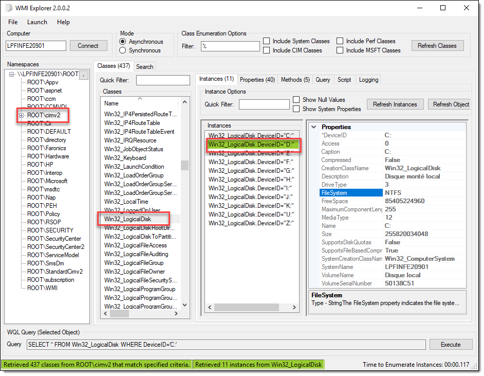

### Le langage WQL

Le langage WQL (WMI Query Language) est un dérivé du SQL et sert à effectuer des requêtes au service WMI.

Pour effectuer une requête simple, on utilise la clause `SELECT` pour spécifier le nom des propriétés à inclure à la requête et la clause `FROM` pour spécifier la classe WMI.

```sql
SELECT Name, FileSystem, Size, FreeSpace FROM Win32_LogicalDisk
```

On peut voir toutes les propriétés avec `SELECT *`.

```sql
SELECT * FROM Win32_LogicalDisk
```

On peut ajouter un filtre à l'aide de la clause `WHERE` avec une condition (_propriété opérateur constante_).

```sql
SELECT * FROM Win32_LogicalDisk WHERE FileSystem = 'NTFS'
```

Les opérateurs admissibles sont:

| Opérateur           | Description                                        |
| ------------------- | -------------------------------------------------- |
| **=**               | Égal à                                             |
| **\<**              | Plus petit que                                     |
| **\>**              | Plus grand que                                     |
| **\<=**             | Plus petit ou égal à                               |
| **\>=**             | Plus grand ou égal à                               |
| **\!=** ou **\<\>** | Différent de                                       |
| **IS NULL**         | Est nul                                            |
| **IS NOT NULL**     | N'est pas nul                                      |
| **AND**             | Et logique (pour spécifier plusieurs conditions)   |
| **OR**              | Ou logique (pour spécifier plusieurs conditions)   |
| **NOT**             | Non logique                                        |
| **LIKE**            | Comparaison de chaîne de caractère avec _wildcard_ |

Les wildcards admissibles avec l'opérateur `LIKE` sont:

| _Wildcard_ | Description                                                                |
| ---------- | -------------------------------------------------------------------------- |
| **%**      | N'importe quelle chaîne de 0 ou plus caractères                            |
| **\_**     | N'importe quel caractère (un seul)                                         |
| **[ ]**    | Un caractère parmi les caractères en crochet (`[a-f]` ou `[abcdef]`)       |
| **[^ ]**   | Un caractère autre que ceux spécifiés en crochet (`[^a-f]` ou `[^abcdef]`) |

Voici un exemple de requête permettant d'obtenir toutes les imprimantes locales de marque HP.

```sql
Select * FROM Win32_Printer WHERE Local="TRUE" AND DriverName LIKE "%HP%"
```

## Utilisation de WMI avec PowerShell

Il existe plusieurs manières d'interroger le service WMI, mais la plus simple en PowerShell consiste à utiliser la commande `Get-WmiObject`, ou son alias `gwmi`.

La principale utilisation de la commande `Get-WmiObject` vise à obtenir une ou plusieurs instances d'une classe dans un _namespace_ donné. Il en résulte à sa sortie un tableau d'objets qui possèdent les propriétés et les méthodes définis par leur classe.


Cette commande se comporte comme la plupart des commandes PowerShell, en ce sens qu'elle retourne un objet. Cet objet peut être manipulé à l'instar de tous les objets PowerShell.

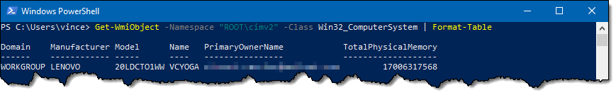

Le paramètre `-Namespace` est optionnel. Lorsqu'il est omis, la commande regarde dans `ROOT\cimv2`. Et on peut spécifier la classe sans devoir spécifier le nom du paramètre `-Class`.

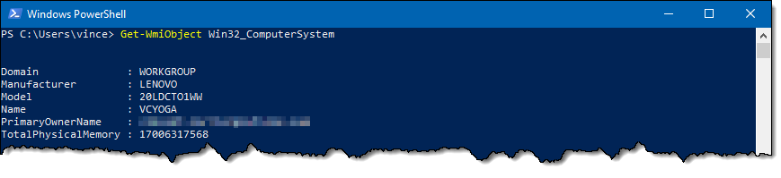

Les objets correspondant à une instance de classe WMI sont de type ManagementObject.


## Commande _Get-WmiObject_

Voici les principaux paramètres qu'on peut fournir à `Get-WmiObject`:

| Paramètre       | Description                                                                                                                                                                                                |
| --------------- | ---------------------------------------------------------------------------------------------------------------------------------------------------------------------------------------------------------- |
| `-Class`        | Nom de la classe WMI dont on veut obtenir les instances.                                                                                                                                                   |
| `-Property`     | Propriété(s) à récupérer (pour s'éviter un `Select-Object`)                                                                                                                                                |
| `-Namespace`    | Le _namespace_ où se trouve la classe. Si ce paramètre n'est pas spécifié, c'est `ROOT\cimv2` qui est pris par défaut                                                                                      |
| `-Filter`       | Spécifie un filtre pour ne retourner que certains objets selon les critères spécifiés. Attention, ce paramètre n'a pas la syntaxe PowerShell mais WQL (proche du SQL).                                     |
| `-Query`        | Au lieu des paramètres `-Class`, `-Property` et `-Filter`, on peut définir une chaîne de caractère représentant une requête WQL (par exemple, `SELECT * FROM Win32_LogicalDisk WHERE FileSystem = 'NTFS'`) |
| `-ComputerName` | Nom de l'ordinateur sur lequel on veut effectuer la requête. Si ce paramètre n'est pas spécifié, c'est "`.`" qui est sa valeur par défaut, ce qui correspond à la machine locale.                          |
| `-Credential`   | Objet de type `[PSCredential]` pour l'authentification. Cette notion sera couverte plus tard.                                                                                                              |
| `-List`         | Affiche la liste des classes du _namespace_ (soit celui spécifié dans le paramètre `-Namespace`, soit `ROOT\cimv2` par défaut)                                                                             |

En sortie, `Get-WmiObject` envoie dans le pipeline un tableau d'objets de type `[ManagementObject]`, ou un objet unique lorsqu'il n'y a qu'une instance. Cet objet peut être affecté à une variable, ou passé à une autre commande via le pipeline, comme les commandes `Format-`, `Out-`, `Sort-`, `Select-`, etc. Autrement, cet objet tombe dans l'hôte et est converti en texte.


On voit cependant que cette commande retourne aussi certaines propriétés système propres à WMI, alors il peut être intéressant de passer cet objet dans un `Select-Object` pour sélectionner les propriétés qu'on veut.


:::tip
Le paramètre `-Property` de `Get-WmiObject` peut quand même être pratique en conjonction avec `Select-Object`, car certains objets WMI ont un grand nombre de propriétés. WMI est un système particulièrement lent, alors si vous ne spécifiez pas les propriétés dans `Get-WmiObject`, ça pourrait nuire à la performance de votre script.
:::

## Énumération des classes WMI

On peut obtenir la liste des classes avec `Get-WMIObject -List`. Par défaut, on recherche dans le namespace `cimv2`.


Pour une recherche plus précise, on peut spécifier un **filtre**.


### Quelques classes intéressantes

Voici quelques classes particulièrement utiles sous `ROOT\cimv2`:

| Classe                           | Description                                                                                                                                                  |
| -------------------------------- | ------------------------------------------------------------------------------------------------------------------------------------------------------------ |
| `Win32_ComputerSystem`           | Informations de base sur le système, comme le modèle et le fabricant, le hostname, le domaine AD, le fuseau horaire, le nombre de processeurs logiques, etc. |
| `Win32_NetworkAdapter`           | Cartes réseau (physiques et logiques) installées.                                                                                                            |
| `Win32_NetworkAdapterConnection` | Configuration des cartes réseau (puisqu'une carte réseau peut avoir plusieurs connections, il doit y avoir une classe différente)                            |
| `Win32_NetworkConnection`        | Partages réseau mappés.                                                                                                                                      |
| `Win32_LogicalDisk`              | Les disques durs logiques (C:, D:, etc.)                                                                                                                     |
| `Win32_Account`                  | Comptes utilisateurs et des groupes locaux.                                                                                                                  |
| `Win32_UserAccount`              | Comptes utilisateurs locaux                                                                                                                                  |
| `Win32_Group`                    | Groupes locaux                                                                                                                                               |
| `Win32_NTLogEvent`               | Événements du journal d'événements Windows                                                                                                                   |
| `Win32_Process`                  | Processus en exécution                                                                                                                                       |
| `Win32_Service`                  | Services                                                                                                                                                     |
| `Win32_SystemEnclosure`          | Information sur le boîtier et le facteur de forme (par exemple, pour distinguer les laptops, les tours, les serveurs rackmount, les tablettes, etc.)         |
| `Win32_BIOS`                     | Information sur le BIOS (fabricant, version, révision, etc.)                                                                                                 |
| `Win32_Battery`                  | Information sur la batterie (charge restante...)                                                                                                             |

## Collectins d'objets et filtrage

Certaines classes n'ont qu'une seule instance (par exemple, `Win32_ComputerSystem`), mais d'autres en ont plusieurs. Lorsqu'on exécute une requête WMI sur ces classes, on obtient un tableau d'objets.


Il se trouve que par défaut, `Get-WmiObject` est formatée en liste plutôt qu'en tableau. Mais il s'agit bel et bien d'un objet et on peut le manipuler de la même manière que toutes les autres collections PowerShell.

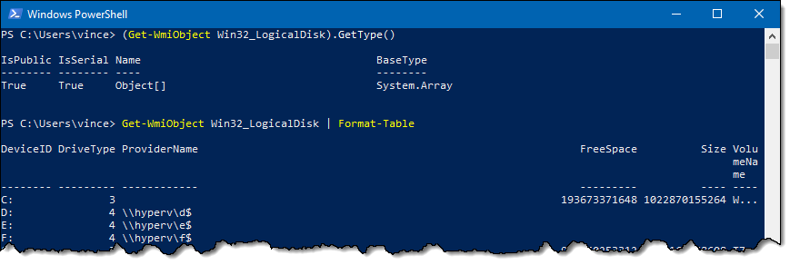

Si on veut une instance spécifique, on doit définir un filtre. Il y a plusieurs manières de procéder.

### Avec _Where-Object_

On peut utiliser l'habituelle commande `Where-Object` pour filtrer une collection et ne garder qu'une ou certaines de ses instances.

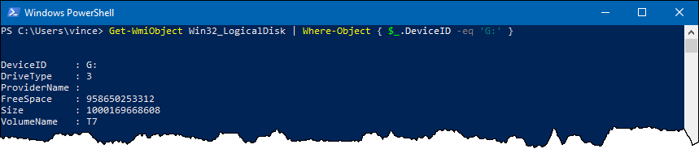

Ou on peut aussi utiliser cette méthode pour obtenir une collection plus petite de toutes les instances qui obéissent à une condition précise.

Dans cet exemple, on filtre pour ne retenir que les disques locaux et non les disques réseau. Selon la documentation, la propriété `DriveType` prend la valeur 3 pour un disque local et 4 pour un lecteur réseau.


### Dans la requête WMI

On peut utiliser le paramètre `-Filter` de `Get-WmiObject` pour définir les critères.


Cette technique préférable à `Where-Object` dans la plupart des cas, car avec cette dernière, toutes les instances circulent dans le pipeline avant le `Where-Object`.

Supposons que le résultat de la requête `Get-WmiObject` donnait un million d'instances. Avec `Where-Object`, il aurait fallu accumuler un million d'objets dans le pipeline, avant le filtrage. Lorsqu'on spécifie le filtre dans la requête WMI, on évite de manipuler les objets qu'on ne veut pas. Ainsi, on gagne en performance et on évite de surutiliser la mémoire du système.

Le désavantage de cette méthode, c'est que les critères doivent être définis en WQL et non en PowerShell. WQL est un langage plus limité que PowerShell. Il arrive parfois qu'on doive faire une partie du travail de filtrage par la requête WMI, puis une autre passe, plus fine, avec `Where-Object`.

### Dans une requête WQL

Lorsqu'on choisit d'utiliser une requête WQL, le filtre doit être défini après la clause `WHERE`, de la même manière qu'en SQL.


## Membres des objets

La commande `Get-WmiObject` s'utilise de la même manière que `Get-Process`, `Get-Service` ou `Get-ChildItem`. Il sort de cette commande un objet (lorsque WMI ne possède qu'une seule instance de cette classe) ou un tableau d'objets (lorsque WMI possède plusieurs instances). Ces objets ont des membres (des propriétés et des méthodes) correspondant à celles de leur classe. Les techniques pour explorer ces objets à la recherche de ce qu'on peut exploiter sont donc semblables à ce qu'on peut faire avec les objets retournés par les commandes natives de PowerShell.

La classe `Win32_OperatingSystem` définit plusieurs propriétés d'un système d'exploitation Windows. Comme il n'y a qu'un seul système d'exploitation actif dans un système, il n'y a qu'un objet, et non une instance d'objets, qui sort de la commande. Avec un `Select-Object *` ou un `Format-List *`, on peut forcer PowerShell à afficher toutes les propriétés de l'objet.

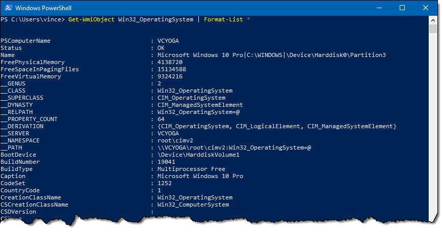

S'il y a plusieurs instances de la classe recherchée, il faut être un peu plus créatif. On pourrait sélectionner un seul objet pour observer son contenu:

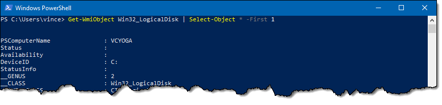

Ou encore utiliser `Out-GridView`…

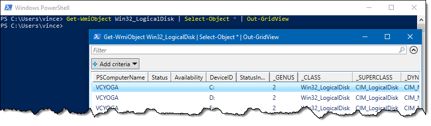

Ou bien exporter en CSV pour pouvoir importer directement dans Excel!

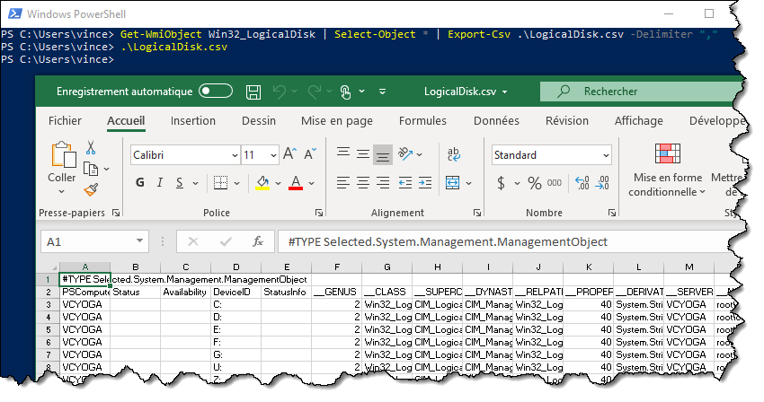

Une autre approche consiste à utiliser `Get-Member`. On peut voir les propriétés, mais aussi les méthodes pouvant être appelées sur cet objet. On peut aussi connaître le type de données de ces propriétés. Cependant, cela ne nous permet pas de voir le contenu.

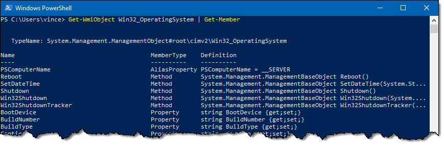

On peut aussi utiliser le paramètre `-MemberType` de `Get-Member` pour n'afficher que les propriétés ou les méthodes.


### Propriétés

On interroge les propriétés d'un objet WMI de la même manière que sur un objet ordinaire. On peut manipuler les propriétés à notre guise et faire toutes les manipulations qu'on souhaite.

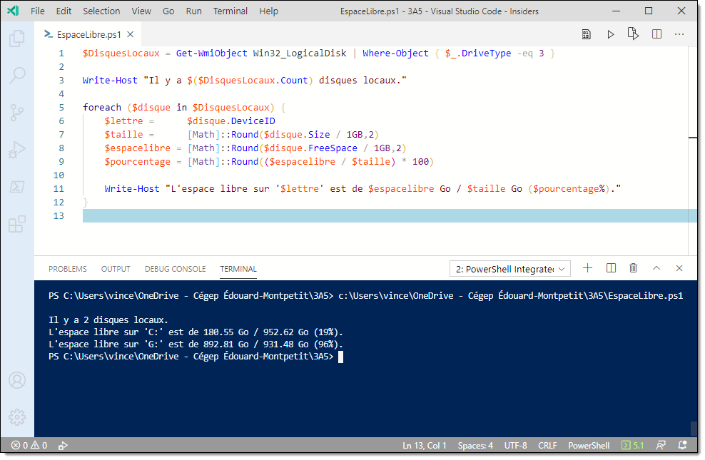

### Méthodes

Il y a plus d'une manière d'appeler une méthode sur un objet WMI.

#### Option 1: Par un appel de méthode sur l'objet

Cette technique revient à simplement appeler une méthode comme vous êtes habitués de le faire. L'exemple ici se fait avec une variable pour, mais on pourrait très bien le faire sur la même ligne.


Notez ci-dessus qu'un objet est retourné. Cet objet sert transmettre au consommateur de WMI un code de retour, où 0 signifie un succès, et n'importe quelle autre valeur signifie qu'une erreur est survenue.

Lorsqu'il y a plusieurs processus du même nom (ici, deux processus _notepad.exe_), alors la méthode est exécutée à chacun des objets, sans qu'on n'ait besoin de faire une boucle.

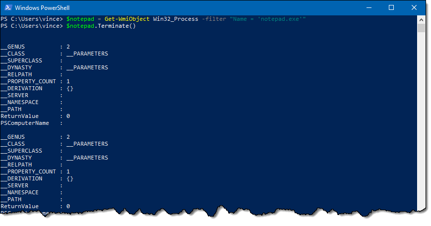

#### Option 2: Avec la commande _Invoke-WmiMethod_

On peut aussi utiliser la commande `Invoke-WmiMethod`. Il suffit de lui passer un objet WMI dans le pipeline et spécifier le nom de la méthode.

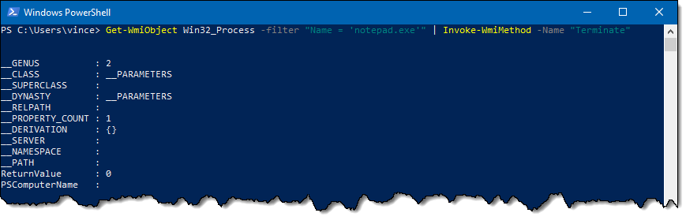

#### Passage de paramètres

On peut passer des paramètres aux méthodes WMI. Cependant, il faut souvent se fier à la documentation de Microsoft pour connaître quels paramètres passer et dans quel format.


#### Cacher l'objet de retour

Si, dans votre script, vous souhaitez invoquer une méthode d'un objet WMI, vous ne voulez pas vraiment que le script affiche l'objet de retour.


Une manière de faire est d'affecter cet objet dans une variable. Ainsi, il ne tomberait pas dans la console à la fin du pipeline. Cependant, ce n'est pas propre puisqu'on utilise de la mémoire inutilement (à moins, bien sûr, qu'on souhaite utiliser cet objet par la suite).


On pourrait aussi affecter cet objet dans une variable, mais cette fois, dans la variable $null. Cette variable est spéciale car elle est toujours vide. Donc si on affecte l'objet dans cette variable, il n'aboutit pas dans la console et sa référence est instantanément détruite.

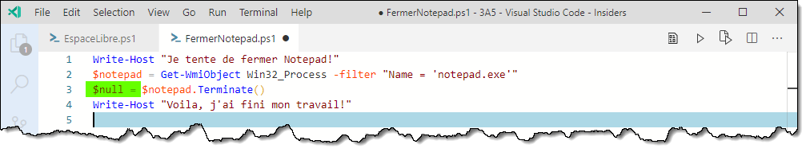

Il y a une manière plus propre et beaucoup plus explicite d'envoyer un objet dans le néant. Il suffit de terminer le pipeline avec la commande de sortie Out-Null.

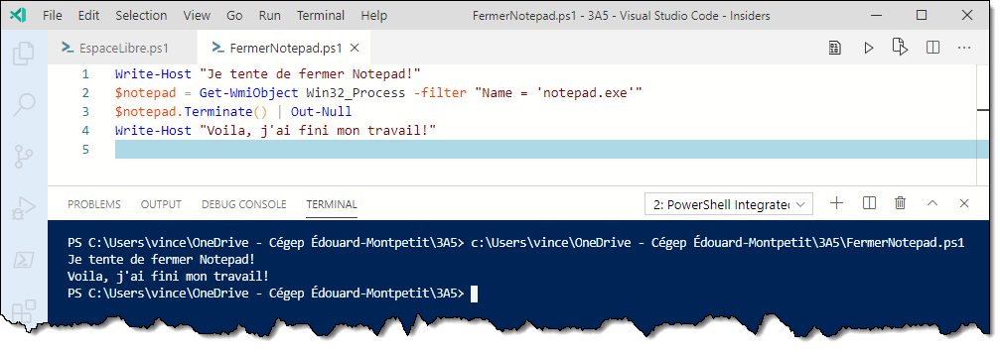

## Outils

Plusieurs outils permettent d'explorer WMI de manière conviviale. Cela peut vous aider grandement dans vos scripts!

### WBEMTest

C'est un outil inclus dans Windows. Il permet d'explorer WMI, mais il est difficile à utiliser et peu convivial. WMI est beaucoup plus vaste et complexe que ce qui est couvert dans ce cours, et cet outil permet d'explorer la mécanique interne de WMI. Par contre, l'outil est inclus dans Windows (tapez simplement "wbemtest" dans une ligne de commande pour le lancer), ce qui vous évite de devoir télécharger un outil.

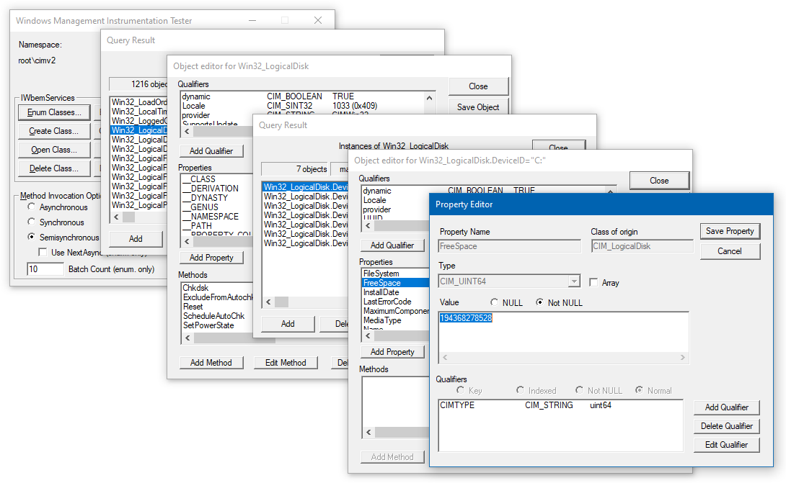

Voici l'article de la documentation portant sur cet outil:
https://docs.microsoft.com/en-us/mem/configmgr/develop/core/understand/introduction-to-wbemtest

### WMIExplorer 2.0

Cet outil est le meilleur que je connaisse, et il est gratuit. Il peut se connecter sur la machine locale ou une machine distante sur le réseau, et permet de générer des scripts automatiquement! Je vous encourage fortement à l'essayer.

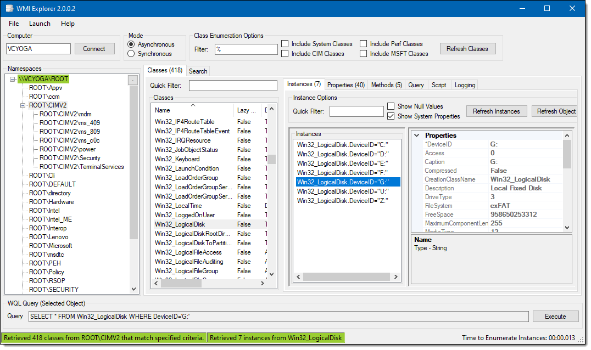

Vous pouvez le télécharger ici:
https://github.com/vinaypamnani/wmie2/releases/latest

### PowerShell WMI Browser

Cet outil est aussi gratuit et téléchargeable sur Internet. Il n'est pas aussi avancé que WMIExplorer, mais il est programmé complètement en PowerShell! Vous pouvez voir son code.

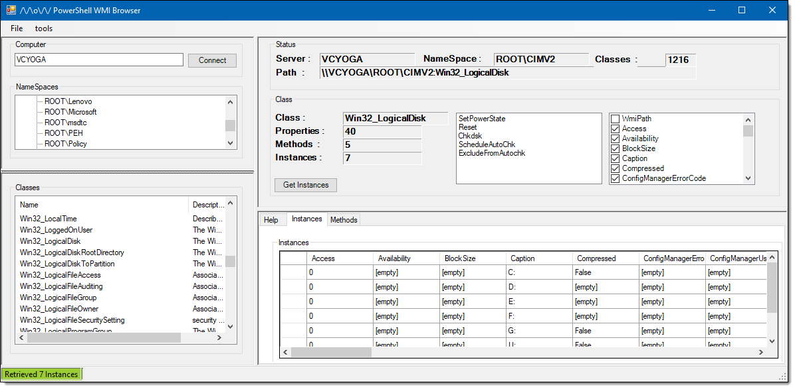

Oui, on peut faire des interfaces graphiques en PowerShell! :-)

Vous pouvez le télécharger ici:
https://jdhitsolutions.com/blog/powershell/2848/wmi-explorer-from-the-powershell-guy/

Il y en a d'autres, mais ils sont soit payants ou désuets. Les outils ci-dessus, en plus de la commande `Get-WmiObject`, vous donneront tout ce qu'il vous faut pour utiliser WMI!

## WMI Explorer 2.0 (mon préféré)

Cet outil est le meilleur que je connaisse, et il est gratuit. Vous pouvez le télécharger sur le site GitHub de son développeur (https://github.com/vinaypamnani/wmie2/releases/latest)

Lorsque vous ouvrez cet outil, vous pouvez parcourir les différents namespaces. Un double-clic sur le namespace énumère ses classes, et un double-clic sur une classe énumère ses instances. Finalement, sélectionnez une instance et vous aurez toutes ses propriétés. Vous pouvez spécifier un ordinateur différent du votre (le "." réfère à l'ordinateur local). En prime, vous avez en tout temps au bas de la fenêtre la requête WQL correspondant à l'instance que vous avez sélectionnée.


Dans l'onglet Properties, vous avez une liste de toutes les propriétés de la classe sélectionnée, tirée de la documentation de WMI.

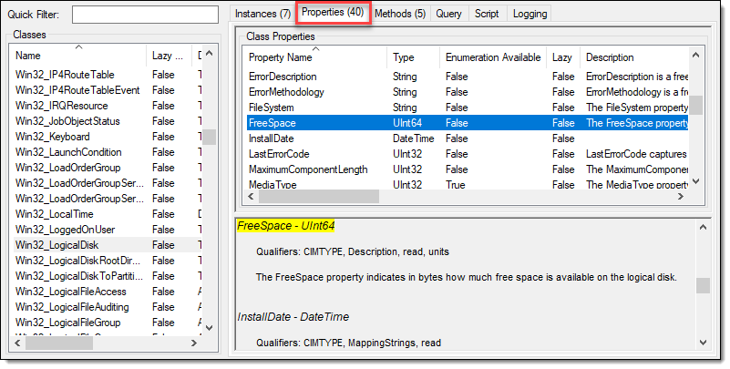

Et dans l'onglet Methods, vous avez la même chose mais pour les méthodes, avec la définition des paramètres d'entrée et de sortie. Attention, ces méthodes ne se comportent pas comme des méthodes classique appelées dans PowerShell, et il peut être un peu ardu de les utiliser.


D'ailleurs, pour exécuter une méthode, il suffit de cliquer-droit sur l'instance (pour un méthode non statique) ou sur la classe (pour une méthode statique).

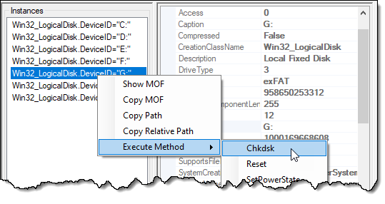

Mais là où cet outil devient vraiment intéressant (et presque de la triche), c'est dans l'onglet Script. Vous pouvez générer automatiquement un bout de code PowerShell qui récupère toutes les propriétés des instances de la classe, et le coller dans votre script. Le bout de code tel quel ne sert pas à grand-chose, mais il vous donne un exemple d'utilisation de toutes les propriétés des objets. Vous n'avez ensuite à prendre ce que vous voulez. L'outil ne fait pas tout le travail, mais en fait une partie à votre place.


