On peut lancer des requêtes WMI à distance sur une machine du réseau, en spécifiant le paramètre `-ComputerName` de la commande `Get-WmiObject`.

Pour que ce soit possible, il faut s'assurer de plusieurs choses:
- La machine distante est joignable sur le réseau
- Le service WMI (winmgmt) est actif sur la machine distante (c'est le cas par défaut)
- Nous avons des droits d'administration sur la machine distante
- Le pare-feu laisse passer le trafic WMI

Lorsque les machines sont membres du domaine et que nous sommes authentifiés avec un compte qui possède des droits d'administration sur les machines (c'est le cas du compte d'admin du domaine), il suffit de préciser le nom de la machine et les requêtes se font à travers le réseau.

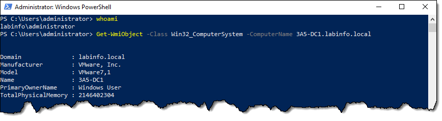


Le paramètre `-ComputerName` est de type `string[]`, donc il est possible de lui donner plusieurs ordinateurs, ou encore de lui passer un tableau de strings.

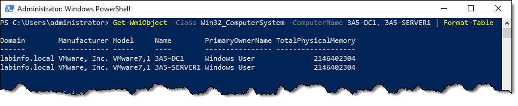


:::tip
Même si le nom du paramètre suggère qu'on doive passer un nom d'ordinateur, on peut aussi passer l'adresse IP numérique de l'ordinateur ou encore le nom DNS complet (FQDN). Dans un environnement de domaine simple, on tend souvent à n'indiquer que le nom de l'ordinateur, puisque les machines membres du domaine vont automatiquement appliquer le suffixe DNS de leur domaine. 

Concernant les résolutions de nom court: Par exemple, si on tente de résoudre le serveur *SRV01* sur une machine client membre du domaine *auto.cemti.ca*, la résolution réelle se fera sur *SRV01.auto.cemti.ca*. 
:::


### Préparation

Dans plusieurs cas, l'administration à distance de Windows est désactivée pour des raisons de sécurité. On l'active au besoin. Dans plusieurs entreprises, où la gestion des ordinateurs à distance est importante, ces configurations sont automatisées.

#### Pare-feu

WMI repose sur DCOM et RPC, deux protocoles d'administration à distance intégrés à Windows. Ceux-ci sont actifs par défaut sous Windows, mais le pare-feu bloque le trafic provenant de l'extérieur. Pour permettre de passer des requêtes WMI à une machine distante, il faut ouvrir le pare-feu des machine sur lesquelles vous voulez vous connecter.

Pour ce faire, démarrez la console avancée du pare-feu de Windows (wf.msc) et activez l'ensemble de règles du groupe "Windows Management Instrumentation".

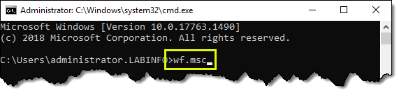

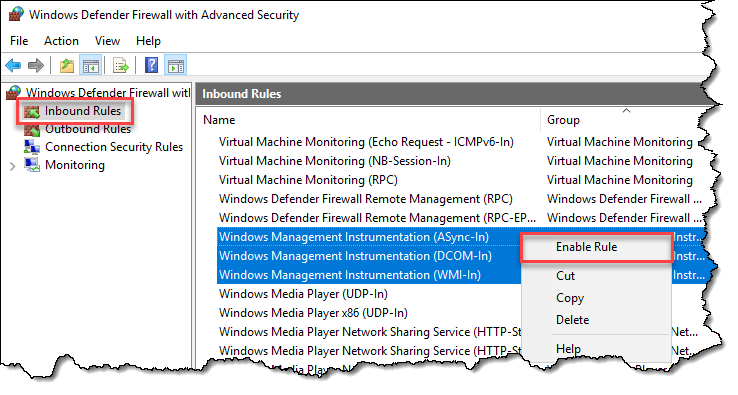

Vous pouvez maintenant tester la connexion en spécifiant les paramètres `ComputerName` et `Credential` (si nécessaire).


### Get-Credential

Pour administrer une machine à distance, il faut minimalement avoir les privilèges pour l'administrer.

Dans un domaine Active Directory, l'authentification est généralement intégrée. Lorsque vous ouvrez une session sur votre machine avec votre compte AD, c'est ce même compte qui sera automatiquement passé à la machine distante que vous tentez d'administrer. Cela simplifie beaucoup les choses.

Lorsqu'on veut poser une action sur un serveur distant avec un compte différent de celui dont on s'est servi pour s'authentifier à notre machine, une manière de procéder est par l'emploi de la commande `Get-Credential`.

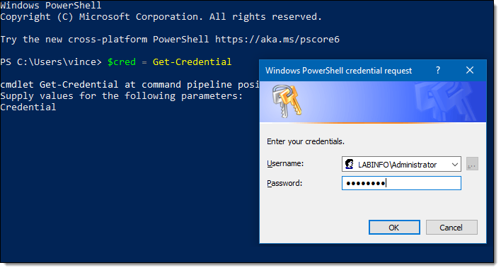

L'objet retourné est de type `PSCredential` et est le type d'objet à passer lorsqu'une commande possède un paramètre `Credential`

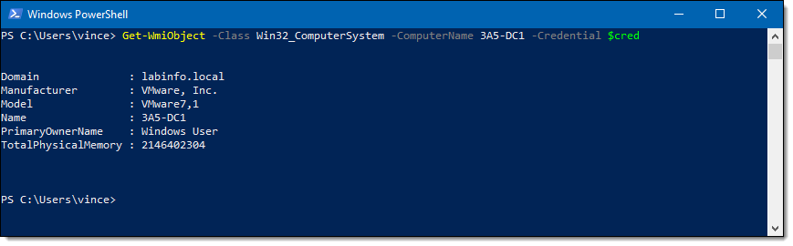


:::tip
On ne devrait jamais utiliser `Get-Credential` dans un script ou une fonction, car cela force une action de l'utilisateur même s'il possède déjà des droits suffisants. Ça l'obligerait à se réauthentifier à chaque lancement du script. On ne devrait utiliser `Get-Credential` que lorsque l'utilisateur doit utiliser un compte différent que celui avec lequel il opère sa session PowerShell.

En fait, on devrait plutôt créer un paramètre `-Credential` non-obligatoire dont la valeur par défaut est un jeton vide.

```powershell
[CmdletBinding()]
Param(
    [System.Management.Automation.PSCredential]
    $Credential = [System.Management.Automation.PSCredential]::Empty
)
```

On passe alors `$Credential` dans les paramètres `-Credential` des commandes qui sont appelées. Si le paramètre n'a pas été spécifié au lancement du script, le jeton est vide, et cela indique à la commande d'exécuter la commande au nom de l'utilisateur qui l'appelle.

`Get-Credential` devrait seulement être utilisé au moment d'appeler le script, au besoin.

```powershell
.\MonScript.ps1 -Credential (Get-Credential)
```
:::


### Objets PSCredential

Creusons un peu dans l'objet `PSCredential`.

Cet objet possède deux propriétés: `UserName` et `Password`.


Pourtant, le mot de passe n'est pas visible. Il s'agit d'un objet `SecureString`.

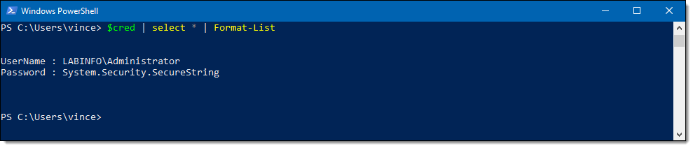

Les objets `SecureString` servent principalement à stocker des mots de passe de manière sécuritaire. On peut leur affecter une chaîne de caractères, mais on ne peut pas la lire. Le mot de passe contenu dans cet objet est chiffré.

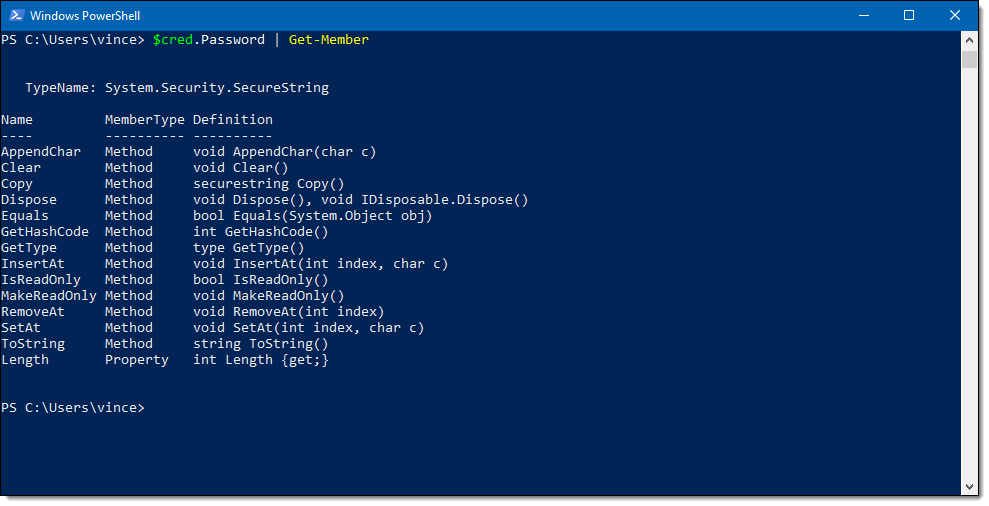


### RPC et WinRM

Le système d'exploitation Windows offre plusieurs options pour permettre aux administrateurs systèmes de les administrer à distance, à travers le réseau.

Nous avons vu précédemment comment les requêtes WMI, à l'aide de la commande `Get-WmiObject`, peuvent être passées à des hôtes distants. C'est possible au moyen du protocole RPC (Remote Procedure Call), un protocole datant des années 80. Microsoft a utilisé RPC dans ses outils de gestion dès les débuts de Windows NT, dans les années 90, et est encore aujourd'hui largement utilisé. C'est ce protocole qui permet l'administration à distance avec WMI et les consoles de gestion MMC (comme Computer Management).

RPC n'a pas été conçu pour la sécurité, qui n'était pas un grand enjeu à l'époque. Microsoft a fait évoluer le protocole, lui greffant des routines de sécurité, mais ça a donné un protocole très complexe et fragile. La nature du protocole oblige, entre autres, à ouvrir un très grand nombre de ports entrants (tous les ports de 1024-65535, éventuellement réduit à 49152-65535), ce qui élargit la surface d'exposition à des menaces extérieures. Aussi, le trafic RPC n'est généralement pas chiffré (à l'exception des credentials).

Microsoft a donc développé un nouveau protocole d'administration à distance pour Windows, avec cette fois-ci la sécurité en tête. Ce protocole, c'est WinRM. Il est basé sur HTTP/HTTPS, comme pour le Web.


### Activation de WinRM sur un serveur

Pour activer WinRM sur une machine (la machine qui va recevoir la connexion), on peut utiliser la commande suivante, dans une console powershell élevée (en tant qu'administrateur)

```powershell
Enable-PSRemoting -Force
```

Si WinRM est déjà activé, la commande vous le dira. Sinon, la commande se chargera d'activer WinRM pour vous, incluant le service et le pare-feu.

On peut également utiliser la commande winrm quickconfig pour arriver au même résultat.


:::tip
Si votre serveur n'est pas dans un domaine, on peut activer WinRM mais la procédure est différente.

Comme le profil de connexion n'est pas celle d'un domaine, Windows le considère moins sécuritaire. Si votre serveur est connecté dans un environnement que vous considérez sécuritaire (un réseau local d'entreprise par exemple), vous pouvez demander de sauter la vérification.

```powershell
Enable-PSRemoting -Force -SkipNetworkProfileCheck
```

Aussi, il faut préciser la liste des machines de confiance. Lorsqu'on est dans un domaine, toutes les machines membres du domaine sont dignes de confiance. Lorsqu'on n'est pas dans un domaine, on doit les définir.

```powershell
Set-Item WSMAN:\localhost\Client\TrustedHosts -Value "192.168.123.45" -Force
```

Si vous voulez accepter la connexion de n'importe quelle machine du réseau, vous pouvez mettre * comme valeur. Mais sachez que ce n'est pas une bonne pratique de sécurité.

Ensuite, redémarrez le service WinRM pour que les changements soient pris en compte.

```powershell
Restart-Service WinRM
```
:::

#### Le pare-feu

Normalement, la règle de pare-feu est créée automatiquement. Vous pouvez vous en assurer dans la console du pare-feu (wf.msc).

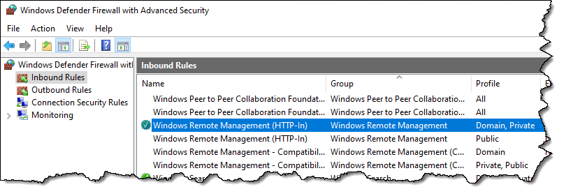


#### Chiffrement

Une bonne pratique, lorsqu'on active WinRM, est de permettre le chiffrement du trafic. Par défaut, c'est HTTP qui est utilisé et pas HTTPS. Pour permettre le chiffrement du trafic, tout comme avec HTTPS pour le Web, on a besoin d'un certificat SSL. On n'entrera pas dans ces détails dans le cadre de ce cours, mais si ça vous intéresse, consultez ce guide: https://4sysops.com/archives/powershell-remoting-over-https-with-a-self-signed-ssl-certificate/.


## Sessions PowerShell à distance

Une fois que WinRM a été activé sur le serveur, vous pouvez maintenant vous y ouvrir une session PowerShell distante. Pour ce faire, utilisez les commandes dont le nom est PSSession.


Pour accéder à la ligne de commande à distance, la commande à utiliser est `Enter-PSSession`.


Une fois dans la session distante, on voit le nom du serveur dans l'invite. Toutes les commandes qu'on tape ici seront faites comme si nous étions physiquement sur le serveur.

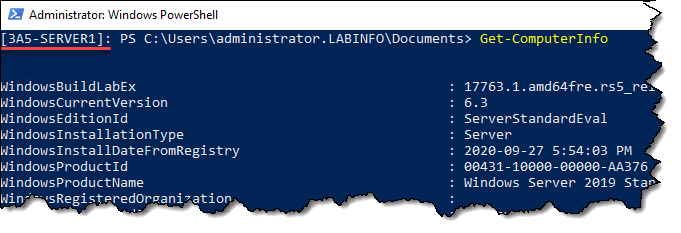

Pour quitter la session, vous pouvez utiliser la commande `Exit-PSSession`.

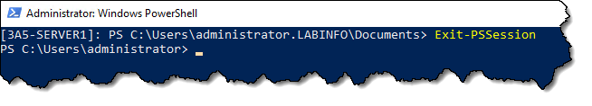


### Authentification

Dans un environnement Active Directory, on se connecte au serveur distant en utilisant par défaut l'identité de l'utilisateur présentement loggé. On peut utiliser le paramètre `-Credential` pour spécifier un utilisateur différent.

En entreprise, il n'est pas rare de recourir à cette façon de faire. Les utilisateurs (même les admins) utilisent un compte régulier, sans droits d'administration, pour travailler sur leur poste de travail. Ils ont un deuxième compte, qu'ils utilisent pour se connecter à des sessions distantes, et c'est ce compte qui possède les droits d'administration.

Dans cet exemple, l'utilisateur du système est loggé avec le compte alice, qui n'a aucun droit d'administration. Lorsqu'on tente de se connecter sur le serveur, l'accès est refusé.


Pour se connecter en tant qu'un utilisateur qui possède des droits sur ce système, il faut spécifier les credentials. On les obtient avec `Get-Credential`.


Et on passe cet objet dans le paramètre -Credential.


### Créer des sessions PowerShell

Les sessions interactives, c'est bien, mais on doit faire toutes nos commandes dans l'ordinateur distant. Si on a un script à exécuter, il faut d'abord le transférer sur l'ordinateur distant, ce qui n'est pas pratique.

On peut ouvrir des sessions PowerShell à distance, non pas pour accéder à la console, mais pour y lancer des commandes.

Créer la session

On créer une nouvelle session avec la commande `New-PSSession`. Celle-ci sera ouverte et portera un numéro d'identification.


Obtenir les sessions existantes

On peut obtenir l'état des sessions en cours avec `Get-PSSession`.

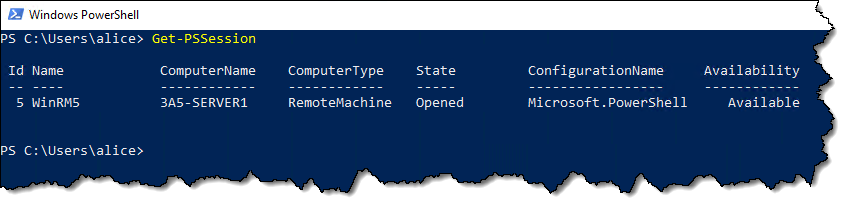

Affecter une session à une variable

Pour obtenir une session spécifique et la mettre dans une variable, on peut l'affecter avec `Get-PSSession` si la session est déjà ouverte, ou encore, l'affecter directement avec `New-PSSession`.


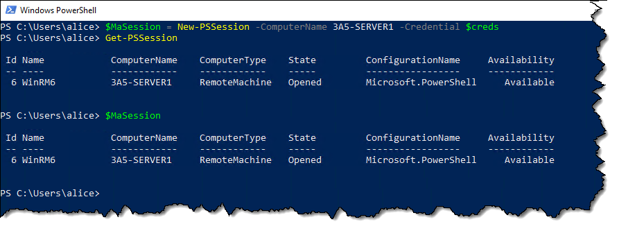


#### Terminer une session


#### Terminer toutes les sessions ouvertes


### Invoke-Command

La commande Invoke-Command exécute une commande à distance. Elle est équivalente à appeler powershell.exe sur la machine distante.

On peut l'utiliser de deux manières.

#### Exécuter un bloc de commandes

Le bloc de commandes se définit avec le paramètre `-ScriptBlock`, entre accolades. C'est pratique pour lancer une commande simple sur les machines distantes.

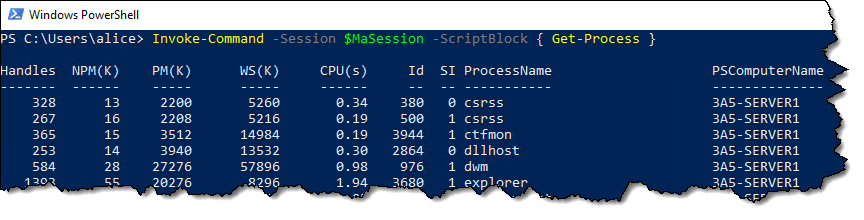


:::caution
Une session PSSession à distance correspond à une session PowerShell ouverte sur une autre machine. Par conséquent, elle est distincte de la session locale. Par exemple, une variable qu'on définit dans la session locale ne sera pas accessible sur la session distante.

```powershell
$NouveauDossier = "C:\MonDossier"
$Session = New-PSSession -ComputerName "SRV01"

Invoke-Command -Session $Session -ScriptBlock { 
    New-Item -Path $NouveauDossier -ItemType Directory  # Ne fonctionnera pas!
}
```

L'exemple précédent ne fonctionnera pas, puisque la variable `$NouveauDossier` n'a jamais été créée dans la session distante. Elle n'existe que dans la session locale.

Pour pouvoir récupérer une variable locale dans un bloc de code à envoyer à une machine distante, il faut utiliser le préfixe `$using:` avant le nom de la variable.

```powershell
$NouveauDossier = "C:\MonDossier"
$Session = New-PSSession -ComputerName "SRV01"

Invoke-Command -Session $Session -ScriptBlock { 
    New-Item -Path $using:NouveauDossier -ItemType Directory
}
```

On peut aussi effectuer un *splatting* avec un hashtable défini localement dans une commande distante avec le préfixe `@using:`, de la même manière.

```powershell
$NouveauDossierSplat = @{
    Path = "C:\MonDossier"
    ItemType = "Directory"
}
$Session = New-PSSession -ComputerName "SRV01"

Invoke-Command -Session $Session -ScriptBlock { 
    New-Item @using:NouveauDossierSplat
}
```
:::


#### Exécuter un script

Lorsqu'on a un plus grand nombre de commandes à lancer sur la machine distante, on peut appeler un script.

Dans cet exemple, on crée un script tout simple composé seulement de la commande `Get-Process`, mais ça pourrait être un script beaucoup plus complexe. Ce script sera lancé dans la session distante.


#### Spécifier les noms de machines au lieu des sessions

On peut aussi créer les sessions automatiquement, en spécifiant les noms de machines plutôt que des sessions, mais si vous avez plusieurs commandes à lancer, il sera plus pratique de réutiliser la même session pour chacune des commandes au lieu de les réinitier à chaque fois.


### PSRemoting et pipeline

Comme c'est une session PowerShell, ce qui sort de la commande distante, c'est un objet. Et cet objet sort sur le pipeline local du client. Autrement dit, quand la commande est lancée à distance, ce qu'elle laisse dans le pipeline revient à l'appelant, et nous pouvons manipuler cet objet à notre guise.


On peut aussi affecter cet objet dans une variable.


### Plusieurs sessions en même temps

On peut lancer une commande sur plusieurs sessions d'un coup. 


### Copie de fichiers à travers une session

Il est possible de copier un fichier à travers une session PSRemoting à l'aide de la commande `Copy-Item`.


#### De la machine locale vers la machine distante

Si on spécifie le paramètre `-ToSession`, on envoie le fichier vers la machine cible. Le paramètre -Path représente donc le chemin sur la machine locale, et le paramètre -Destination représente le chemin sur la machine distante.


#### De la machine distante vers la machine locale

À l'inverse, si on spécifie le paramètre `-FromSession`, alors on tire le fichier de l'ordinateur distant vers l'ordinateur local. Le paramètre `-Path` représente alors le chemin sur la machine distante, et le paramètre `-Destination`, celui sur la machine locale.


