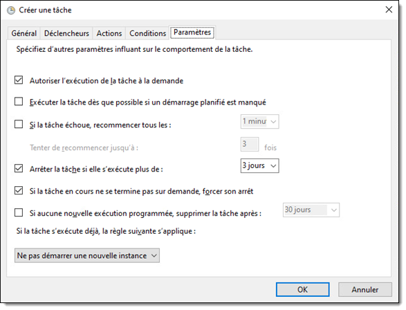

## Le planificateur de tâches

Le planificateur de tâches sert, comme son nom l'indique, à planifier des opérations sous Windows afin qu'elles démarrent automatiquement selon certains critères et dans certaines conditions. Il est très utile dans de nombreux contextes, comme la planification de tâches de maintenance régulières, le démarrage d'opérations automatique au démarrage du système ou à l'ouverture d'une session utilisateur, le nettoyage automatique de fichiers temporaires, la prise de sauvegardes régulières, etc.

Avec l'interface graphique, on utilise la console MMC du planificateur de tâches, `taskschd`, ou encore la console de gestion de l'ordinateur, `compmgmt.msc`.

Les tâches planifiées sont organisées sous forme d'arborescence. La racine (nommée "bibliothèque du planificateur de tâches", ou simplement, **/**) contient un certain nombre de tâches planifiées déjà mises en place à l'installation de Windows ou d'un logiciel, mais d'autres tâches sont stockées dans des conteneurs sous la racine.

Pour créer une tâche à l'aide de l'interface graphique, il suffit d'ouvrir le menu contextuel par un clic-droit sur le conteneur où créer la tâche. Il existe deux manière de créer une tâche: simplifiée ("*créer une tâche de base...*") et avancée ("*créer une tâche...*"). Il est préférable de ne pas choisir une tâche de base, puisque certaines options sont inaccessibles.

### Composition d'une tâche planifiée

Une tâche planifiée est en ensemble de plusieurs éléments d'information. Ils sont assemblés ensemble pour former une tâche planifiée incrite dans le planificateur.

- L'information d'enregistrement (**RegistrationInfo**) contient les propriétés de la tâche qui concernent son enregistrement dans le planificateur, comme le nom de la tâche, sa description et son emplacement dans l'arborescence du planificateur.

- Les déclencheurs (**Trigger**) définissent dans quelle circonstance la tâche pourra être lancée. Par exemple, au démarrage de l'ordinateur, à l'ouverture de session, à chaque vendredi minuit, ou même lorsqu'un événement système est détecté. Il peut y en avoir plus d'un.

- Les actions (**Action**) définissent une action (comme le lancement d'une commande ou d'un script) à exécuter chaque fois que la tâche est déclenchée. Il peut y en avoir plusieurs.

- Le principal de sécurité (**Principal**) décrit avec quelle identité (un compte utilisateur ou un groupe) la tâche sera lancée. Si le principal est un compte utilisateur, alors c'est sous ce compte que la tâche sera exécutée (comme si l'utilisateur l'avait fait manuellement). Si le principal est un groupe, la tâche sera lancée au nom de l'utilisateur courant uniquement s'il est membre de ce groupe.

- Les paramètres (**Settings**) décrivent diverses options concernant la tâche. Par exemple, la tâche doit-elle être exécutée même si l'ordinateur tourne sur la batterie, ou le comportement à adopter si la tâche échoue.

## Planification d'une tâche (GUI)

Voici les éléments importants à configurer pour créer une tâche planifiée au moyen de l'interface graphique.

### Déclencheur (*Trigger*)

Une tâche planifiée comprend un ou plusieurs déclencheurs, c'est-à-dire des événements qui démarreront automatiquement la tâche.

Plusieurs types de déclencheurs sont disponibles:
- À l'heure programmée
- À l'ouverture de session
- Au démarage
- Après une période d'activité 
- Sur un événement (système)
- Lors de la création/modification de la tâche
- Au moment de la connexion à une session utilisateur (par exemple, RDP)
- Au moment de la déconnexion à une session utilisateur
- Au verrouillage du poste de travail (Win+L)
- Au déverrouillage du poste de travail

### Action (*Action*)

Une tâche planifiée comprend une ou plusieurs actions qui seront lancées lorsque la tâche sera déclenchée. Le principal type d'action est le lancement d'une commande ("*démarrer un programme*").

Pour lancer une commande, il faut définir trois paramètres:

| Paramètre | Description |
| -- | -- |
| Programme/script | Le nom ou chemin du fichier exécutable à appeler seulement. |
| Ajouter des arguments (facultatif) | Tous les arguments après le nom de l'exécutable. |
| Commencer dans (facultatif) | Le répertoire de travail dans lequel lancer la commande. |

Par exemple, pour qu'une tâche exécute le script PowerShell `C:\Scripts\MonScript.ps1`, il faudrait que le nom du programme soit `powershell.exe` et que les arguments soient `-File C:\Scripts\MonScript.ps1 -ExecutionPolicy Bypass`.

:::tip
Pour connaître la syntaxe de la commande Powershell.exe, vous pouvez lancer `Powershell.exe /?` pour accéder à la rubrique d'aide.

:::

### Conditions et paramètres

Les onglets Conditions et Paramètres contiennent des options supplémentaires sur la tâche.

### Forcer le lancement une tâche planifiée

On peut forcer l'exécution d'une tâche planifiée directement par la console. C'est pratique pour la tester.

:::tip
Comme bien des consoles MMC, vous pouvez gérer les tâches planifiées sur une machine distante à partir de la console. Vous devez être administrateur local de la machine distante, et les pare-feux doivent laisser passer le protocole MSRPC.

:::

## Gestion des tâches planifiées en PowerShell

PowerShell offre un ensemble de commandes pour contrôler, localement ou à distance, les tâches planifiées.

Pour ce faire, il y a plusieurs commandes à faire, puisqu'il faut créer chaque élément de la tâche planifiée individuellement, puis les mettre ensemble pour l'enregistrer dans la bibliothèque du planificateur de tâches.

### Définir le déclencheur

Il existe plusieurs déclencheurs. Il suffit ici de créer un nouveau déclencheur du type souhaité. Il faut le stocker dans une variable.

### Définir l'action

Il faut définir l'action, soit le programme a exécuter. Tout comme avec l'interface graphique, le programme à spécifier dans le paramètre -Execute n'est que l'exécutable à lancer. Si c'est un script PowerShell, alors on met "powershell.exe". Si c'est un autre programme, on met uniquement le nom du programme, sans ses arguments.

### Définir le principal

Le principal désigne l'utilisateur au nom duquel la tâche sera exécutée.

Nous avons deux options:
- Spécifier un compte utilisateur spécifique (`-UserID`)
- Spécifier un groupe (`-GroupID`)

Si le principal est un utilisateur, la tâche sera faite au nom de ce compte précis.

Si le principal est un groupe, la tâche sera faite au nom de l'utilisateur courant, uniquement si celui-ci fait partie du groupe. Lorsque le principal est un groupe, il est impossible que la tâche soit lancée lorsque l'utilisateur n'est pas loggé.

### Enregistrer la tâche planifiée

Une fois tous les éléments en place, il ne reste plus qu'à enregistrer la tâche planifiée. On lui donne alors un nom, une description et un emplacement dans le planificateur, puis on lui donne une ou plusieurs actions, un ou plusieurs déclencheurs ainsi qu'un principal.

:::tip
Il est aussi possible de contrôler les tâches planifiées sur un ordinateur distant. On peut simplement passer par une session distante (PSSession) au moyen de la commande Invoke-Command.

:::